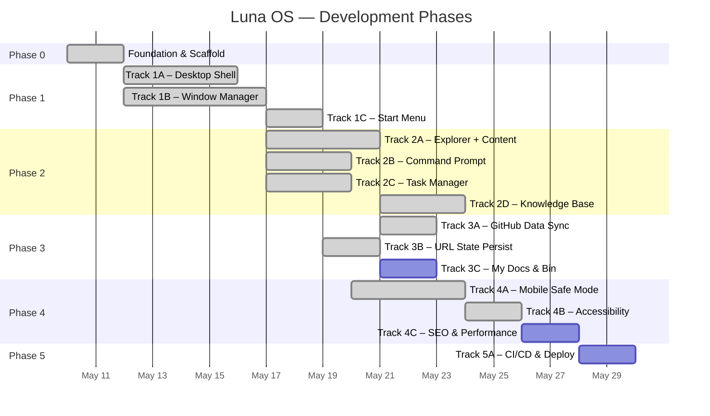
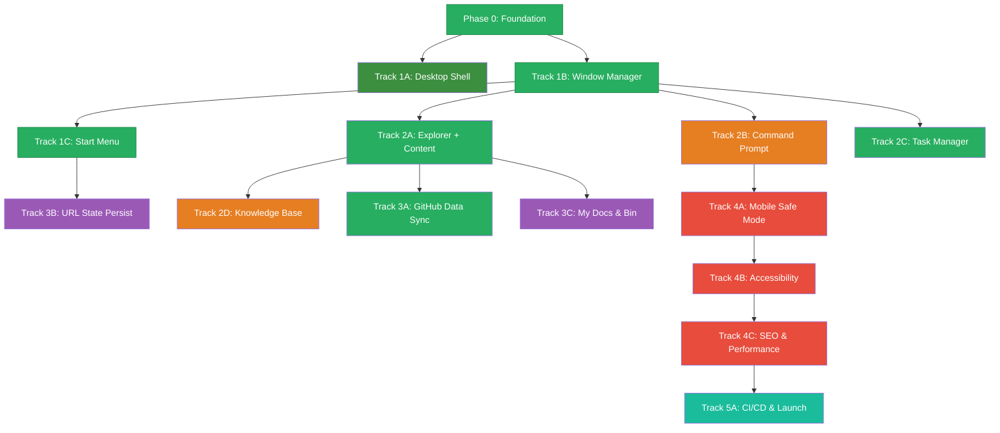

# Roadmap: Luna OS Portfolio

**Parent Docs:** [PRD.md](./PRD.md) · [TDD.md](./TDD.md)  
**Version:** 2.2 · **Updated:** 2026-05-14  
**Methodology:** Vertical slicing — each track delivers a testable end-to-end feature.

---

## Overview



---

## Phase 0 — Foundation & Scaffold ✅

> Bootstrap the project, install dependencies, and establish the design system. No features yet — just a buildable, styled skeleton. _(Completed 2026-05-11)_

### Tasks

- [x] Init Astro project with React, MDX, Tailwind integrations ([TDD §1](./TDD.md#1-project-structure))
- [x] Create directory structure: `components/`, `stores/`, `content/`, `lib/`, `styles/` ([TDD §1](./TDD.md#1-project-structure))
- [x] Install all dependencies with `pnpm` ([TDD §13](./TDD.md#13-dependencies))
- [x] Set up ESLint & Prettier for code formatting and linting
- [x] Set up TypeScript for strict typechecking
- [x] Set up Vitest for unit testing and coverage reporting
- [x] Create a custom file modularity script (e.g. `scripts/check-modularity.js`) to ensure files in `src/` do not exceed 500 lines
- [x] Configure Husky and lint-staged for git hooks:
  - [x] **pre-commit**: use `lint-staged` to run lint and file modularity check on staged files
  - [x] **pre-push**: run typecheck and vitest coverage (enforcing 80% threshold)
- [x] Create `src/styles/xp-theme.css` with full design token set ([TDD §5](./TDD.md#5-design-tokens--style-specification))
- [x] Add Tahoma font files to `public/fonts/` via `@font-face` system reference ([TDD §5.2](./TDD.md#52-typography))
- [x] Configure Tailwind v4 `@theme` block in `global.css` with XP theme tokens
- [x] Create `DesktopLayout.astro` skeleton ([TDD §6](./TDD.md#6-component-inventory))
- [x] Create `index.astro` mounting the layout ([TDD §1](./TDD.md#1-project-structure))
- [x] Verify: `pnpm dev` / `pnpm build` serves a blank page with correct fonts and XP blue background

### Acceptance Criteria

```
✅ Project builds and serves locally without errors (build: 2.4s)
✅ Code quality tools (ESLint, Prettier, TypeScript, Vitest) are fully configured
✅ Git hooks enforce pre-commit (lint, modularity) and pre-push (typecheck, coverage >= 80%) rules
✅ Custom modularity script successfully fails if a file in `src/` exceeds 500 lines
✅ XP design tokens are available in CSS (verified with 12 test assertions)
✅ Tahoma font loads correctly (via `@font-face` system reference)
✅ Directory structure matches TDD §1 (verified with 17 test assertions)
✅ 36 unit/integration tests passing, 0 type errors
```

### Key Files Created

```
src/styles/xp-theme.css          — Full Luna design token system (colors, borders, typography, animations)
src/styles/global.css             — Tailwind v4 @theme integration with XP tokens
src/layouts/DesktopLayout.astro   — XP-themed layout shell
src/pages/index.astro             — Entry point with placeholder mount points
astro.config.mjs                  — Astro 6 config with React, MDX, Tailwind
eslint.config.mjs                 — ESLint with TypeScript + React rules
vitest.config.ts                  — Vitest with 80% coverage thresholds
tsconfig.json                     — Strict TypeScript with @/ path aliases
scripts/check-modularity.js       — 500-line file size limiter
.husky/pre-commit                 — lint-staged + modularity check
.husky/pre-push                   — typecheck + coverage
tests/directory-structure.test.ts  — 17 directory existence tests
tests/xp-theme.test.ts             — 12 CSS token verification tests
tests/check-modularity.test.ts     — 2 modularity script tests
tests/pages/index.test.ts          — 5 integration tests
```

### Commits (shas tracked in plan.md)

Phase 0 produced 15 commits across ~8,400 lines changed (42 files). Track archived at `conductor/archive/foundation_scaffold_20260510/`.

---

## Phase 1 — Core Shell

### Track 1A — Desktop Shell ✅ _(Completed 2026-05-11)_

> Wallpaper, desktop icons grid, and static taskbar. Clicking icons does nothing yet — the window manager doesn't exist. Uses custom SVG/CSS generated art rather than real bitmap wallpaper.

**Refs:** [PRD §3.1](./PRD.md#31-the-desktop-experience) · [TDD §5.3](./TDD.md#53-classic-3d-border-system) · [TDD §5.4](./TDD.md#54-icon-sources) · [TDD §6 Astro Components](./TDD.md#astro-components-static)

#### Tasks

- [x] Add `--xp-taskbar-bg` and `--xp-start-btn-green` gradient tokens to `xp-theme.css` ([TDD §5.1](./TDD.md#51-color-palette))
- [x] Create `.xp-taskbar-border` utility class (top-edge-only outset border)
- [x] Create 5 custom desktop icon SVGs (My Computer, My Documents, Knowledge Base, Command Prompt, Recycle Bin) ([TDD §5.4](./TDD.md#54-icon-sources))
- [x] Create `Wallpaper.astro` — custom inline SVG/CSS Bliss-style rolling hills art with optional `imageSrc` prop ([TDD §6](./TDD.md#astro-components-static))
- [x] Create `DesktopIcon.astro` — icon + label with XP blue hover highlight, `data-window-id` and `data-window-label` attributes ([TDD §6](./TDD.md#astro-components-static), [TDD §9](./TDD.md#9-animations--transitions))
- [x] Layout 5 icon instances in left-aligned vertical column in `index.astro` (Astro static, zero JS)
- [x] Create `Taskbar.tsx` — React island with blue gradient bar, green Start button, and system tray using `var(--xp-taskbar-bg)` and `var(--xp-start-btn-green)` CSS tokens ([PRD §3.1](./PRD.md#31-the-desktop-experience))
- [x] Create `Clock.tsx` — React component displaying current time in HH:MM format, updating every 60 seconds, mounted in taskbar system tray

#### Acceptance Criteria

```
✅ Desktop shows custom CSS/SVG Bliss-style wallpaper filling the full viewport
✅ Wallpaper.astro accepts optional imageSrc prop for future bitmap fallback
✅ 5 desktop icons render in a left-aligned vertical column (top-left)
✅ Each DesktopIcon includes data-window-id and data-window-label attributes
✅ Icons show XP-style blue selection highlight on hover
✅ Taskbar spans full width at bottom with blue gradient and outset top border
✅ Taskbar uses top-edge-only outset border (.xp-taskbar-border)
✅ Green Start button visible on taskbar left (non-functional, ARIA labeled)
✅ Live clock in system tray showing user's local time (HH:MM, updates every minute)
✅ All icons are custom SVGs in public/icons/ (48×48 viewport)
✅ Zero-JS for wallpaper and icons (Astro static components; Taskbar & Clock = React client:load)
✅ --xp-taskbar-bg and --xp-start-btn-green CSS tokens added to xp-theme.css
✅ Looks authentically XP at a glance
```

#### Key Files Created

```
public/icons/*.svg                        — 5 custom 48×48 XP-inspired desktop icons
src/components/desktop/Wallpaper.astro     — CSS/SVG Bliss-style rolling hills wallpaper
src/components/desktop/DesktopIcon.astro   — Reusable icon component with XP hover highlight
src/components/taskbar/Clock.tsx           — React clock (HH:MM, 60s update)
src/components/taskbar/Taskbar.tsx         — React taskbar island with Start button + system tray
src/styles/xp-theme.css (modified)         — Added --xp-taskbar-bg, --xp-start-btn-green, .xp-taskbar-border
src/pages/index.astro (modified)           — Mounted Wallpaper, Icons, Taskbar
vitest.config.ts (modified)               — jsdom env, @testing-library/react, @/ alias
tests/setup.ts                            — jest-dom vitest matchers
tests/wallpaper.test.ts                   — 5 unit tests (Pattern B: source file read)
tests/desktop-icon.test.ts                — 7 unit tests (Pattern B: source file read)
tests/clock.test.tsx                      — 3 React component tests (@testing-library/react)
tests/taskbar.test.tsx                    — 4 React component tests (@testing-library/react)
tests/pages/index.test.ts (modified)      — 4 new integration tests (9 total)
```

#### Commits (shas tracked in plan.md)

Track 1A produced 11 feature/fix commits, 6 plan/checkpoint commits, 1 review fix commit across ~1,041 lines changed (18 files). Track archived at `conductor/archive/desktop_shell_20260511/`.

---

### Track 1B — Window Manager ✅ _(Completed 2026-05-12)_

> The core engineering challenge. Implement the Nano Stores-driven window system with open/close/drag/minimize/maximize/focus.

**Refs:** [TDD §3 (all subsections)](./TDD.md#3-window-manager-specification) · [TDD §6 React Islands](./TDD.md#react-islands-interactive)

#### Tasks

- [x] Create `src/stores/windows.ts` with `$windows`, `$zCounter`, `$activeWindow` stores ([TDD §3.1](./TDD.md#31-window-state-schema))
- [x] Implement all window actions: `openWindow`, `closeWindow`, `minimizeWindow`, `maximizeWindow`, `restoreWindow`, `focusWindow`, `moveWindow`, `resizeWindow` ([TDD §3.3](./TDD.md#33-window-actions))
- [x] Create `WindowLayer.tsx` — iterates `$windows`, renders `WindowFrame` for each ([TDD §6](./TDD.md#react-islands-interactive))
- [x] Create `WindowFrame.tsx` — chrome, 3D borders, rounded top corners ([TDD §5.3](./TDD.md#53-classic-3d-border-system))
- [x] Create `TitleBar.tsx` — icon, title, min/max/close buttons ([TDD §6](./TDD.md#react-islands-interactive))
- [x] Implement drag logic (title bar only, viewport-constrained) ([TDD §3.4](./TDD.md#34-behavior-rules))
- [x] Implement edge/corner resize with min size constraints ([TDD §3.2](./TDD.md#32-default-window-configs), [TDD §3.4](./TDD.md#34-behavior-rules))
- [x] Implement z-index stacking and focus-on-click ([TDD §3.4](./TDD.md#34-behavior-rules))
- [x] Implement minimize/maximize/restore with CSS transitions ([TDD §9](./TDD.md#9-animations--transitions))
- [x] Wire desktop icon double-click → `openWindow()` ([TDD §3.3](./TDD.md#33-window-actions))
- [x] Update `Taskbar` to show buttons for open windows ([TDD §3.4 Taskbar toggle](./TDD.md#34-behavior-rules))
- [x] Implement taskbar button toggle behavior (focus/minimize/restore) ([TDD §3.4](./TDD.md#34-behavior-rules))
- [x] Mount `WindowLayer` as React island with `client:only` in `DesktopLayout.astro` ([TDD §1 Island Boundary Rules](./TDD.md#island-boundary-rules))

#### Acceptance Criteria

```
✅ Double-clicking a desktop icon opens a window with placeholder content
✅ Windows can be dragged by title bar (viewport-constrained)
✅ Windows can be resized from edges/corners (min size enforced)
✅ Clicking a window brings it to front (z-index updates)
✅ Min/max/close buttons work with correct XP-style transitions
✅ Taskbar shows buttons for all open windows
✅ Taskbar toggle: click focused → minimize, click minimized → restore, click unfocused → focus
✅ Multiple windows can be open simultaneously without state conflicts
✅ Windows open with scale-in animation (150ms), close with scale-out (120ms)
✅ Minimize slides window toward taskbar (200ms), restore expands from cached position
✅ Maximize fills viewport minus 40px taskbar height
✅ All animations respect prefers-reduced-motion: reduce
✅ Window system uses pointer-events layering for click-through when no windows open
```

#### Key Files Created

```
src/stores/windows.ts                  — Nano Stores: $windows, $zCounter, $activeWindow, all 8 actions
src/components/window/TitleBar.tsx     — XP-style title bar with active/inactive gradient
src/components/window/WindowFrame.tsx  — 3D chrome border, 8 resize handles, CSS animations
src/components/window/WindowLayer.tsx  — Store subscriber, drag/resize logic, event listener
src/lib/useStore.ts                    — Custom React hook (useState/useEffect) to subscribe to Nano Stores
src/components/desktop/DesktopIcon.astro (modified) — onclick/ondblclick handlers for window opening
src/components/taskbar/Taskbar.tsx (modified)       — Window buttons with toggle behavior
src/pages/index.astro (modified)                    — WindowLayer mount + pointer-events fix
src/styles/global.css (modified)                    — Animation keyframes + prefers-reduced-motion
```

#### Commits (shas tracked in plan.md)

Track 1B produced 17 feature/fix commits, 6 plan/checkpoint commits, 1 review fix commit, 1 docs sync commit across ~2,400 lines changed (29 files). Track archived at `conductor/archive/window_manager_20260511/`.

---

### Track 1C — Start Menu ✅ _(Completed 2026-05-12)_

> Fully interactive Start Menu with two-column layout, user header, and program list that opens windows. Includes XP-style shutdown overlay with auto-reboot.

**Refs:** [PRD §3.1](./PRD.md#31-the-desktop-experience) · [TDD §7.3](./TDD.md#73-start-menu-layout) · [TDD §9](./TDD.md#9-animations--transitions)

#### Tasks

- [x] Create `src/stores/desktop.ts` with `$startMenuOpen` atom and toggle/open/close actions
- [x] Create `StartMenu.tsx` with two-column layout ([TDD §7.3](./TDD.md#73-start-menu-layout))
- [x] Add blue header bar with "MARP" initials avatar and "Muhammad Ansyar Rafi Putra" name
- [x] Add left column: pinned apps (Resume, Explorer, Task Manager, CMD)
- [x] Add right column: system folders (My Documents, My Computer, Control Panel, Help)
- [x] Add bottom bar with "Shut Down..." button and power icon
- [x] Wire menu items to `openWindow()` + close Start Menu
- [x] Implement keyboard navigation (Tab/Shift+Tab focus cycling, Enter activation, Escape close)
- [x] Implement click-outside detection to close menu
- [x] Wire Start button toggle in Taskbar with active pressed state
- [x] Implement slide-up (150ms) / slide-down (100ms) animation ([TDD §9](./TDD.md#9-animations--transitions))
- [x] Create `ShutdownOverlay.tsx` — 3-phase XP shutdown sequence with progress bar (~6s total, auto-reboot)
- [x] Respect `prefers-reduced-motion: reduce` for all animations
- [x] Use `--xp-start-*` CSS tokens from design system for styling

#### Acceptance Criteria

```
✅ Clicking Start button opens the two-column menu with slide-up animation (150ms ease-out)
✅ Menu shows blue header with "MARP" initials avatar and "Muhammad Ansyar Rafi Putra" name
✅ Left column: Resume, Explorer, Task Manager, Command Prompt
✅ Right column: My Documents, My Computer, Control Panel, Knowledge Base
✅ Each menu item opens the corresponding window and closes the menu
✅ Clicking outside or pressing Escape closes the menu (slide-down, 100ms ease-in)
✅ Tab key cycles through menu items with visible ARIA focus tracking; Enter activates
✅ "Shut Down..." shows an XP "Windows is shutting down" screen — NOT a BSOD (reserved for 404)
✅ After shutdown sequence completes (~6s), desktop is restored (auto-reboot)
✅ Start button shows pressed state when menu is open
✅ All --xp-start-* CSS tokens from xp-theme.css are used for styling
✅ All animations respect prefers-reduced-motion: reduce
✅ 201 tests passing, 95%+ coverage
```

#### Key Files Created

```
src/stores/desktop.ts                    — Nano Stores: $startMenuOpen, $shuttingDown, 5 action functions
src/components/taskbar/StartMenu.tsx     — Two-column menu, keyboard nav, click-outside, animations
src/components/taskbar/ShutdownOverlay.tsx — 3-phase shutdown sequence with progress bar
src/components/taskbar/Taskbar.tsx (modified) — Start button wiring, StartMenu mount, Fragment wrapper
src/styles/xp-theme.css (modified)       — Added --xp-start-* CSS tokens, .startmenu-icon class
src/styles/global.css (modified)         — Added @keyframes for start-menu-open/close and shutdownProgress
public/icons/task-manager.svg            — New icon asset (was missing from 5-icon set)
tests/stores/desktop.test.ts             — 10 store tests (start menu + shutdown state)
tests/start-menu.test.tsx                — 29 component tests (rendering, actions, keyboard, icons)
tests/shutdown-overlay.test.tsx          — 5 shutdown overlay tests (render, timers, cleanup)
tests/taskbar.test.tsx (modified)         — 2 new Start button wiring tests
tests/setup.ts (modified)                — window.matchMedia mock for jsdom
```

#### Commits (shas tracked in plan.md)

Track 1C produced 14 code/feature/test commits, 11 plan/checkpoint commits, 1 review fix commit across ~1,100 lines changed (16 files). Track archived at `conductor/archive/start_menu_20260512/`.

---

## Phase 2 — Applications

### Track 2A — Explorer + Content ✅ _(Completed 2026-05-12)_

---

> File explorer with integrated address-bar/breadcrumb navigation through a static virtual filesystem (C:, D:, E: drives). Project metadata renders inline via a split-pane detail pane.

**Refs:** [PRD §4](./PRD.md#4-file-system--content-mapping) · [TDD §4.1](./TDD.md#41-project-mdx-frontmatter) · [TDD §4.3](./TDD.md#43-virtual-filesystem-tree) · [TDD §6](./TDD.md#react-islands-interactive) · T2A [spec](conductor/archive/explorer-content_20260512/spec.md) · T2A [plan](conductor/archive/explorer-content_20260512/plan.md)

#### Notes on Deferrals

| Deferred Feature                                                        | Target Track                                               | Reason                                                                                                                                 |
| ----------------------------------------------------------------------- | ---------------------------------------------------------- | -------------------------------------------------------------------------------------------------------------------------------------- |
| Dynamic `FILE_SYSTEM` population from content collections at build-time | [Track 3A](#track-3a--github-data-sync) — GitHub Data Sync | Astro content collections are not importable synchronously in plain TS modules; requires a build-time pipeline                         |
| Full MDX body rendering in the detail pane                              | [Track 3A](#track-3a--github-data-sync)                    | React client islands cannot import `.mdx` at runtime; v1 renders frontmatter metadata only (title, description, tech stack, repo link) |
| Explorer path persistence across page reloads                           | [Track 3B](#track-3b--url-state-persistence) — URL State   | Requires Nano Store ↔ URL search param sync, which is the scope of Track 3B                                                            |

#### Tasks

- [x] Create `src/content.config.ts` (Astro 6 format) with `projects` + `devopsAcademy` collection schemas using Zod validation ([TDD §4.1](./TDD.md#41-project-mdx-frontmatter))
- [x] Create `src/lib/content-schemas.ts` with testable Zod schemas (projectSchema, devopsAcademySchema)
- [x] Write MDX files for `icarus-server-manager`, `chasing-chapters` (C: drive), and `tubular-bexus-osw` (D: drive) ([PRD §4](./PRD.md#-directory-details))
- [x] Create 3 DevOps Academy stub MDX files (`docker-basics`, `linux-essentials`, `ci-cd-pipeline`) on E: drive
- [x] Create 3 drive icon SVGs in `public/icons/` (32×32, C:, D:, E:) and 3 list icon SVGs (16×16 file, folder, folder-open)
- [x] Create `src/lib/constants.ts` with `FSNode` discriminated union types + static `FILE_SYSTEM` tree ([TDD §4.3](./TDD.md#43-virtual-filesystem-tree))
- [x] Create `src/lib/filesystem.ts` with navigation helpers (`getChildren`, `resolvePath`, `getParent`, `splitPath`)
- [x] Add `explorerPath` to `WindowState` in `src/stores/windows.ts` (defaults to `C:\`)
- [x] Create Explorer sub-components: `ExplorerToolbar`, `ExplorerBreadcrumb`, `ExplorerFileList`, `ExplorerDetailPane`
- [x] Implement folder navigation (back button with history stack, up-level, breadcrumb click)
- [x] Render file list with 16×16 icons, name, size, type, date columns (XP detail view)
- [x] Clicking a project file opens its frontmatter metadata (title, description, tech stack badges, repo link) in the detail pane
- [x] Create `src/lib/projects-data.ts` with static metadata for all projects and academy articles
- [x] Wire "My Computer" icon → Explorer at root (`C:\`, `D:\`, `E:\`)
- [x] Wire drive icons to their respective folders ([PRD §4](./PRD.md#-desktop-icons))
- [x] Wire Explorer component into WindowLayer (replaces placeholder text)

#### Acceptance Criteria

```
✅ Double-click My Computer → Explorer opens showing C: drive contents (Software_Engineering folder)
✅ Navigate into C:\Software_Engineering → see project files listed (Icon, Name, Size, Type, Date)
✅ Click a project → detail pane shows title, description, tech stack badges, repo link
✅ Address bar with integrated breadcrumb: displays path, clicking segments navigates
✅ Back button returns to previous directory; up-level goes to parent
✅ Empty folders show "This folder is empty."
✅ File list matches XP Explorer detail view aesthetically (table with grid role, header columns)
✅ E:\Knowledge_Base shows 3 stub articles (Docker, Linux, CI/CD) — to be expanded with SE and AI articles in Track 2D
✅ 281 tests passing, 81.17% branch coverage, 91.2% statement coverage
✅ All src/ files under 500 lines (modularity check passes)
✅ Type assertions cleaned up during review (filesystem.ts, useCallback simplification)
```

#### Key Files Created

```
src/content.config.ts                 — Astro 6 content collections with glob loaders
src/lib/content-schemas.ts            — Zod schemas for projects + devopsAcademy (testable without astro:content; to be broadened in Track 2D)
src/lib/constants.ts                  — FSNode discriminated union types + static FILE_SYSTEM tree
src/lib/filesystem.ts                 — Navigation helpers (getChildren, resolvePath, getParent, splitPath)
src/lib/projects-data.ts              — Static metadata for all projects and academy articles
src/content/projects/*.mdx            — 3 project MDX files (icarus-server-manager, chasing-chapters, tubular-bexus-osw)
src/content/devops-academy/*.mdx      — 3 academy stub MDX files (docker-basics, linux-essentials, ci-cd-pipeline)
src/stores/windows.ts (modified)      — Added explorerPath to WindowState, defaults to C:\
src/components/apps/Explorer.tsx      — Parent shell: navigation state, history stack, store integration
src/components/apps/ExplorerToolbar.tsx  — Back/Up buttons with disabled state
src/components/apps/ExplorerBreadcrumb.tsx — Clickable path segments (address bar + breadcrumb)
src/components/apps/ExplorerFileList.tsx  — XP Detail View columns + empty state + folder navigation
src/components/apps/ExplorerDetailPane.tsx — Split-pane detail view (title, description, badges, GitHub link)
src/components/window/WindowLayer.tsx (modified) — Mounts Explorer component
public/icons/drive-{c,d,e}.svg        — 3 drive icons (32×32, hard disk with label)
public/icons/{file,folder,folder-open}.svg — 3 list icons (16×16)
```

#### Test Files Created

```
tests/content-schemas.test.ts         — 12 Zod schema validation tests
tests/content-files.test.ts           — 15 MDX frontmatter parsing tests
tests/filesystem.test.ts              — 19 FSNode + navigation helper tests
tests/icons.test.ts                   — 12 SVG icon existence tests
tests/explorer.test.tsx               — 19 React component + detail pane + integration tests
tests/stores/windows.test.ts (modified) — 3 explorerPath tests (43 total)
```

#### Commits (shas tracked in plan.md)

Track 2A produced 12 feature/commits, 7 plan/checkpoint commits, 1 review fix commit across ~1,800+ lines changed (35 files). Track archived at `conductor/archive/explorer-content_20260512/`.

---

### Track 2B — Command Prompt ✅ _(Completed 2026-05-12)_

> Functional terminal emulator with command parsing, history, tab completion, and filesystem navigation. Built as a React island with Nano Stores integration.

**Refs:** [PRD §5.1](./PRD.md#51-command-prompt-cmdexe) · [TDD §7.1](./TDD.md#71-command-prompt) · T2B [spec](conductor/tracks/command-prompt_20260512/spec.md) · T2B [plan](conductor/tracks/command-prompt_20260512/plan.md)

#### Tasks

- [x] Add `cmdPath` to `WindowState` (initialized to `C:\` on window open) ([TDD §3.1](./TDD.md#31-window-state-schema))
- [x] Create `src/lib/commands.ts` — command type definitions (`CmdOutput`, `CmdContext`, `CommandHandler`), `COMMAND_REGISTRY` map, and `parseCommand()` parser ([TDD §1](./TDD.md#1-project-structure))
- [x] Implement all 9 commands with aliases: `help`/`/?`, `ls`/`dir`, `cd`/`chdir`, `cat`/`type`, `clear`/`cls`, `neofetch`, `open`, `whoami`, `echo` ([TDD §7.1](./TDD.md#71-command-prompt))
- [x] Command history via ↑/↓ arrow keys (stored in component state, per-session) ([TDD §7.1](./TDD.md#71-command-prompt))
- [x] Tab completion: command names on empty prefix, folder names for `cd`, file slugs for `cat`/`type`/`open`
- [x] Navigate the same `FILE_SYSTEM` tree used by Explorer via `getChildren`, `resolvePath`, `getParent` ([TDD §4.3](./TDD.md#43-virtual-filesystem-tree))
- [x] `open <slug>` opens Explorer window navigated to the file's parent folder via `openWindow('explorer')` + `explorerPath` update
- [x] `open resume.pdf` opens `/resume.pdf` in a new browser tab
- [x] XP-style error messages for unknown commands, invalid paths, and missing files
- [x] Auto-scroll to bottom on new output via `scrollTop = scrollHeight`
- [x] `neofetch` with Tux ASCII art (12-line penguin) + formatted system info block (OS, Shell, Uptime, Packages, Terminal, Resolution, DE, CPU, Memory, Disk)
- [x] MARP ASCII art welcome banner on initial render and after `clear`/`cls`
- [x] `CmdPrompt.tsx` — React island with hidden input for keystroke capture, visible text + blinking block cursor overlay
- [x] Wire into `WindowLayer.tsx` replacing placeholder text for `'cmd'` window ID
- [x] Both scrollbars (vertical + horizontal) positioned at terminal window edge; horizontal below input line; input line sticky at bottom
- [x] Blinking cursor respects `prefers-reduced-motion: reduce`
- [x] Prompt format: `C:\ [MANSYAR]>` with bracket-separated username

#### Acceptance Criteria

```
✅ CMD opens with "C:\ [MANSYAR]>" prompt and blinking block cursor on black background
✅ `help` lists all 9 commands with descriptions
✅ `ls`/`dir` lists drives/folders/files with [DRIVE], [DIR], [FILE] type indicators
✅ `cd` navigates through C:, D:, E: drives (supports ., .., \, absolute paths)
✅ `cat <slug>` shows project/DevOps metadata (title, description, tech stack, repo)
✅ `clear`/`cls` clears output and re-shows welcome banner
✅ `neofetch` shows Tux ASCII art + system info block
✅ `open icarus-server-manager` opens Explorer at C:\Software_Engineering
✅ `open resume.pdf` opens PDF in new tab
✅ `whoami` displays "mansyar\administrator"
✅ `echo Hello World` outputs "Hello World"
✅ Unknown command shows XP-style error: "'xyz' is not recognized..."
✅ ↑/↓ arrow keys cycle through command history
✅ Tab auto-completes commands, cd folders, cat slugs
✅ Both scrollbars at terminal window edge; horizontal below input
✅ Output auto-scrolls to bottom
✅ Coexists with Explorer and other windows in multi-window context
✅ 342 tests passing, all pre-commit hooks clean
```

#### Key Files Created

```
src/lib/commands.ts                  — Command registry, parser, all 9 command handlers, CmdOutput/CmdContext types
src/components/apps/CmdPrompt.tsx     — Terminal shell: hidden input, visible text+cursor overlay, history, tab completion
src/styles/global.css (modified)      — cmd-cursor-blink animation keyframes + prefers-reduced-motion support
src/components/window/WindowLayer.tsx (modified) — Wired CmdPrompt component for 'cmd' window ID
src/stores/windows.ts (modified)      — Added cmdPath to WindowState
tests/lib/commands.test.ts           — 49 command unit tests (all 9 commands + aliases + parsing + edge cases)
tests/CmdPrompt.test.tsx             — 9 React component tests (rendering, accessibility, command execution, cursor, clear)
tests/stores/windows.test.ts (modified) — 3 cmdPath store tests
```

#### Commits (shas tracked in plan.md)

Track 2B produced 11 feature/fix commits, 7 plan/checkpoint/review commits, plus 6 post-review fixes (cursor, tab completion, scrollbar, prompt format) — across ~1,600+ lines changed (9 files). Track folder at `conductor/tracks/command-prompt_20260512/`.

---

### Track 2C — Task Manager ✅ _(Completed 2026-05-12)_

> Full Windows XP-style Task Manager with Processes tab (8 skill-themed entries with live CPU fluctuation, row selection, End Process with XP warning dialog) and Performance tab (Canvas-based line graphs for CPU/Memory with 60-point rolling buffer). Built with pure React + Canvas API, no external charting libraries.

**Refs:** [PRD §5.2](./PRD.md#52-task-manager-control-panel) · [TDD §7.2](./TDD.md#72-task-manager) · T2C [spec](conductor/archive/task-manager_20260512/spec.md) · T2C [plan](conductor/archive/task-manager_20260512/plan.md)

#### Tasks

- [x] Create `CanvasGraph.tsx` — reusable canvas line graph with green-on-black grid, 60-point buffer, Y-axis labels
- [x] Create `TaskManager.tsx` with XP-style tab switching (Processes / Performance) ([TDD §7.2](./TDD.md#72-task-manager))
- [x] Implement Processes tab with table: 8 entries, 5 columns (Image Name, PID, CPU, Mem, Description) ([TDD §7.2](./TDD.md#72-task-manager))
- [x] Animate CPU % with ±3% random fluctuation every 1s (ref-based DOM updates, no full table re-renders) ([TDD §7.2](./TDD.md#72-task-manager))
- [x] Implement row selection (XP blue highlight) + End Process button (disabled when no selection)
- [x] Create XP-style warning dialog: blue gradient title bar, process-specific warning text, OK/Cancel
- [x] Implement Performance tab with `<canvas>` line graphs (green `#00ff00` on black `#000000`) ([TDD §7.2](./TDD.md#72-task-manager))
- [x] 60-point rolling buffer, scrolling left, updating every 1s with ±2% random fluctuation
- [x] CPU graph label: "Skills Utilization" / Memory graph label: "Knowledge Base"
- [x] Wire TaskManager into WindowLayer, remove placeholder text
- [x] Extract process data and performance constants to `src/lib/task-manager-data.ts` (modularity)
- [x] Style tabs and chrome to match XP Task Manager (Tahoma font, 3D borders, XP colors)
- [x] Keyboard navigation: Left/Right arrows for tab switching with full ARIA roles
- [x] Replace text `!` warning icon with SVG warning triangle icon (review fix)

#### Acceptance Criteria

```
✅ Task Manager opens at 500×550, position (200, 60), min size 400×450
✅ Two tabs visible: "Processes" and "Performance" with XP-style raised/pressed appearance
✅ Processes tab shows 8 entries with all 5 columns (Image Name, PID, CPU, Mem, Description)
✅ CPU % values fluctuate ±3% randomly every 1 second (clamped 0–100%)
✅ Clicking a row selects it (XP blue highlight); End Process is disabled when no row selected
✅ End Process shows XP warning dialog naming the selected process; OK/Cancel dismiss it
✅ Performance tab shows two Canvas graphs (CPU + Memory) with green lines on black grid
✅ Graphs display 60 data points, updating every 1s, scrolling left
✅ Tab switching works and retains state; keyboard arrow keys navigate tabs
✅ Taskbar button appears when Task Manager is open
✅ Coexists with other open windows (Explorer, CMD)
✅ Visually matches XP Task Manager aesthetic
✅ 382 tests passing, all pre-commit hooks clean
```

#### Key Files Created

```
src/components/apps/TaskManager.tsx     — 438-line XP Task Manager with tabs, processes, dialog, canvas
src/components/apps/CanvasGraph.tsx     — Reusable canvas graph component (green-on-black, grid, Y-labels)
src/lib/task-manager-data.ts           — Process data constants, CPU/MEM performance base values
src/components/window/WindowLayer.tsx (modified) — Wired TaskManager component for 'taskmanager' window ID
tests/taskmanager.test.tsx             — 26 tests (tabs, process table, CPU animation, End Process, Canvas)
tests/window/windowlayer.test.tsx (modified) — 1 new TaskManager integration test
tests/canvas-graph.test.tsx            — 5 CanvasGraph unit tests
```

#### Commits (shas tracked in plan.md)

Track 2C produced 10 feature/fix commits, 9 plan/checkpoint commits, 1 review fix commit across ~1,097 lines changed (12 files). Track archived at `conductor/archive/task-manager_20260512/`.

---

### Track 2D — Knowledge Base ✅ _(Completed 2026-05-13)_

> MDX article browser styled as the classic XP Knowledge Base pane. Hosts 5 variative articles across DevOps, Software Engineering, and AI categories. Content is pre-compiled at build time to JSON for fast runtime access.

**Refs:** [PRD §5.3](./PRD.md#53-knowledge-base) · [TDD §4.1](./TDD.md#41-content-collection-schemas) (article schema) · [TDD §6](./TDD.md#6-component-inventory)

#### Tasks

- [x] Rename content collection from `devopsAcademy` to `articles` with broadened `category` field (`z.string()`)
- [x] Migrate MDX files from `src/content/devops-academy/` to `src/content/articles/`
- [x] Write 2 new articles: `microservices-patterns.mdx` (Software Engineering) + `llm-fine-tuning.mdx` (AI)
- [x] Rename virtual filesystem from `E:\DevOps_Academy` to `E:\Knowledge_Base` with subfolders per category (DevOps, Software_Engineering, AI)
- [x] Rename `DEVOPS_METADATA` to `ARTICLES_METADATA` with 5 entries, rename `DevopsAcademyMetadata` to `ArticleMetadata`
- [x] Create `scripts/compile-articles.mjs` — standalone build-time script using `marked` (no Astro API)
- [x] Integrate compile step into build pipeline: `"build": "node scripts/compile-articles.mjs && astro build"`
- [x] Create `KnowledgeBase.tsx` — React island with sidebar, search, article list, HTML detail pane
- [x] Wire KnowledgeBase into WindowLayer at `windowId === 'help'`, rename "Help & Support" → "Knowledge Base"
- [x] Style with Tailwind utility classes (blue XP panel, Tahoma font, 3D borders)

#### Acceptance Criteria

```
✅ Content collection renamed from devopsAcademy to articles with broadened categories
✅ 5 articles across 3 categories: DevOps (3), Software Engineering (1), AI (1)
✅ scripts/compile-articles.mjs compiles 5 articles → articles-content.json (1.6KB)
✅ pnpm build runs compile script before astro build (total: ~3.5s)
✅ KnowledgeBase window opens from desktop icon and Start Menu
✅ Left sidebar shows auto-discovered categories (All Articles, DevOps, AI, Software Engineering)
✅ Clicking a category filters article list
✅ Clicking an article renders pre-compiled HTML in detail pane with metadata header
✅ Search filters articles in real-time by title/description, crosses category boundaries
✅ Empty states shown: "No articles in this category" / "No articles match your search"
✅ Layout matches classic XP Knowledge Base pane (blue/white, Tahoma, search bar)
✅ CMD cat command still works with ARTICLES_METADATA
✅ 412 tests passing, all pre-commit hooks clean
✅ All src/ files under 500 lines (modularity check passes)
```

#### Key Files Created/Modified

```
src/components/apps/KnowledgeBase.tsx     — React island: sidebar, search, article list, HTML detail pane (159 lines)
scripts/compile-articles.mjs             — Standalone build script: manual YAML parsing + marked rendering
src/lib/generated/articles-content.json  — Pre-compiled article data (metadata + HTML, 1.6KB)
src/lib/content-schemas.ts (modified)    — devopsAcademySchema → articleSchema, z.string() for category
src/lib/projects-data.ts (modified)      — DEVOPS_METADATA → ARTICLES_METADATA, 5 entries
src/lib/constants.ts (modified)          — E:\Knowledge_Base with DevOps/Software_Engineering/AI subfolders
src/lib/commands.ts (modified)           — ARTICLES_METADATA import, cat handler updated
src/components/apps/ExplorerDetailPane.tsx (modified) — Updated type references
src/content.config.ts (modified)         — devopsAcademy → articles collection
src/components/window/WindowLayer.tsx (modified) — KnowledgeBase wired at 'help' window ID
src/components/taskbar/StartMenu.tsx (mod.) — "Help & Support" → "Knowledge Base"
src/stores/windows.ts (modified)         — Window title: "Help & Support" → "Knowledge Base"
src/pages/index.astro (modified)         — Desktop icon label: "Help & Support" → "Knowledge Base"
tests/KnowledgeBase.test.tsx             — 15 component + integration tests
tests/compile-articles.test.ts           — 8 script output validation tests
package.json (modified)                  — Added marked dependency, updated build script
.gitignore (modified)                    — Added src/lib/generated/* with !articles-content.json exception
eslint.config.mjs (modified)             — Added scripts/ to ignores
conductor/tech-stack.md (modified)       — Added marked to core stack, updated build pipeline, added changelog
```

#### Commits (shas tracked in plan.md)

Track 2D produced 11 feature/fix commits, 5 plan/checkpoint commits, 1 review fix commit, 1 docs sync commit, 1 archive commit across all phases. Track archived at `conductor/archive/knowledge-base_20260513/`.

---

## Phase 3 — Integration & Data

### Track 3A — GitHub Data Sync ✅ _(Completed 2026-05-13)_

> Build-time GitHub API fetching to populate project metadata (stars, commits, last push). Also inherits deferred Explorer enhancements from [Track 2A](#track-2a--explorer-content). All pre-build steps orchestrated via `scripts/prebuild.mjs`.

**Refs:** [PRD §6](./PRD.md#6-devops--deployment-strategy) · [TDD §4.2](./TDD.md#42-github-api-data-shape) · [TDD §14](./TDD.md#14-build--deploy-pipeline) · T3A [spec](conductor/archive/github-data-sync_20260513/spec.md) · T3A [plan](conductor/archive/github-data-sync_20260513/plan.md)

#### Notes on Inherited Scope (from Track 2A)

| Inherited Feature                                                       | Original Track | Why Here                                                                                                                                            |
| ----------------------------------------------------------------------- | -------------- | --------------------------------------------------------------------------------------------------------------------------------------------------- |
| Dynamic `FILE_SYSTEM` population from content collections at build-time | Track 2A       | Astro content collections require a build-time pipeline (not available in plain TS modules); this track provides the fetch infrastructure           |
| Full MDX body rendering in Explorer detail pane                         | Track 2A       | React client islands cannot import `.mdx` at runtime; this track can pre-render MDX to HTML strings at build time and inject them into the Explorer |

#### Tasks

- [x] Create `src/lib/github.ts` with `fetchRepoStats()` + `fetchRepoCommitCount()` ([TDD §4.2](./TDD.md#42-github-api-data-shape))
- [x] `GITHUB_TOKEN` env var support with unauthenticated fallback (60/hr limit sufficient for 3 repos)
- [x] Request timeout (configurable, default 10s) via `AbortController`
- [x] Cache last-good API response in `src/lib/generated/github-cache.json` ([TDD §11](./TDD.md#11-error-states))
- [x] Fallback to cache on API failure with console warning, fail build if no cache ([TDD §11](./TDD.md#11-error-states))
- [x] `scripts/fetch-github-stats.mjs` — reads repo URLs from project MDX frontmatter, fetches all stats, writes cache
- [x] `scripts/compile-projects.mjs` — parses project MDX frontmatter + renders body to HTML via `marked`, merges GitHub data
- [x] `ExplorerDetailPane.tsx` — imports from `projects-content.json` instead of static metadata, renders full body HTML
- [x] `scripts/generate-filesystem.mjs` — builds dynamic `FILE_SYSTEM` from compiled JSON outputs (no redundant MDX parsing)
- [x] `scripts/prebuild.mjs` — orchestrator running all 4 sub-scripts in sequence; `pnpm build` → `node scripts/prebuild.mjs && astro build`
- [x] `src/lib/constants.ts` — preserves static `FILE_SYSTEM` as dev-mode fallback
- [x] `.gitignore` — added `!src/lib/generated/projects-content.json` exception
- [x] Update GitHub username from `ansyarr` to `mansyar` across all MDX + data files

#### Acceptance Criteria

```
✅ `pnpm build` fetches live GitHub data and injects into project content
✅ `GITHUB_TOKEN` env var is respected when set
✅ FILE_SYSTEM is dynamically built from compiled JSON at build time (no redundant MDX re-parsing)
✅ Explorer detail pane imports from `projects-content.json` and renders full MDX project body HTML
✅ Explorer shows real star counts, last commit dates, and commit counts
✅ CMD `cat` shows live fetched values, not hardcoded
✅ `projects-content.json` checked into git — works in dev mode without build
✅ `constants.ts` keeps minimal fallback tree for dev mode
✅ If GitHub API is unreachable, build succeeds using cached data with console warning
✅ If no cache and API fails, build fails with clear error
✅ `prebuild.mjs` orchestrates all 4 scripts in correct order
✅ `conductor/tech-stack.md` updated with new build pipeline
✅ `pnpm build` completes successfully (~3.44s)
✅ 462 tests passing, 31 test files, all pre-commit hooks clean
```

#### Key Files Created/Modified

```
src/lib/github.ts                       — GitHub API fetch module (fetchRepoStats, fetchRepoCommitCount)
scripts/fetch-github-stats.mjs          — Build-time fetch script with cache fallback
scripts/compile-projects.mjs            — Project MDX → HTML + GitHub data merge
scripts/generate-filesystem.mjs         — Dynamic FILE_SYSTEM tree from compiled JSON
scripts/prebuild.mjs                    — Orchestrator (4 sub-scripts in sequence)
src/components/apps/ExplorerDetailPane.tsx — Body HTML rendering, commits display, live GitHub data
src/lib/constants.ts                    — Updated comments, static tree preserved as fallback
src/lib/projects-data.ts                — GitHub username fix
src/content/projects/*.mdx              — GitHub username fix
package.json                            — Build command: prebuild.mjs → astro build
.gitignore                              — Added projects-content.json exception
conductor/tech-stack.md                 — Updated build pipeline diagram + changelog
```

#### Test Files Created

```
tests/lib/github.test.ts                — 15 tests (auth, timeout, Link header, error handling)
tests/fetch-github-stats.test.ts        — 8 tests (URL parsing, cache read/write, repo extraction)
tests/compile-projects.test.ts          — 9 tests (output schema, frontmatter, bodyHtml, GitHub merge)
tests/generate-filesystem.test.ts       — 8 tests (drive structure, folder hierarchy, type shape)
tests/prebuild.test.ts                  — 4 tests (script existence, sub-script references, error handling)
tests/explorer.test.tsx (modified)      — 1 new body HTML rendering test
```

#### Commits (shas tracked in plan.md)

Track 3A produced 17 feature/plan/checkpoint commits, 1 review fix commit, 1 archive commit — across ~1,891+ lines changed (24 files). Track archived at `conductor/archive/github-data-sync_20260513/`. Username fix from `ansyarr` to `mansyar` included.

---

### Track 3B — URL State Persistence ✅ _(Completed 2026-05-13)_

> Sync window state to URL search params for deep-linking and share-ability. Also inherits Explorer path persistence deferred from [Track 2A](#track-2a--explorer-content).

**Refs:** [TDD §2](./TDD.md#2-routing--url-strategy)

#### Notes on Inherited Scope (from Track 2A)

| Inherited Feature                     | Original Track | Why Here                                                                                                                                |
| ------------------------------------- | -------------- | --------------------------------------------------------------------------------------------------------------------------------------- |
| Explorer `path` parameter persistence | Track 2A       | The `?path=` URL param (defined in TDD §2) is the natural mechanism for persisting the Explorer's current directory across page reloads |

#### Tasks

- [x] Create `src/stores/url-sync.ts` — dedicated URL ↔ store sync module with `parseParams`, `serializeState`, `hydrateFromUrl`, `initUrlSync` ([TDD §2](./TDD.md#2-routing--url-strategy))
- [x] On page load: `hydrateFromUrl()` parses `?w=`, `?focus=`, `?start=`, `?path=` → hydrates stores via `openWindow()`, `focusWindow()`, `openStartMenu()` ([TDD §2](./TDD.md#2-routing--url-strategy))
- [x] `isHydrating` boolean flag prevents feedback loop during hydration
- [x] Subscribe to `$windows`, `$startMenuOpen`, `$activeWindow` with 100ms debounce → `replaceState()`/`pushState()` (no reload) ([TDD §2](./TDD.md#2-routing--url-strategy))
- [x] `setPendingPushState()` marks user-initiated actions for `pushState`; all other changes use `replaceState`
- [x] Sync Explorer `explorerPath` to/from `?path=` URL param with forward/backslash conversion
- [x] `popstate` event listener re-hydrates stores for browser back/forward navigation
- [x] No-op guard: skip `replaceState()` when serialized state matches current URL
- [x] Integrate `initUrlSync()` in WindowLayer `useEffect` on mount
- [x] Wire `setPendingPushState()` for window open/close/focus and Start Menu toggle
- [x] 36 unit tests covering parsing, serialization, path conversion, hydration, subscriber guards
- [x] SSR safety: `typeof window !== 'undefined'` guard in `initUrlSync()`

#### Acceptance Criteria

```

✅ Opening windows updates the URL with correct params
✅ Pasting a URL with `?w=explorer&path=C:/Software_Engineering` opens Explorer to that path
✅ Pasting a URL with `?w=cmd,taskmanager&focus=cmd` opens both windows with CMD focused
✅ Pasting a URL with `?start=1` opens the Start Menu on load
✅ Closing all windows returns URL to clean `/`
✅ Browser back/forward navigates window state history correctly
✅ Start Menu state is reflected in URL (`?start=1`)
✅ Path uses forward slashes in URL, backslashes in store
✅ Invalid paths fall back to `C:\` gracefully
✅ No page reload occurs during any URL update
✅ URL updates are debounced at 100ms — no spamming during rapid operations
✅ No spurious `replaceState()` calls during drag/resize (no-op guard)
✅ Unknown window IDs in URL params are silently skipped with console warning
✅ Initial hydration uses `replaceState()` — browser back button doesn't show duplicate states
✅ Hydration order is correct: `focusWindow()` called last so focused window has highest z-index

```

---

### Track 3C — My Documents & Recycle Bin ✅ _(Completed 2026-05-14)_

> My Documents displays a professional portfolio folder (Resume PDF, Certs placeholder, Contact info). Recycle Bin provides an archived/deleted-style view linking to legacy content (`chasing-chapters` v1). Both reuse the existing Explorer component with special views.

**Refs:** [PRD §4](./PRD.md#-desktop-icons) · [TDD §4.4](./TDD.md#44-resume) · T3C [spec](conductor/archive/mydocs-recyclebin_20260514/spec.md) · T3C [plan](conductor/archive/mydocs-recyclebin_20260514/plan.md)

#### Tasks

- [x] Add `D:\My_Documents` to virtual filesystem with `Resume.pdf`, `Certs/` (empty), `Contact.txt`
- [x] Add `CONTACT_METADATA` export with 6 fields (name, title, email, github, linkedin, location)
- [x] Wire `mydocs` window → Explorer at `D:\My_Documents` default path
- [x] Resume.pdf click → `window.open('/resume.pdf', '_blank')` opens in new tab
- [x] Certs/ folder shows "This folder is empty." when navigated into
- [x] Contact.txt shows formatted contact card in detail pane (clickable GitHub & LinkedIn links)
- [x] Create `\Recycle_Bin` virtual root-level folder with `chasing-chapters (v1)` deleted item
- [x] Add `RECYCLE_BIN_METADATA` with archive status, description, and repo URL
- [x] Wire `recyclebin` window → Explorer at `\Recycle_Bin` default path
- [x] Deleted-file styling: grayed-out icon, strikethrough name, reduced opacity, 'Deleted File' type label
- [x] Detail pane shows ARCHIVED badge + disabled Restore button with tooltip
- [x] Update `scripts/generate-filesystem.mjs` to include static `My_Documents` entries
- [x] Create placeholder `public/resume.pdf` (user to replace with actual resume PDF)
- [x] Re-add core filesystem utility regression tests (splitPath, getParent, resolvePath edge cases)

#### Acceptance Criteria

```

✅ My Documents (D:\My_Documents) opens showing Resume.pdf, Certs/, Contact.txt
✅ Clicking Resume.pdf opens PDF in a new browser tab
✅ Certs/ shows "This folder is empty."
✅ Contact.txt shows contact card with all 6 metadata fields (clickable GitHub/LinkedIn)
✅ Recycle Bin (\Recycle_Bin) opens with "chasing-chapters (v1)" as a deleted/archived item
✅ Clicking item shows archive status badge + disabled Restore button + tooltip
✅ Grayed-out icon, strikethrough name, reduced opacity on deleted items
✅ Both views support back/up/breadcrumb navigation
✅ D: drive shows both Systems_Data and My_Documents (existing content preserved)
✅ 514 tests passing, 90.41% coverage, all src/ files under 500 lines
✅ Track archived (13 commits, ~833 lines changed across 16 files)

```

---

## Phase 4 — Mobile & Polish

### Track 4A — Mobile Safe Mode ✅ _(Completed 2026-05-14)_

> Full mobile experience: BIOS boot sequence, terminal menu navigation, all content accessible. Implemented across 6 phases with 14 feature/fix commits, 6 plan/checkpoint commits, 1 review fix commit, and 1 archive commit.

**Refs:** [PRD §3.2](./PRD.md#32-the-mobile-experience-safe-mode) · [TDD §8](./TDD.md#8-mobile-safe-mode-specification) · T4A [spec](conductor/archive/mobile-safe-mode_20260514/spec.md) · T4A [plan](conductor/archive/mobile-safe-mode_20260514/plan.md)

#### Tasks

##### Phase 1 — Safe Mode Foundation & Visuals [checkpoint: 283fab5]

- [x] Define Safe Mode CSS tokens and CRT utility classes in `xp-safe-mode.css` (5263688)
- [x] Create `SafeModeShell.astro` with full-screen black background, green monospace text, CRT effects overlay (fe8cbc1)
- [x] Write tests verifying CSS token availability and CRT class structure

##### Phase 2 — BIOS Boot Sequence [checkpoint: a24fec1]

- [x] Implement `BiosBoot.tsx` animation component with typewriter text effect (e5bf0f5)
- [x] Define custom branding strings (MANSYAR OS v1.0, Loading PORTFOLIO.SYS, etc.)
- [x] Enforce 2-second total boot animation duration
- [x] `prefers-reduced-motion` skips animation entirely
- [x] Write tests for line order, 2s completion, and reduced-motion handling

##### Phase 3 — Terminal Navigation & Input UI [checkpoint: e9bf80c]

- [x] Create `TerminalNav.tsx` with menu structure: Projects, Knowledge Base, Contact, Desktop Mode, Restart (bd7766d)
- [x] Implement touch-to-select (tap) navigation
- [x] Implement passive keyboard listener (hidden input, numeric keys 0-5, no virtual keyboard popup)
- [x] Write tests for menu rendering, touch navigation, and keyboard input

##### Phase 4 — Content Rendering & Navigation [checkpoint: 5e76f30]

- [x] Implement content views within `TerminalNav.tsx` for project/article lists (8edd402)
- [x] Implement detailed article/project view using monospace HTML
- [x] Implement `[0] Back` navigation to return to previous menu level
- [x] Write tests for content navigation and monospace styling

##### Phase 5 — URL State & Sync Sandbox [checkpoint: 451cc81]

- [x] Sync Safe Mode state to URL: `?safe=` view + `?slug=` deep-link (2d2e120)
- [x] Mode-switch guard prevents Safe Mode URL from clearing Desktop state (`?w=`, `?path=`)
- [x] Implement hydration from URL on page load
- [x] Write tests for deep-linking, browser back/forward, and state sandboxing

##### Phase 6 — Final Integration & CSS Toggling

- [x] Responsive toggling: `hidden md:block` / `block md:hidden` at 768px breakpoint (12cf48f)
- [x] Desktop override: `$forceDesktop` Nano Store + `.force-desktop` CSS class (12cf48f)
- [x] Update SEO meta tags for mobile accessibility (6d1e563)
- [x] Final layout fix: single `RootLayout` to prevent styling leaks (829d618)
- [x] Scope Safe Mode terminal text to prevent CSS leaking to desktop (14ecd80)
- [x] Apply review suggestions: improved test isolation and modularity check robustness (83c1e35)

#### Acceptance Criteria

```

✅ Resizing browser below 768px shows the Safe Mode boot sequence
✅ Boot text appears line-by-line (50ms/line), completes in exactly 2 seconds
✅ Tapping `[1] Projects`, `[2] Knowledge Base`, `[3] Contact` renders content correctly
✅ `[0] Back` returns to previous menu level
✅ `[4] Desktop Mode` forces desktop view via Nano Store override
✅ `[5] Restart` retriggers the BIOS boot animation
✅ CRT scanline and curvature effects visible but subtle
✅ URL state syncs without clearing Desktop window params
✅ All portfolio content accessible via mobile terminal
✅ 535 tests passing, 88.61% statement coverage, all src/ files under 500 lines

```

#### Key Files Created

```
src/styles/xp-safe-mode.css                — Safe Mode CSS tokens (--safe-mode-*) + CRT utility classes
src/layouts/SafeModeShell.astro            — Full-screen black/green terminal layout with CRT overlay
src/components/mobile/BiosBoot.tsx         — 2-second typewriter boot animation component
src/components/mobile/TerminalNav.tsx      — Numbered menu, content views, passive keyboard listener
src/components/mobile/SafeModeManager.tsx  — Orchestrator: boot → menu → restart cycle
src/components/desktop/ModeContainer.tsx   — Desktop override wrapper (force-desktop class)
src/stores/safe-mode.ts                    — Nano Store: $safeModeView, $safeModeSlug
src/stores/url-sync.ts (modified)          — Safe mode URL params (?safe=, ?slug=) + desktop state sandbox
src/stores/desktop.ts (modified)           — Added $forceDesktop atom
src/pages/index.astro (modified)           — Responsive toggling between Desktop/Safe Mode
src/layouts/DesktopLayout.astro (modified) — Added RootLayout wrapper
```

#### Test Files Created/Modified

```
tests/safe-mode-shell.test.ts              — 1 SafeModeShell rendering test (Astro container)
tests/safe-mode-visuals.test.ts            — 3 CSS token + CRT class verification tests
tests/safe-mode-url.test.ts                — 5 URL sync + sandbox tests
tests/BiosBoot.test.tsx                    — 3 BIOS animation tests (order, timing, reduced motion)
tests/TerminalNav.test.tsx                 — 7 TerminalNav tests (menu, touch, keyboard)
tests/ModeContainer.test.tsx               — 2 force-desktop store integration tests
```

#### Commits (shas tracked in plan.md)

Track 4A produced 14 feature/fix commits, 6 plan/checkpoint commits, 1 review fix commit, 1 docs sync commit, 1 archive commit — across ~1,800+ lines changed (20+ files). Track archived at `conductor/archive/mobile-safe-mode_20260514/`.

---

### Track 4B — Accessibility ✅ _(Completed 2026-05-14)_

> Comprehensive accessibility implementation: ARIA roles, keyboard navigation, focus management, reduced motion support, and WCAG AA color contrast across all interactive components. Implemented across 7 phases with 13 feature/fix commits, 6 plan/checkpoint commits.

**Refs:** [TDD §10](./TDD.md#10-accessibility-strategy) · [spec](conductor/archive/accessibility_20260514/spec.md) · [plan](conductor/archive/accessibility_20260514/plan.md)

#### Tasks

##### Phase 0 — Pre-Audit & Baseline [checkpoint: 4398c78]

- [x] Audit all 30+ interactive components and document current ARIA state in component-by-component inventory table
- [x] Create `tests/aria-helpers.ts` with 16 reusable helper functions (ARIA attribute assertions, contrast ratio calculations)
- [x] Verify `@testing-library/jest-dom` already configured

##### Phase 1 — Desktop Shell & Window ARIA [checkpoint: 385cdc0]

- [x] Add `role="group"` + `aria-label="Luna OS Desktop"` to `DesktopLayout.astro`
- [x] Add `role="button"`, `aria-label`, `tabindex="0"`, Enter/Space key handler to `DesktopIcon.astro`
- [x] Add `aria-haspopup="menu"` + dynamic `aria-expanded` to Start Button in `Taskbar.tsx`
- [x] Add `role="timer"` + `aria-live="polite"` + `aria-label="Current time"` to `Clock.tsx`
- [x] Add `aria-modal="true"` to `WindowFrame.tsx`
- [x] Add `aria-live="polite"` to `ShutdownOverlay.tsx`
- [x] Verify pre-existing ARIA on Taskbar, TitleBar, WindowFrame, StartMenu with existing tests

##### Phase 2 — Apps & Safe Mode ARIA [checkpoint: 148522a]

- [x] Add `role="region"` + `aria-label="File Explorer"` to Explorer shell
- [x] Add `role="log"` + `aria-live="polite"` to CmdPrompt output container
- [x] Add `role="region"` + `aria-label="Knowledge Base"`, `role="searchbox"` on search input, `role="navigation"` + `aria-label="Article categories"` on KB sidebar
- [x] Add `role="group"` + `aria-label="Safe Mode Terminal"` to `SafeModeShell.astro`
- [x] Add `role="status"` + `aria-live="polite"` to `BiosBoot.tsx`
- [x] Verify pre-existing ARIA on ExplorerToolbar, ExplorerBreadcrumb, ExplorerDetailPane, CmdPrompt, TaskManager

##### Phase 3 — Decorative Elements [checkpoint: 4031365]

- [x] Add `aria-hidden="true"` to window 3D border resize handles (8 divs in WindowFrame)
- [x] Document CSS-only decorative elements (gradients, pseudo-elements, borders) as not exposed to accessibility tree

##### Phase 4a — Desktop Keyboard Navigation

- [x] Implement global Escape keydown listener in WindowLayer: closes Start Menu → closes active window
- [x] Guard Escape during shutdown sequence
- [x] DesktopIcon keyboard support (tabindex, role=button, Enter/Space) pre-implemented in Phase 1
- [x] Tab cycle is native DOM order (DesktopIcon tabindex=0, Taskbar native buttons, StartMenu keyboard pre-existing)

##### Phase 4b — Focus Management

- [x] Track `document.activeElement` before window opens via `previousFocusElement` module-level variable
- [x] Auto-focus TitleBar minimize button when window opens (via `requestAnimationFrame`)
- [x] Restore focus when window closes (fall back to Start button if saved element no longer in DOM)

##### Phase 4c — Skip Link & Focus-Visible Styling

- [x] Add visually-hidden skip-to-content link as first focusable element in `RootLayout.astro`
- [x] Add `id="main-content"` to `DesktopLayout.astro` wrapper as skip link target
- [x] Add `.xp-focus-visible` CSS class + `:focus-visible` global styling (dotted outline)
- [x] Ensure `:focus:not(:focus-visible)` has no outline (mouse-click prevention)

##### Phase 5 — Reduced Motion

- [x] Add CSS overrides for shutdown progress bar, desktop icon hover transition, BIOS cursor (`animate-pulse`), CRT scanline/curvature pseudo-elements under `@media (prefers-reduced-motion: reduce)`

##### Phase 6 — Color Contrast (WCAG AA)

- [x] Write 9 contrast ratio tests verifying all color pairs pass WCAG AA (4.5:1 normal, 3:1 large)
- [x] Fix link hover color from `#ff0000` (~4.0:1) to `#cc0000` (~5.9:1) for AA compliance
- [x] Document disabled text (`#aca899` on `#ece9d8` ~2.4:1) as acceptable for disabled state

#### Acceptance Criteria

```

✅ Entire site navigable with keyboard only (no mouse required)
✅ Tab cycles: Desktop Icons → Skip-to-content → Taskbar → Start Menu (when open) → Open Windows
✅ Enter/Space activates focused element; Escape closes menus/windows
✅ Opening a window focuses TitleBar; closing returns focus to previous element
✅ Focus-visible outline visible on all interactive elements
✅ All interactive components have correct ARIA roles and labels
✅ All decorative chrome elements have aria-hidden="true"
✅ All animations respect prefers-reduced-motion: reduce
✅ Desktop and Safe Mode color combinations pass WCAG AA (4.5:1 text, 3:1 large text)
✅ Full test suite continues to pass (557 tests, 41 test files)

```

#### Key Files Modified

```
Accessibility attributes implemented across 13 components:
src/layouts/DesktopLayout.astro      — role="group", aria-label, skip-link target
src/components/desktop/DesktopIcon.astro — role="button", aria-label, tabindex, key handler
src/components/taskbar/Taskbar.tsx   — aria-haspopup, aria-expanded on Start Button
src/components/taskbar/Clock.tsx     — role="timer", aria-live, aria-label
src/components/window/WindowFrame.tsx — aria-modal, aria-hidden on resize handles
src/components/taskbar/ShutdownOverlay.tsx — aria-live="polite"
src/components/window/WindowLayer.tsx — Escape key handler, focus-on-open, focus-return-on-close
src/components/apps/Explorer.tsx      — role="region", aria-label
src/components/apps/CmdPrompt.tsx     — role="log", aria-live on output
src/components/apps/KnowledgeBase.tsx — region, searchbox, navigation roles
src/components/mobile/BiosBoot.tsx    — role="status", aria-live
src/layouts/SafeModeShell.astro       — role="group", aria-label
src/layouts/RootLayout.astro          — skip-to-content link
src/styles/global.css                 — focus-visible styling, reduced-motion overrides, link hover fix
```

#### Test Files Created

```
tests/aria-helpers.ts              — 16 ARIA test utility helpers
tests/aria-desktop-shell.test.tsx  — 6 desktop shell ARIA tests (Astro)
tests/aria-apps-safe-mode.test.tsx  — 7 app + safe mode ARIA tests (React)
tests/aria-contrast.test.ts        — 9 WCAG AA contrast ratio tests
```

#### Commits (shas tracked in plan.md)

Track 4B produced 13 feature/fix commits, 6 plan/checkpoint commits, 1 archive commit — across ~1,200+ lines changed (18+ files). Track archived at `conductor/archive/accessibility_20260514/`.

---

### Track 4C — SEO & Performance

> Meta tags, Open Graph, structured data, performance tuning to hit TBT < 100ms.

**Refs:** [PRD §7](./PRD.md#7-success-metrics) · [TDD §12](./TDD.md#12-seo--meta-strategy)

#### Tasks

- [ ] Create `MetaTags.astro` component ([TDD §6](./TDD.md#astro-components-static), [TDD §12](./TDD.md#12-seo--meta-strategy))
- [ ] Add title, description, OG tags, and structured data ([TDD §12](./TDD.md#12-seo--meta-strategy))
- [ ] Generate `og-preview.png` screenshot ([TDD §12](./TDD.md#12-seo--meta-strategy))
- [ ] Create 404 page styled as BSOD ([TDD §11](./TDD.md#11-error-states))
- [ ] Optimize asset pipeline: AVIF/WebP images, font subsetting ([PRD §6](./PRD.md#6-devops--deployment-strategy))
- [ ] Audit with Lighthouse — target TBT < 100ms ([PRD §7](./PRD.md#7-success-metrics))
- [ ] Add `<noscript>` fallback listing all projects ([TDD §11](./TDD.md#11-error-states))

#### Acceptance Criteria

```

✅ Lighthouse Performance score > 90
✅ TBT < 100ms
✅ OG preview renders correctly when shared on social media
✅ 404 page shows a styled BSOD
✅ Content accessible with JavaScript disabled via <noscript>

```

---

## Phase 5 — Deploy

### Track 5A — CI/CD & Launch

> GitHub Actions pipeline with CRON-triggered rebuilds, Cloudflare Pages deployment.

**Refs:** [PRD §6](./PRD.md#6-devops--deployment-strategy) · [TDD §14](./TDD.md#14-build--deploy-pipeline)

#### Tasks

- [ ] Create `.github/workflows/deploy.yml` ([TDD §14](./TDD.md#14-build--deploy-pipeline))
- [ ] Configure build steps: `pnpm install` → fetch GitHub data → `astro build` → deploy
- [ ] Add CRON trigger: `0 0 * * *` (daily at 00:00 UTC) ([PRD §6](./PRD.md#6-devops--deployment-strategy))
- [ ] Configure Cloudflare Pages project
- [ ] Set up custom domain (`mansyar.dev`) with SSL
- [ ] Smoke test: push to main → site live within 2 minutes

#### Acceptance Criteria

```

✅ Push to main triggers automatic build and deploy
✅ Site is live on mansyar.dev with SSL
✅ CRON job triggers daily build to refresh GitHub data
✅ Build completes in under 60 seconds

```

---

## Track Dependency Graph



### Parallel Work Opportunities

| Tracks that can run in parallel | After                 |
| :------------------------------ | :-------------------- |
| Track 1A + Track 1B             | Phase 0               |
| Track 2A + Track 2B + Track 2C  | Track 1B              |
| Track 3A + Track 3B + Track 3C  | Their respective deps |

---

## Legend

| Status  | Meaning     |
| :------ | :---------- |
| `- [ ]` | Not started |
| `- [x]` | Complete    |
| `🚧`    | In progress |
| `🔴`    | Blocked     |
