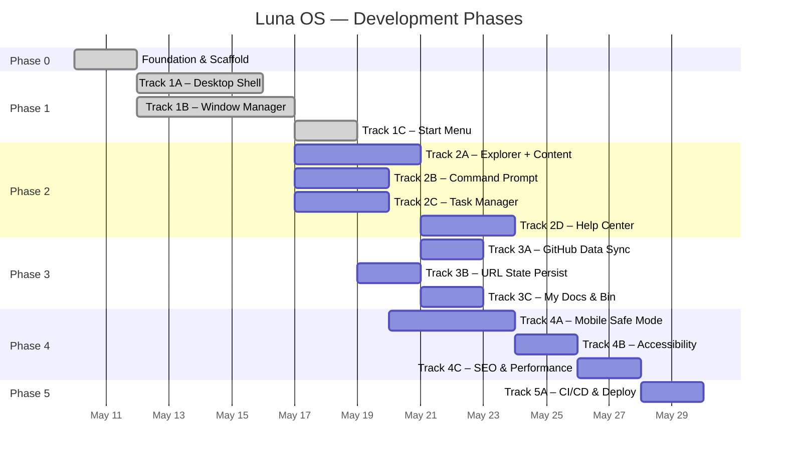
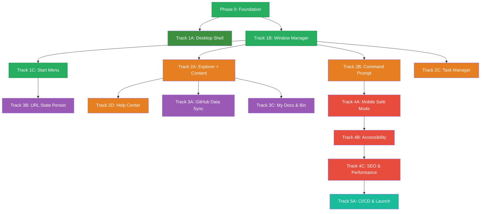

# Roadmap: Luna OS Portfolio

**Parent Docs:** [PRD.md](./PRD.md) · [TDD.md](./TDD.md)  
**Version:** 1.4 · **Updated:** 2026-05-12  
**Methodology:** Vertical slicing — each track delivers a testable end-to-end feature.

---

## Overview



---

## Phase 0 — Foundation & Scaffold ✅

> Bootstrap the project, install dependencies, and establish the design system. No features yet — just a buildable, styled skeleton. _(Completed 2026-05-11)_

### Tasks

- [x] Init Astro project with React, MDX, Tailwind integrations ([TDD §1](./TDD.md#1-project-structure))
- [x] Create directory structure: `components/`, `stores/`, `content/`, `lib/`, `styles/` ([TDD §1](./TDD.md#1-project-structure))
- [x] Install all dependencies with `pnpm` ([TDD §13](./TDD.md#13-dependencies))
- [x] Set up ESLint & Prettier for code formatting and linting
- [x] Set up TypeScript for strict typechecking
- [x] Set up Vitest for unit testing and coverage reporting
- [x] Create a custom file modularity script (e.g. `scripts/check-modularity.js`) to ensure files in `src/` do not exceed 500 lines
- [x] Configure Husky and lint-staged for git hooks:
  - [x] **pre-commit**: use `lint-staged` to run lint and file modularity check on staged files
  - [x] **pre-push**: run typecheck and vitest coverage (enforcing 80% threshold)
- [x] Create `src/styles/xp-theme.css` with full design token set ([TDD §5](./TDD.md#5-design-tokens--style-specification))
- [x] Add Tahoma font files to `public/fonts/` via `@font-face` system reference ([TDD §5.2](./TDD.md#52-typography))
- [x] Configure Tailwind v4 `@theme` block in `global.css` with XP theme tokens
- [x] Create `DesktopLayout.astro` skeleton ([TDD §6](./TDD.md#6-component-inventory))
- [x] Create `index.astro` mounting the layout ([TDD §1](./TDD.md#1-project-structure))
- [x] Verify: `pnpm dev` / `pnpm build` serves a blank page with correct fonts and XP blue background

### Acceptance Criteria

```
✅ Project builds and serves locally without errors (build: 2.4s)
✅ Code quality tools (ESLint, Prettier, TypeScript, Vitest) are fully configured
✅ Git hooks enforce pre-commit (lint, modularity) and pre-push (typecheck, coverage >= 80%) rules
✅ Custom modularity script successfully fails if a file in `src/` exceeds 500 lines
✅ XP design tokens are available in CSS (verified with 12 test assertions)
✅ Tahoma font loads correctly (via `@font-face` system reference)
✅ Directory structure matches TDD §1 (verified with 17 test assertions)
✅ 36 unit/integration tests passing, 0 type errors
```

### Key Files Created

```
src/styles/xp-theme.css          — Full Luna design token system (colors, borders, typography, animations)
src/styles/global.css             — Tailwind v4 @theme integration with XP tokens
src/layouts/DesktopLayout.astro   — XP-themed layout shell
src/pages/index.astro             — Entry point with placeholder mount points
astro.config.mjs                  — Astro 6 config with React, MDX, Tailwind
eslint.config.mjs                 — ESLint with TypeScript + React rules
vitest.config.ts                  — Vitest with 80% coverage thresholds
tsconfig.json                     — Strict TypeScript with @/ path aliases
scripts/check-modularity.js       — 500-line file size limiter
.husky/pre-commit                 — lint-staged + modularity check
.husky/pre-push                   — typecheck + coverage
tests/directory-structure.test.ts  — 17 directory existence tests
tests/xp-theme.test.ts             — 12 CSS token verification tests
tests/check-modularity.test.ts     — 2 modularity script tests
tests/pages/index.test.ts          — 5 integration tests
```

### Commits (shas tracked in plan.md)

Phase 0 produced 15 commits across ~8,400 lines changed (42 files). Track archived at `conductor/archive/foundation_scaffold_20260510/`.

---

## Phase 1 — Core Shell

### Track 1A — Desktop Shell ✅ _(Completed 2026-05-11)_

> Wallpaper, desktop icons grid, and static taskbar. Clicking icons does nothing yet — the window manager doesn't exist. Uses custom SVG/CSS generated art rather than real bitmap wallpaper.

**Refs:** [PRD §3.1](./PRD.md#31-the-desktop-experience) · [TDD §5.3](./TDD.md#53-classic-3d-border-system) · [TDD §5.4](./TDD.md#54-icon-sources) · [TDD §6 Astro Components](./TDD.md#astro-components-static)

#### Tasks

- [x] Add `--xp-taskbar-bg` and `--xp-start-btn-green` gradient tokens to `xp-theme.css` ([TDD §5.1](./TDD.md#51-color-palette))
- [x] Create `.xp-taskbar-border` utility class (top-edge-only outset border)
- [x] Create 5 custom desktop icon SVGs (My Computer, My Documents, Help & Support, Command Prompt, Recycle Bin) ([TDD §5.4](./TDD.md#54-icon-sources))
- [x] Create `Wallpaper.astro` — custom inline SVG/CSS Bliss-style rolling hills art with optional `imageSrc` prop ([TDD §6](./TDD.md#astro-components-static))
- [x] Create `DesktopIcon.astro` — icon + label with XP blue hover highlight, `data-window-id` and `data-window-label` attributes ([TDD §6](./TDD.md#astro-components-static), [TDD §9](./TDD.md#9-animations--transitions))
- [x] Layout 5 icon instances in left-aligned vertical column in `index.astro` (Astro static, zero JS)
- [x] Create `Taskbar.tsx` — React island with blue gradient bar, green Start button, and system tray using `var(--xp-taskbar-bg)` and `var(--xp-start-btn-green)` CSS tokens ([PRD §3.1](./PRD.md#31-the-desktop-experience))
- [x] Create `Clock.tsx` — React component displaying current time in HH:MM format, updating every 60 seconds, mounted in taskbar system tray

#### Acceptance Criteria

```
✅ Desktop shows custom CSS/SVG Bliss-style wallpaper filling the full viewport
✅ Wallpaper.astro accepts optional imageSrc prop for future bitmap fallback
✅ 5 desktop icons render in a left-aligned vertical column (top-left)
✅ Each DesktopIcon includes data-window-id and data-window-label attributes
✅ Icons show XP-style blue selection highlight on hover
✅ Taskbar spans full width at bottom with blue gradient and outset top border
✅ Taskbar uses top-edge-only outset border (.xp-taskbar-border)
✅ Green Start button visible on taskbar left (non-functional, ARIA labeled)
✅ Live clock in system tray showing user's local time (HH:MM, updates every minute)
✅ All icons are custom SVGs in public/icons/ (48×48 viewport)
✅ Zero-JS for wallpaper and icons (Astro static components; Taskbar & Clock = React client:load)
✅ --xp-taskbar-bg and --xp-start-btn-green CSS tokens added to xp-theme.css
✅ Looks authentically XP at a glance
```

#### Key Files Created

```
public/icons/*.svg                        — 5 custom 48×48 XP-inspired desktop icons
src/components/desktop/Wallpaper.astro     — CSS/SVG Bliss-style rolling hills wallpaper
src/components/desktop/DesktopIcon.astro   — Reusable icon component with XP hover highlight
src/components/taskbar/Clock.tsx           — React clock (HH:MM, 60s update)
src/components/taskbar/Taskbar.tsx         — React taskbar island with Start button + system tray
src/styles/xp-theme.css (modified)         — Added --xp-taskbar-bg, --xp-start-btn-green, .xp-taskbar-border
src/pages/index.astro (modified)           — Mounted Wallpaper, Icons, Taskbar
vitest.config.ts (modified)               — jsdom env, @testing-library/react, @/ alias
tests/setup.ts                            — jest-dom vitest matchers
tests/wallpaper.test.ts                   — 5 unit tests (Pattern B: source file read)
tests/desktop-icon.test.ts                — 7 unit tests (Pattern B: source file read)
tests/clock.test.tsx                      — 3 React component tests (@testing-library/react)
tests/taskbar.test.tsx                    — 4 React component tests (@testing-library/react)
tests/pages/index.test.ts (modified)      — 4 new integration tests (9 total)
```

#### Commits (shas tracked in plan.md)

Track 1A produced 11 feature/fix commits, 6 plan/checkpoint commits, 1 review fix commit across ~1,041 lines changed (18 files). Track archived at `conductor/archive/desktop_shell_20260511/`.

---

### Track 1B — Window Manager ✅ _(Completed 2026-05-12)_

> The core engineering challenge. Implement the Nano Stores-driven window system with open/close/drag/minimize/maximize/focus.

**Refs:** [TDD §3 (all subsections)](./TDD.md#3-window-manager-specification) · [TDD §6 React Islands](./TDD.md#react-islands-interactive)

#### Tasks

- [x] Create `src/stores/windows.ts` with `$windows`, `$zCounter`, `$activeWindow` stores ([TDD §3.1](./TDD.md#31-window-state-schema))
- [x] Implement all window actions: `openWindow`, `closeWindow`, `minimizeWindow`, `maximizeWindow`, `restoreWindow`, `focusWindow`, `moveWindow`, `resizeWindow` ([TDD §3.3](./TDD.md#33-window-actions))
- [x] Create `WindowLayer.tsx` — iterates `$windows`, renders `WindowFrame` for each ([TDD §6](./TDD.md#react-islands-interactive))
- [x] Create `WindowFrame.tsx` — chrome, 3D borders, rounded top corners ([TDD §5.3](./TDD.md#53-classic-3d-border-system))
- [x] Create `TitleBar.tsx` — icon, title, min/max/close buttons ([TDD §6](./TDD.md#react-islands-interactive))
- [x] Implement drag logic (title bar only, viewport-constrained) ([TDD §3.4](./TDD.md#34-behavior-rules))
- [x] Implement edge/corner resize with min size constraints ([TDD §3.2](./TDD.md#32-default-window-configs), [TDD §3.4](./TDD.md#34-behavior-rules))
- [x] Implement z-index stacking and focus-on-click ([TDD §3.4](./TDD.md#34-behavior-rules))
- [x] Implement minimize/maximize/restore with CSS transitions ([TDD §9](./TDD.md#9-animations--transitions))
- [x] Wire desktop icon double-click → `openWindow()` ([TDD §3.3](./TDD.md#33-window-actions))
- [x] Update `Taskbar` to show buttons for open windows ([TDD §3.4 Taskbar toggle](./TDD.md#34-behavior-rules))
- [x] Implement taskbar button toggle behavior (focus/minimize/restore) ([TDD §3.4](./TDD.md#34-behavior-rules))
- [x] Mount `WindowLayer` as React island with `client:only` in `DesktopLayout.astro` ([TDD §1 Island Boundary Rules](./TDD.md#island-boundary-rules))

#### Acceptance Criteria

```
✅ Double-clicking a desktop icon opens a window with placeholder content
✅ Windows can be dragged by title bar (viewport-constrained)
✅ Windows can be resized from edges/corners (min size enforced)
✅ Clicking a window brings it to front (z-index updates)
✅ Min/max/close buttons work with correct XP-style transitions
✅ Taskbar shows buttons for all open windows
✅ Taskbar toggle: click focused → minimize, click minimized → restore, click unfocused → focus
✅ Multiple windows can be open simultaneously without state conflicts
✅ Windows open with scale-in animation (150ms), close with scale-out (120ms)
✅ Minimize slides window toward taskbar (200ms), restore expands from cached position
✅ Maximize fills viewport minus 40px taskbar height
✅ All animations respect prefers-reduced-motion: reduce
✅ Window system uses pointer-events layering for click-through when no windows open
```

#### Key Files Created

```
src/stores/windows.ts                  — Nano Stores: $windows, $zCounter, $activeWindow, all 8 actions
src/components/window/TitleBar.tsx     — XP-style title bar with active/inactive gradient
src/components/window/WindowFrame.tsx  — 3D chrome border, 8 resize handles, CSS animations
src/components/window/WindowLayer.tsx  — Store subscriber, drag/resize logic, event listener
src/lib/useStore.ts                    — Custom React hook (useState/useEffect) to subscribe to Nano Stores
src/components/desktop/DesktopIcon.astro (modified) — onclick/ondblclick handlers for window opening
src/components/taskbar/Taskbar.tsx (modified)       — Window buttons with toggle behavior
src/pages/index.astro (modified)                    — WindowLayer mount + pointer-events fix
src/styles/global.css (modified)                    — Animation keyframes + prefers-reduced-motion
```

#### Commits (shas tracked in plan.md)

Track 1B produced 17 feature/fix commits, 6 plan/checkpoint commits, 1 review fix commit, 1 docs sync commit across ~2,400 lines changed (29 files). Track archived at `conductor/archive/window_manager_20260511/`.

---

### Track 1C — Start Menu ✅ _(Completed 2026-05-12)_

> Fully interactive Start Menu with two-column layout, user header, and program list that opens windows. Includes XP-style shutdown overlay with auto-reboot.

**Refs:** [PRD §3.1](./PRD.md#31-the-desktop-experience) · [TDD §7.3](./TDD.md#73-start-menu-layout) · [TDD §9](./TDD.md#9-animations--transitions)

#### Tasks

- [x] Create `src/stores/desktop.ts` with `$startMenuOpen` atom and toggle/open/close actions
- [x] Create `StartMenu.tsx` with two-column layout ([TDD §7.3](./TDD.md#73-start-menu-layout))
- [x] Add blue header bar with "MARP" initials avatar and "Muhammad Ansyar Rafi Putra" name
- [x] Add left column: pinned apps (Resume, Explorer, Task Manager, CMD)
- [x] Add right column: system folders (My Documents, My Computer, Control Panel, Help)
- [x] Add bottom bar with "Shut Down..." button and power icon
- [x] Wire menu items to `openWindow()` + close Start Menu
- [x] Implement keyboard navigation (Tab/Shift+Tab focus cycling, Enter activation, Escape close)
- [x] Implement click-outside detection to close menu
- [x] Wire Start button toggle in Taskbar with active pressed state
- [x] Implement slide-up (150ms) / slide-down (100ms) animation ([TDD §9](./TDD.md#9-animations--transitions))
- [x] Create `ShutdownOverlay.tsx` — 3-phase XP shutdown sequence with progress bar (~6s total, auto-reboot)
- [x] Respect `prefers-reduced-motion: reduce` for all animations
- [x] Use `--xp-start-*` CSS tokens from design system for styling

#### Acceptance Criteria

```
✅ Clicking Start button opens the two-column menu with slide-up animation (150ms ease-out)
✅ Menu shows blue header with "MARP" initials avatar and "Muhammad Ansyar Rafi Putra" name
✅ Left column: Resume, Explorer, Task Manager, Command Prompt
✅ Right column: My Documents, My Computer, Control Panel, Help & Support
✅ Each menu item opens the corresponding window and closes the menu
✅ Clicking outside or pressing Escape closes the menu (slide-down, 100ms ease-in)
✅ Tab key cycles through menu items with visible ARIA focus tracking; Enter activates
✅ "Shut Down..." shows an XP "Windows is shutting down" screen — NOT a BSOD (reserved for 404)
✅ After shutdown sequence completes (~6s), desktop is restored (auto-reboot)
✅ Start button shows pressed state when menu is open
✅ All --xp-start-* CSS tokens from xp-theme.css are used for styling
✅ All animations respect prefers-reduced-motion: reduce
✅ 201 tests passing, 95%+ coverage
```

#### Key Files Created

```
src/stores/desktop.ts                    — Nano Stores: $startMenuOpen, $shuttingDown, 5 action functions
src/components/taskbar/StartMenu.tsx     — Two-column menu, keyboard nav, click-outside, animations
src/components/taskbar/ShutdownOverlay.tsx — 3-phase shutdown sequence with progress bar
src/components/taskbar/Taskbar.tsx (modified) — Start button wiring, StartMenu mount, Fragment wrapper
src/styles/xp-theme.css (modified)       — Added --xp-start-* CSS tokens, .startmenu-icon class
src/styles/global.css (modified)         — Added @keyframes for start-menu-open/close and shutdownProgress
public/icons/task-manager.svg            — New icon asset (was missing from 5-icon set)
tests/stores/desktop.test.ts             — 10 store tests (start menu + shutdown state)
tests/start-menu.test.tsx                — 29 component tests (rendering, actions, keyboard, icons)
tests/shutdown-overlay.test.tsx          — 5 shutdown overlay tests (render, timers, cleanup)
tests/taskbar.test.tsx (modified)         — 2 new Start button wiring tests
tests/setup.ts (modified)                — window.matchMedia mock for jsdom
```

#### Commits (shas tracked in plan.md)

Track 1C produced 14 code/feature/test commits, 11 plan/checkpoint commits, 1 review fix commit across ~1,100 lines changed (16 files). Track archived at `conductor/archive/start_menu_20260512/`.

---

## Phase 2 — Applications

### Track 2A — Explorer + Content

> File explorer with breadcrumb navigation through the virtual filesystem. Project MDX content renders inside the window.

**Refs:** [PRD §4](./PRD.md#4-file-system--content-mapping) · [TDD §4.1](./TDD.md#41-project-mdx-frontmatter) · [TDD §4.3](./TDD.md#43-virtual-filesystem-tree) · [TDD §6](./TDD.md#react-islands-interactive)

#### Tasks

- [ ] Create `src/content/config.ts` with `projects` collection schema ([TDD §4.1](./TDD.md#41-project-mdx-frontmatter))
- [ ] Write MDX files for `icarus-server-manager`, `portable-mc-manager`, `tubular-bexus-osw`, and other featured projects ([PRD §4](./PRD.md#-directory-details))
- [ ] Create `src/lib/constants.ts` with `FILE_SYSTEM` tree built from content collections ([TDD §4.3](./TDD.md#43-virtual-filesystem-tree))
- [ ] Create `Explorer.tsx` — address bar, toolbar, breadcrumb, file list pane ([TDD §6](./TDD.md#react-islands-interactive))
- [ ] Implement folder navigation (`cd` into directories, back button)
- [ ] Render file list with 16×16 icons, name, size, type columns (XP detail view)
- [ ] Clicking a project file opens its MDX content in the Explorer detail pane
- [ ] Wire "My Computer" icon → Explorer at root (`C:\`, `D:\`, `E:\`)
- [ ] Wire drive icons to their respective folders ([PRD §4](./PRD.md#-desktop-icons))

#### Acceptance Criteria

```
✅ Double-click My Computer → Explorer opens showing C:, D:, E: drives
✅ Navigate into C:\Software_Engineering → see project files listed
✅ Click a project → MDX content renders in the Explorer window
✅ Breadcrumb updates and is clickable for navigation
✅ Back button works correctly
✅ File list matches XP Explorer detail view aesthetically
```

---

### Track 2B — Command Prompt

> Functional terminal emulator with command parsing, history, and filesystem navigation.

**Refs:** [PRD §5.1](./PRD.md#51-command-prompt-cmdexe) · [TDD §7.1](./TDD.md#71-command-prompt) · [TDD §4.3](./TDD.md#43-virtual-filesystem-tree)

#### Tasks

- [ ] Create `CmdPrompt.tsx` — black terminal with blinking cursor ([TDD §7.1](./TDD.md#71-command-prompt))
- [ ] Create `src/lib/commands.ts` — command registry and parser ([TDD §1](./TDD.md#1-project-structure))
- [ ] Implement all commands: `help`, `ls`/`dir`, `cd`, `cat`, `clear`/`cls`, `neofetch`, `open`, `whoami`, `echo` ([TDD §7.1](./TDD.md#71-command-prompt))
- [ ] Implement command history via ↑/↓ arrow keys (stored in window state) ([TDD §7.1](./TDD.md#71-command-prompt))
- [ ] Navigate the same `FILE_SYSTEM` tree used by Explorer ([TDD §4.3](./TDD.md#43-virtual-filesystem-tree))
- [ ] `open` command triggers `openWindow()` for the target ([TDD §7.1](./TDD.md#71-command-prompt))
- [ ] Unknown commands show XP-style error message ([TDD §7.1](./TDD.md#71-command-prompt))
- [ ] Auto-scroll to bottom on new output
- [ ] Create `neofetch` ASCII art + system info layout

#### Acceptance Criteria

```
✅ CMD opens with "C:\MANSYAR>" prompt and blinking cursor
✅ All 9 commands produce correct output
✅ `cd` + `ls` navigate the virtual filesystem consistently with Explorer
✅ `open resume.pdf` opens the PDF in a new tab
✅ Arrow keys cycle through command history
✅ Unknown command shows: "'xyz' is not recognized as an internal or external command."
```

---

### Track 2C — Task Manager

> Processes list and animated performance graphs representing skills.

**Refs:** [PRD §5.2](./PRD.md#52-task-manager-control-panel) · [TDD §7.2](./TDD.md#72-task-manager)

#### Tasks

- [ ] Create `TaskManager.tsx` with tab switching (Processes / Performance) ([TDD §7.2](./TDD.md#72-task-manager))
- [ ] Implement Processes tab with table: Image Name, PID, CPU, Mem, Description ([TDD §7.2](./TDD.md#72-task-manager))
- [ ] Animate CPU % with ±3% random fluctuation every 1s ([TDD §7.2](./TDD.md#72-task-manager))
- [ ] Implement Performance tab with `<canvas>` or SVG line graphs ([TDD §7.2](./TDD.md#72-task-manager))
- [ ] Green line on black grid, scrolling left, updating every 1s
- [ ] Style tabs and chrome to match XP Task Manager

#### Acceptance Criteria

```
✅ Task Manager opens with Processes tab showing 8+ skill entries
✅ CPU percentages animate with subtle fluctuation
✅ Performance tab shows two live-updating line graphs
✅ Tab switching works correctly
✅ Visually matches XP Task Manager aesthetic
```

---

### Track 2D — Help & Support Center

> MDX article browser styled as the XP Help and Support Center pane.

**Refs:** [PRD §5.3](./PRD.md#53-help--support-center) · [TDD §4.1](./TDD.md#41-project-mdx-frontmatter) (devopsAcademy schema) · [TDD §6](./TDD.md#react-islands-interactive)

#### Tasks

- [ ] Create `src/content/config.ts` `devopsAcademy` collection schema ([TDD §4.1](./TDD.md#41-project-mdx-frontmatter))
- [ ] Write initial MDX articles from `devops-from-scratch` repo ([PRD §5.3](./PRD.md#53-help--support-center))
- [ ] Create `HelpCenter.tsx` — blue/white pane with search bar and sidebar ([PRD §5.3](./PRD.md#53-help--support-center))
- [ ] Implement sidebar category tree navigation
- [ ] Implement basic text search filtering over articles
- [ ] Render selected MDX article in the main content pane
- [ ] Style to match XP "Help and Support Center" window

#### Acceptance Criteria

```
✅ Help & Support opens showing categories in sidebar
✅ Clicking a category shows its articles
✅ Clicking an article renders MDX content
✅ Search bar filters articles by title/description
✅ Layout matches the classic XP Help pane aesthetic
```

---

## Phase 3 — Integration & Data

### Track 3A — GitHub Data Sync

> Build-time GitHub API fetching to populate project metadata (stars, commits, last push).

**Refs:** [PRD §6](./PRD.md#6-devops--deployment-strategy) · [TDD §4.2](./TDD.md#42-github-api-data-shape) · [TDD §14](./TDD.md#14-build--deploy-pipeline)

#### Tasks

- [ ] Create `src/lib/github.ts` with `fetchRepoStats()` ([TDD §4.2](./TDD.md#42-github-api-data-shape))
- [ ] Integrate into Astro build pipeline — fetch data, merge into content collection entries
- [ ] Cache last-good API response in `src/content/_cache/github.json` ([TDD §11](./TDD.md#11-error-states))
- [ ] Fallback to cache on API failure with console warning ([TDD §11](./TDD.md#11-error-states))
- [ ] Verify fetched data appears in Explorer project listings and CMD `cat` output

#### Acceptance Criteria

```
✅ `pnpm build` fetches live GitHub data and injects into project content
✅ Explorer shows real star counts and last commit dates
✅ If GitHub API is unreachable, build succeeds using cached data
```

---

### Track 3B — URL State Persistence

> Sync window state to URL search params for deep-linking and share-ability.

**Refs:** [TDD §2](./TDD.md#2-routing--url-strategy)

#### Tasks

- [ ] Create URL ↔ store sync logic in `src/stores/windows.ts` ([TDD §2](./TDD.md#2-routing--url-strategy))
- [ ] On page load: parse `?w=`, `?focus=`, `?start=`, `?path=` → hydrate stores
- [ ] On store change: debounced `replaceState()` to update URL (no reload) ([TDD §2](./TDD.md#2-routing--url-strategy))
- [ ] Test all deep-link examples from TDD §2

#### Acceptance Criteria

```
✅ Opening windows updates the URL with correct params
✅ Pasting a URL with `?w=cmd,taskmanager&focus=cmd` opens both windows with CMD focused
✅ Closing all windows returns URL to clean `/`
✅ Browser back/forward navigates window state history
```

---

### Track 3C — My Documents & Recycle Bin

> My Documents contains resume, certs, and contact info. Recycle Bin links to legacy content.

**Refs:** [PRD §4](./PRD.md#-desktop-icons) · [TDD §4.4](./TDD.md#44-resume)

#### Tasks

- [ ] Add `resume.pdf` to `public/` ([TDD §4.4](./TDD.md#44-resume))
- [ ] Create My Documents Explorer view: `Resume.pdf`, `Certs/` folder, `Contact.txt`
- [ ] PDF click → `window.open()` in new tab ([TDD §4.4](./TDD.md#44-resume))
- [ ] Create Recycle Bin Explorer view with links to `mansyar.github.io` and old repos ([PRD §4](./PRD.md#-desktop-icons))

#### Acceptance Criteria

```
✅ My Documents opens showing Resume.pdf, Certs folder, Contact.txt
✅ Clicking Resume.pdf opens the PDF in a new browser tab
✅ Recycle Bin shows legacy project links (styled as "deleted" files)
```

---

## Phase 4 — Mobile & Polish

### Track 4A — Mobile Safe Mode

> Full mobile experience: BIOS boot sequence, terminal menu navigation, all content accessible.

**Refs:** [PRD §3.2](./PRD.md#32-the-mobile-experience-safe-mode) · [TDD §8](./TDD.md#8-mobile-safe-mode-specification)

#### Tasks

- [ ] Create `SafeModeShell.astro` — black screen with green monospace text ([TDD §8](./TDD.md#8-mobile-safe-mode-specification))
- [ ] Implement boot sequence animation (line-by-line text, 50ms/line) ([TDD §8](./TDD.md#8-mobile-safe-mode-specification), [TDD §9](./TDD.md#9-animations--transitions))
- [ ] Create numbered menu system: `[1] Projects [2] Skills [3] About [4] Contact` ([TDD §8](./TDD.md#8-mobile-safe-mode-specification))
- [ ] Render all content (projects, skills, about, contact) as monospace text blocks
- [ ] Implement `[0] Back` navigation ([TDD §8](./TDD.md#8-mobile-safe-mode-specification))
- [ ] Add CRT scanline + curvature CSS effects ([TDD §8](./TDD.md#8-mobile-safe-mode-specification))
- [ ] Conditional rendering: viewport < 768px → Safe Mode, else → Desktop ([PRD §3.2](./PRD.md#32-the-mobile-experience-safe-mode))

#### Acceptance Criteria

```
✅ Resizing browser below 768px shows the Safe Mode boot sequence
✅ Boot text appears line-by-line, then shows numbered menu
✅ All 4 menu options render their content correctly
✅ [0] Back returns to previous menu
✅ CRT visual effects are visible and subtle
✅ All portfolio content is accessible on mobile
```

---

### Track 4B — Accessibility

> Keyboard navigation, ARIA roles, focus management, and reduced motion support.

**Refs:** [TDD §10](./TDD.md#10-accessibility-strategy)

#### Tasks

- [ ] Add ARIA roles to all interactive components ([TDD §10](./TDD.md#10-accessibility-strategy))
- [ ] Implement keyboard navigation: `Tab` cycles icons → taskbar → windows ([TDD §10](./TDD.md#10-accessibility-strategy))
- [ ] `Enter` activates focused element, `Escape` closes menus/windows ([TDD §10](./TDD.md#10-accessibility-strategy))
- [ ] Focus management: opening window moves focus to it, closing returns focus ([TDD §10](./TDD.md#10-accessibility-strategy))
- [ ] Add `aria-hidden="true"` to decorative elements ([TDD §10](./TDD.md#10-accessibility-strategy))
- [ ] Add `@media (prefers-reduced-motion: reduce)` to disable animations ([TDD §10](./TDD.md#10-accessibility-strategy))
- [ ] Verify color contrast passes WCAG AA

#### Acceptance Criteria

```
✅ Entire site navigable with keyboard only (no mouse required)
✅ Screen reader announces windows, menus, and content correctly
✅ Focus is visible and moves logically
✅ Animations disabled with prefers-reduced-motion
```

---

### Track 4C — SEO & Performance

> Meta tags, Open Graph, structured data, performance tuning to hit TBT < 100ms.

**Refs:** [PRD §7](./PRD.md#7-success-metrics) · [TDD §12](./TDD.md#12-seo--meta-strategy)

#### Tasks

- [ ] Create `MetaTags.astro` component ([TDD §6](./TDD.md#astro-components-static), [TDD §12](./TDD.md#12-seo--meta-strategy))
- [ ] Add title, description, OG tags, and structured data ([TDD §12](./TDD.md#12-seo--meta-strategy))
- [ ] Generate `og-preview.png` screenshot ([TDD §12](./TDD.md#12-seo--meta-strategy))
- [ ] Create 404 page styled as BSOD ([TDD §11](./TDD.md#11-error-states))
- [ ] Optimize asset pipeline: AVIF/WebP images, font subsetting ([PRD §6](./PRD.md#6-devops--deployment-strategy))
- [ ] Audit with Lighthouse — target TBT < 100ms ([PRD §7](./PRD.md#7-success-metrics))
- [ ] Add `<noscript>` fallback listing all projects ([TDD §11](./TDD.md#11-error-states))

#### Acceptance Criteria

```
✅ Lighthouse Performance score > 90
✅ TBT < 100ms
✅ OG preview renders correctly when shared on social media
✅ 404 page shows a styled BSOD
✅ Content accessible with JavaScript disabled via <noscript>
```

---

## Phase 5 — Deploy

### Track 5A — CI/CD & Launch

> GitHub Actions pipeline with CRON-triggered rebuilds, Cloudflare Pages deployment.

**Refs:** [PRD §6](./PRD.md#6-devops--deployment-strategy) · [TDD §14](./TDD.md#14-build--deploy-pipeline)

#### Tasks

- [ ] Create `.github/workflows/deploy.yml` ([TDD §14](./TDD.md#14-build--deploy-pipeline))
- [ ] Configure build steps: `pnpm install` → fetch GitHub data → `astro build` → deploy
- [ ] Add CRON trigger: `0 0 * * *` (daily at 00:00 UTC) ([PRD §6](./PRD.md#6-devops--deployment-strategy))
- [ ] Configure Cloudflare Pages project
- [ ] Set up custom domain (`mansyar.dev`) with SSL
- [ ] Smoke test: push to main → site live within 2 minutes

#### Acceptance Criteria

```
✅ Push to main triggers automatic build and deploy
✅ Site is live on mansyar.dev with SSL
✅ CRON job triggers daily build to refresh GitHub data
✅ Build completes in under 60 seconds
```

---

## Track Dependency Graph



### Parallel Work Opportunities

| Tracks that can run in parallel | After                 |
| :------------------------------ | :-------------------- |
| Track 1A + Track 1B             | Phase 0               |
| Track 2A + Track 2B + Track 2C  | Track 1B              |
| Track 3A + Track 3B + Track 3C  | Their respective deps |

---

## Legend

| Status  | Meaning     |
| :------ | :---------- |
| `- [ ]` | Not started |
| `- [x]` | Complete    |
| `🚧`    | In progress |
| `🔴`    | Blocked     |
