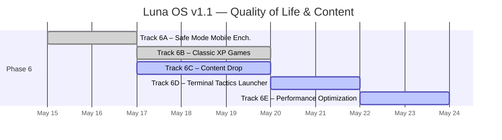
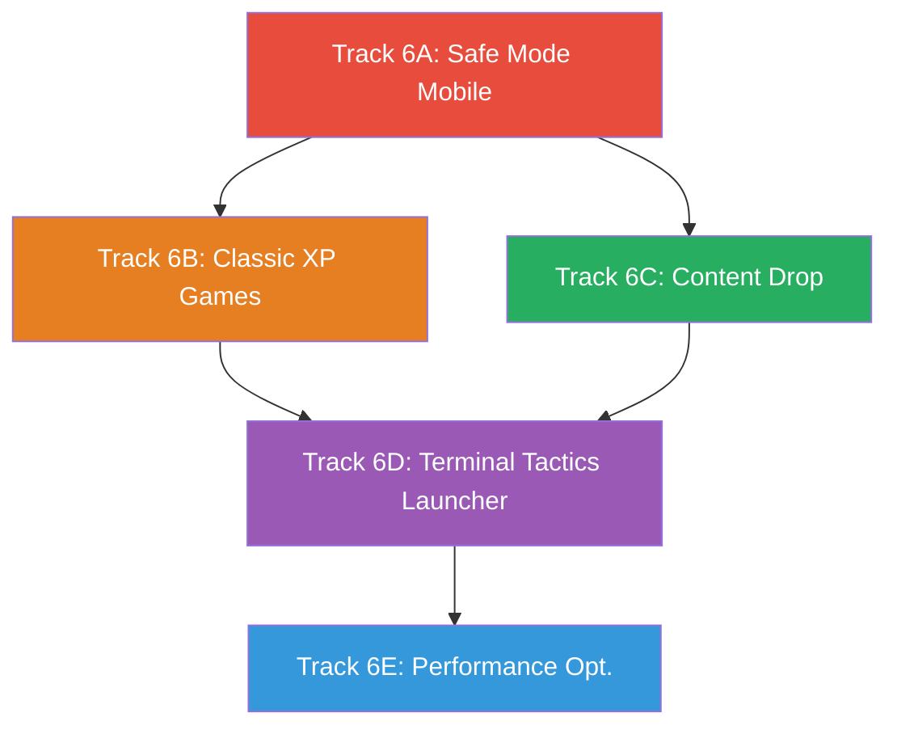

# Roadmap: Luna OS Portfolio — v1.1

**Parent Docs:** [ROADMAP_v1.md](./archive/ROADMAP_v1.md)  
**Version:** 1.1 · **Updated:** 2026-05-15  
**Methodology:** Vertical slicing — each track delivers a testable end-to-end feature.

---

## Overview



## Phase 6 — Quality of Life & Content

> The first post-launch iteration. Delivers mobile UX polish, native XP games (Pong + Minesweeper), content expansion (projects, articles, resume, OG image, certifications), a Terminal Tactics itch.io game launcher, and a full performance optimization pass.

---

### Track 6A — Safe Mode Mobile Enhancement ✅

> Touch gesture support, cross-fade transitions, swipe-to-go-back, and content dimming for the mobile Safe Mode experience. Turns the functional-but-abrupt terminal into a polished, app-like navigable interface with BIOS-appropriate animations.

**Refs:** [ROADMAP_v1 §Track 4A](../archive/ROADMAP_v1.md#track-4a--mobile-safe-mode-) · T6A [spec](conductor/tracks/safe-mode-mobile_20260515/spec.md) · T6A [plan](conductor/tracks/safe-mode-mobile_20260515/plan.md)

#### Tasks

- [x] Implement view stack architecture (outgoing/incoming views rendered simultaneously)
- [x] Add cross-fade transitions: outgoing disappears instantly, incoming fades in (0→1, 200ms)
- [x] Implement swipe-to-go-back gesture from left edge (40px detection, >80px commit)
- [x] Add content dimming marker class on outgoing view during transitions
- [x] Respect `prefers-reduced-motion: reduce` (disable transitions, keep dimming)
- [x] Write 23 tests (cross-fade, swipe, dimming, existing)
- [x] Verify no regressions in existing keyboard/touch navigation
- [x] **Update PRD §3.2 (Mobile Experience)** — add gestures, cross-fade transitions, dimming
- [x] **Update TDD §8 (Mobile Safe Mode)** — add view stack, swipe gesture, cross-fade specs

#### Acceptance Criteria

```
✅ Swiping right from the left edge (within 40px) navigates back one view level
✅ Swipe < 80px snaps back with no navigation (cancel gesture)
✅ Opacity fade (1→0) provides visual feedback during drag
✅ Swipe-committed back is instant (no cross-fade transition)
✅ Vertical swipes are ignored (scrolling still works)
✅ Forward programmatic navigation: outgoing disappears instantly, incoming fades in (200ms)
✅ Back programmatic navigation: same transition as forward (uniform BIOS feel)
✅ Both outgoing and incoming views render simultaneously (overlaid on same grid cell)
✅ Outgoing view has content-dimming class during transitions
✅ prefers-reduced-motion disables all cross-fade transitions (dimming still functions)
✅ All existing Safe Mode tests continue to pass (673/673 total)
✅ All src/ files under 500 lines
```

#### Docs Updated

| Document           | Sections | What Changed                                                                               |
| :----------------- | :------- | :----------------------------------------------------------------------------------------- |
| [PRD.md](./PRD.md) | §3.2     | Mobile Safe Mode — added swipe gesture, cross-fade transitions, content dimming            |
| [TDD.md](./TDD.md) | §8, §9   | Mobile spec — view stack architecture, swipe gesture, cross-fade, dimming; animation table |

#### Key Files Modified

```
src/components/mobile/TerminalNav.tsx — View stack, cross-fade, swipe gesture, content dimming
src/styles/xp-safe-mode.css — Cross-fade keyframes, grid overlay, reduced-motion
tests/TerminalNav-transitions.test.tsx — Cross-fade transition tests (4)
tests/TerminalNav-swipe.test.tsx — Swipe gesture tests (8)
tests/TerminalNav-dimming.test.tsx — Content dimming tests (4)
tests/TerminalNav.test.tsx — Updated existing test for dual-view rendering
docs/PRD.md — §3.2 Mobile Experience
docs/TDD.md — §8 Mobile Safe Mode, §9 Animations & Transitions
```

---

### Track 6B — Classic XP Games

> Two native canvas-based games — **Pong** (VS AI) and **Minesweeper** (9×9 Beginner) — running directly inside the XP window system as first-class apps. Desktop icons, CMD commands, and Start Menu integration included.

**Refs:** [ROADMAP_v1 §Track 2C](../archive/ROADMAP_v1.md#track-2c--task-manager-) (Canvas precedent) · T6B [spec](conductor/tracks/classic-xp-games_20260515/spec.md) · T6B [plan](conductor/tracks/classic-xp-games_20260515/plan.md)

#### Tasks

##### Phase 1 — Pong (VS AI) ✅

- [x] Create `src/components/apps/Pong.tsx` — Canvas-based Pong game
  - [x] Game loop via `requestAnimationFrame` with delta-time
  - [x] Player paddle: controlled by keyboard (W/S or Arrow Up/Down)
  - [x] AI paddle: simple tracking with difficulty-dependent speed (Easy: 0.7×, Medium: 1.0×, Hard: 1.4×), configurable reaction delay + error margin, capped at 600 px/s
  - [x] Ball physics: angle reflection off paddles, wall bounces, speed increase per hit (capped at 600 px/s)
  - [x] Score tracking: first to 5 wins, display score at top of canvas
  - [x] Game states: `menu` (difficulty select), `waiting` ("Press SPACE to start"), `playing`, `scored` (brief pause), `won`/`lost` (result + "Press SPACE to restart")
  - [x] XP-styled border around canvas, Tahoma font for score text
  - [x] Respect `prefers-reduced-motion` (cap ball speed at 60%)
  - [x] Pause on window minimize (stop rAF loop), resume on restore
  - [x] Keyboard: Escape to close window, Space to start/restart, R to restart from any state, W/S or Arrow Up/Down for paddle

- [x] Write Pong tests
  - [x] Canvas render (smoke test)
  - [x] Ball-wall collision (4 tests)
  - [x] Paddle-ball collision (8 tests)
  - [x] AI tracking behavior (4 tests)
  - [x] Score state transitions
  - [x] 44 total Pong tests (31 physics + 13 component)

##### Phase 2 — Minesweeper (9×9 Beginner) ✅

- [x] Create `src/components/apps/Minesweeper.tsx` — Canvas-based Minesweeper
  - [x] 9×9 grid, 10 mines, standard Minesweeper rules
  - [x] Left-click: reveal cell; Right-click: toggle flag
  - [x] Flood-fill: BFS-based auto-reveal of adjacent empty cells
  - [x] Mine explosion: reveal all mines on loss, highlight triggered mine in red
  - [x] Win detection: all non-mine cells revealed; auto-flags remaining mines on win
  - [x] Timer: counts up from 0 in seconds, displayed in header area, starts on first click
  - [x] Mine counter: shows remaining mines (total - flags placed)
  - [x] Smiley face button: 🙂 (playing), 😮 (clicking), 😎 (won), 💀 (lost) — click to restart
  - [x] First click guarantee: first click is never a mine (re-generate board if needed)
  - [x] XP-styled border around game area, Courier New monospace for counter/timer
  - [x] Keyboard: R to restart, Escape to close window
  - [x] Canvas rendering: grid lines, numbered cells (1-8 with classic number colors), flag icon, mine icon, 3D raised/inset cell borders

- [x] Write Minesweeper tests
  - [x] Board generation (6 tests: dimensions, mine count, hidden state, first-click safety, validation, adjacency)
  - [x] Flood-fill logic through `revealCell`
  - [x] Win/loss detection
  - [x] Flag toggle (4 tests)
  - [x] First-click safety
  - [x] Timer start/stop
  - [x] 40 total Minesweeper tests (30 engine + 10 component)

##### Phase 3 — Integration ✅

- [x] Add `pong` and `minesweeper` to `WindowId` type in `stores/windows.ts`
- [x] Add default window configs for both games (Pong: 620×460, Minesweeper: 380×450)
- [x] Wire both games into `WindowLayer.renderContent()` — Pong and Minesweeper component imports + case branches
- [x] Create desktop icons: `public/icons/pong.svg`, `public/icons/minesweeper.svg` (48×48 XP-styled)
- [x] Add desktop icons to `index.astro` (vertical column, below Recycle Bin)
- [x] Add both games to Start Menu pinned apps list (LEFT_ITEMS, after Command Prompt)
- [x] Register `pong` and `minesweeper` CMD commands → returns `{ openWindow: 'pong'/'minesweeper' }` — opens via `openWindow` field in `CmdOutput`
- [x] Verify multi-window coexistence (games + Explorer + CMD all open simultaneously)
- [x] Verify all games respect window minimize (pause/resume rAF)
- [x] **Docs — Update PRD §5 (Application Specs)** — added §5.4 Pong and §5.5 Minesweeper app specs
- [x] **Docs — Update TDD §3.1 (WindowId type)** — added `'pong' | 'minesweeper'` to the union
- [x] **Docs — Update TDD §3.2 (Default Window Configs)** — added Pong and Minesweeper rows
- [x] **Docs — Update TDD §6 (Component Inventory)** — added Pong and Minesweeper to React Islands table

#### Acceptance Criteria

```
✅ Pong opens in XP window (~600×450), VS AI opponent, first-to-5 scoring
✅ Player paddle controlled by W/S or Arrow Up/Down keys
✅ Ball reflects off paddles and walls with accurate collision detection
✅ SPACE to start/restart, Escape to close window
✅ AI opponent is beatable (configurable reaction delay + error margin)
✅ Score displayed at canvas top in Tahoma font
✅ Games pause on window minimize (rAF stops, resumes on restore)

✅ Minesweeper opens in XP window (~400×450), 9×9 grid, 10 mines
✅ Left-click reveals cell; Right-click flags/unflags
✅ Flood-fill reveals empty regions instantly
✅ First click is never a mine
✅ Timer counts up from 0; mine counter shows remaining mines
✅ Smiley face button shows game state and restarts on click
✅ R to restart game, Escape to close window

✅ Both games have desktop icons and Start Menu entries
✅ `pong` and `minesweeper` CMD commands open respective windows
✅ Multiple windows (games + apps) can be open simultaneously
✅ All animations respect prefers-reduced-motion: reduce
✅ All existing tests continue to pass
✅ All src/ files under 500 lines
```

#### Key Files Created

```
src/components/apps/Pong.tsx — Canvas-based Pong with VS AI, ~250 lines
src/components/apps/Minesweeper.tsx — Canvas-based Minesweeper 9×9, ~350 lines
public/icons/pong.svg — 48×48 XP-styled Pong desktop icon
public/icons/minesweeper.svg — 48×48 XP-styled Minesweeper desktop icon
tests/pong.test.tsx — Pong unit tests (collision, AI, scoring, states)
tests/minesweeper.test.tsx — Minesweeper unit tests (board, flood-fill, win/loss, flags)
```

#### Docs Updated

| Document           | Sections            | What Changed                                                |
| :----------------- | :------------------ | :---------------------------------------------------------- |
| [PRD.md](./PRD.md) | §5 (new §5.4, §5.5) | Added Pong and Minesweeper application specs                |
| [TDD.md](./TDD.md) | §3.1, §3.2, §6      | Updated WindowId type, default configs, component inventory |

#### Key Files Modified

```
src/stores/windows.ts — Added pong + minesweeper to WindowId, default configs
src/components/window/WindowLayer.tsx — Render Pong/Minesweeper components
src/pages/index.astro — Add game desktop icons
src/components/taskbar/StartMenu.tsx — Add games to pinned apps
src/lib/commands.ts — Add pong + minesweeper commands
src/styles/global.css — Game-specific keyframes, reduced-motion support
tests/window/windowlayer.test.tsx — Game integration tests
docs/PRD.md — §5.4 Pong, §5.5 Minesweeper
docs/TDD.md — §3.1, §3.2, §6
```

---

### Track 6C — Content Drop

> Expand the portfolio's substance with new project write-ups, knowledge base articles, a real resume PDF, and visual assets (OG preview image, certifications). This is where the portfolio gains genuine depth for recruiters.

**Refs:** [PRD §4](./PRD.md#4-file-system--content-mapping) · [ROADMAP_v1 §Track 2A](./archive/ROADMAP_v1.md#track-2a--explorer-content-) · T6C [spec](conductor/tracks/content-drop_20260515/spec.md) · T6C [plan](conductor/tracks/content-drop_20260515/plan.md)

#### Tasks

- [ ] **Projects — Add 1-2 new MDX files**
  - [ ] Create project MDX files in `src/content/projects/` with full frontmatter (title, description, repoUrl, tech stack, etc.)
  - [ ] Update virtual filesystem `FILE_SYSTEM` and `scripts/generate-filesystem.mjs` to include new entries
  - [ ] Update `src/lib/projects-data.ts` with new metadata
  - [ ] Write tests verifying frontmatter schema for new entries

- [ ] **Knowledge Base — Add 2-3 new articles**
  - [ ] Create article MDX files in `src/content/articles/` with frontmatter (title, description, category, order)
  - [ ] Populate body content with substantive technical writing
  - [ ] Update `E:\Knowledge_Base` filesystem structure with new articles in appropriate category folders
  - [ ] Verify compile script picks up new articles → `articles-content.json`

- [ ] **Resume PDF**
  - [ ] Generate a polished, professional PDF resume using first-class design tools
  - [ ] Place at `public/resume.pdf`, replacing the placeholder
  - [ ] Verify "My Documents → Resume.pdf" opens correctly in new tab

- [ ] **OG Preview Image**
  - [ ] Generate a social media preview card image at `/public/og-preview.png` (1200×630px)
  - [ ] Design with Luna OS branding (XP blue, screen with desktop icons, "Muhammad Ansyar Rafi Putra" text)
  - [ ] Verify `<meta property="og:image">` renders correctly in MetaTags

- [ ] **Certifications**
  - [ ] Add cert entries to `D:\My_Documents\Certs\` folder
  - [ ] Create cert detail view component or detail pane entries for cert items
  - [ ] Wire Certs folder navigation to display cert metadata (issuer, date, credential URL)

- [ ] **Update build pipeline**
  - [ ] Re-run `scripts/prebuild.mjs` to regenerate content JSON files
  - [ ] Verify `pnpm build` completes with new content
- [ ] **Docs — Update PRD §4 (File System & Content Mapping)** — add new projects (C: drive), articles (E: drive), certs (D:\My_Documents\Certs), and update directory details
- [ ] **Docs — Update PRD §7 (Success Metrics)** — bump to v2.1, add content volume metrics
- [ ] **Docs — Update TDD §4.1 (Content Schemas)** — update article collection to reflect new total count and categories

#### Acceptance Criteria

```
✅ 1-2 new project MDX files render correctly in Explorer and CMD `cat`
✅ 2-3 new Knowledge Base articles appear in the correct categories and render correctly
✅ All content is deep-linkable via URL state (content in detail pane matches slug)
✅ Resume PDF at /resume.pdf opens in new browser tab from My Documents
✅ OG preview image at /og-preview.png (1200×630px) is referenced in meta tags
✅ Certs folder populated and navigable in Explorer
✅ pnpm build completes with no errors
✅ All existing tests continue to pass
```

#### Docs Updated

| Document           | Sections | What Changed                                                                           |
| :----------------- | :------- | :------------------------------------------------------------------------------------- |
| [PRD.md](./PRD.md) | §4, §7   | File system updated with new projects, articles, certs; success metrics bumped to v2.1 |
| [TDD.md](./TDD.md) | §4.1     | Article collection schema — updated categories and total count                         |

#### Key Files Created/Modified

```
src/content/projects/<new-project>.mdx — 1-2 new project MDX files
src/content/articles/<new-article>.mdx — 2-3 new article MDX files
public/resume.pdf — Generated resume PDF (replaces placeholder)
public/og-preview.png — OG social preview image (1200×630px)
src/lib/projects-data.ts (modified) — Updated metadata
src/lib/constants.ts (modified) — Updated filesystem tree
scripts/generate-filesystem.mjs (modified) — Updated content generator
tests/content-files.test.ts (modified) — New frontmatter schema tests
tests/content-schemas.test.ts (modified) — New validation tests
docs/PRD.md — §4, §7
docs/TDD.md — §4.1
```

---

### Track 6D — Terminal Tactics Launcher

> Embed the published **Terminal Tactics** game from itch.io inside an XP-styled game launcher window. Desktop icon, iframe window, and CMD `play` command.

**Refs:** T6B (Classic XP Games — same integration patterns) · [PRD §5](./PRD.md#5-interactive-applications) · T6D [spec](conductor/tracks/terminal-tactics-launcher_20260515/spec.md) · T6D [plan](conductor/tracks/terminal-tactics-launcher_20260515/plan.md)

**Prerequisite:** Terminal Tactics published on itch.io as an HTML game with an embed URL.

#### Tasks

- [ ] Create `src/components/apps/GameLauncher.tsx` — iframe wrapper component
  - [ ] Accept `src` prop for itch.io embed URL (configurable from store/window config)
  - [ ] Render iframe with `title`, `allow="fullscreen"`, sandbox attributes
  - [ ] Full-viewport inside window frame (no scrollbars on wrapper)
  - [ ] Loading state: show "Loading Terminal Tactics..." with XP-style progress bar until iframe loads
  - [ ] Error state: if iframe fails to load, show "Game failed to load. [Open in new tab]" fallback link
  - [ ] Escape key: handled by WindowLayer (closes the window) — no keyboard conflicts

- [ ] Add `terminal-tactics` to `WindowId` type and default window config (800×600, centered)
- [ ] Wire `GameLauncher` into `WindowLayer.renderContent()` at `windowId === 'terminal-tactics'`
- [ ] Create desktop icon: `public/icons/terminal-tactics.svg` (48×48, military/terminal aesthetic)
- [ ] Add desktop icon to `index.astro`
- [ ] Add "Terminal Tactics" to Start Menu pinned apps
- [ ] Register `play` CMD command: `play terminal-tactics` → opens game window
  - [ ] Register `terminal-tactics` as a standalone CMD command (alias to the same)
  - [ ] Handle unknown game name: `'unknown-game' is not a recognized game`
- [ ] Write tests
  - [ ] iframe renders with correct src
  - [ ] Loading state displays
  - [ ] Fallback link renders on error
  - [ ] CMD `play` command integration
- [ ] Document: user must update the embed URL in config when game is published
- [ ] **Docs — Update PRD §5 (Application Specs)** — add §5.6 Game Launcher spec (Terminal Tactics iframe)
- [ ] **Docs — Update PRD §4 (Desktop Icons)** — add "Terminal Tactics" to the desktop icons table
- [ ] **Docs — Update TDD §3.1 (WindowId type)** — add `'terminal-tactics'` to the union type
- [ ] **Docs — Update TDD §3.2 (Default Window Configs)** — add Terminal Tactics entry (800×600, centered)
- [ ] **Docs — Update TDD §6 (Component Inventory)** — add `GameLauncher` to React Islands table
- [ ] **Docs — Update TDD §7.1 (Command Prompt)** — add `play` command to the supported commands table

#### Acceptance Criteria

```
✅ Desktop icon "Terminal Tactics" opens XP window with iframe → itch.io embed URL
✅ iframe renders game at full window size with no scrollbars
✅ "Loading Terminal Tactics..." shown with progress bar until iframe loads
✅ "Game failed to load" error state offers "Open in new tab" fallback
✅ Escape key closes game window correctly
✅ CMD: `play terminal-tactics` opens game window
✅ CMD: `terminal-tactics` also opens game window (standalone command)
✅ CMD: `play nonexistent` shows "'nonexistent' is not a recognized game"
✅ All existing tests continue to pass
✅ All src/ files under 500 lines
```

#### Key Files Created

```
src/components/apps/GameLauncher.tsx — iframe wrapper with loading/error states
public/icons/terminal-tactics.svg — 48×48 XP-styled game icon
tests/GameLauncher.test.tsx — iframe, loading, error state tests
```

#### Docs Updated

| Document           | Sections             | What Changed                                                            |
| :----------------- | :------------------- | :---------------------------------------------------------------------- |
| [PRD.md](./PRD.md) | §5 (new §5.6), §4    | Added Game Launcher spec + Terminal Tactics to desktop icons table      |
| [TDD.md](./TDD.md) | §3.1, §3.2, §6, §7.1 | Updated WindowId type, configs, component inventory, CMD commands table |

#### Key Files Modified

```
src/stores/windows.ts — Added terminal-tactics window ID + config
src/components/window/WindowLayer.tsx — Render GameLauncher component
src/pages/index.astro — Add desktop icon
src/components/taskbar/StartMenu.tsx — Add to pinned apps
src/lib/commands.ts — Add play + terminal-tactics commands
src/components/apps/GameLauncher.tsx (modified) — Embed URL config
docs/PRD.md — §5.6 Game Launcher, §4 Desktop Icons
docs/TDD.md — §3.1, §3.2, §6, §7.1
```

---

### Track 6E — Performance Optimization

> Full performance pass targeting Lighthouse scores, bundle size, and Core Web Vitals. Bundle-splits window apps, optimizes font loading, converts wallpaper to modern formats, and reduces unnecessary re-renders.

**Refs:** [PRD §7](./PRD.md#7-success-metrics) · [ROADMAP_v1 §Track 4C](./archive/ROADMAP_v1.md#track-4c--seo--performance-) · [AGENTS.md](../AGENTS.md) (TBT < 100ms target) · T6E [spec](conductor/tracks/performance_20260515/spec.md) · T6E [plan](conductor/tracks/performance_20260515/plan.md)

#### Tasks

- [ ] **Bundle-split window apps**
  - [ ] Replace static imports in `WindowLayer.tsx` with `React.lazy()` + `<Suspense>`
  - [ ] Lazy-load: `Explorer`, `CmdPrompt`, `TaskManager`, `KnowledgeBase`, `Pong`, `Minesweeper`, `GameLauncher`
  - [ ] Show minimal loading fallback (XP-styled spinner or skeleton frame) while each app loads
  - [ ] Verify each app's chunk loads only when its window first opens

- [ ] **Component-level optimizations**
  - [ ] Add `React.memo` to `ExplorerFileList`, `ExplorerBreadcrumb`, `ExplorerDetailPane`, `Clock`
  - [ ] Verify `TaskManager` CPU cell updates use ref-based DOM writes (already done — confirm no regression)
  - [ ] Remove unnecessary `useCallback`/`useMemo` that add overhead (audit with React DevTools)

- [ ] **Font optimization**
  - [ ] Add `<link rel="preload">` for Tahoma font in `RootLayout.astro` (woff2 format)
  - [ ] Ensure `font-display: swap` is set on all `@font-face` declarations
  - [ ] Verify no FOUT (Flash of Unstyled Text) on initial page load

- [ ] **Wallpaper image optimization**
  - [ ] Convert `Wallpaper.astro` inline SVG to use `<picture>` with WebP/AVIF sources if bitmap
  - [ ] Add `loading="eager"` (wallpaper is above-the-fold) + `fetchpriority="high"`
  - [ ] If SVG-only, ensure it's inlined (zero network request)

- [ ] **Build-time optimizations**
  - [ ] Audit `pnpm build` output for duplicate chunks
  - [ ] Verify `@astrojs/cloudflare` adapter only adds edge runtime code in production (not in test/dev)
  - [ ] Check CSS bundle size — remove unused Tailwind classes if any

- [ ] **Performance baseline & verification**
  - [ ] Record pre-optimization Lighthouse score (mobile + desktop)
  - [ ] Record pre-optimization bundle size breakdown
  - [ ] After optimization: verify TBT < 100ms, Lighthouse Performance > 90
  - [ ] Record post-optimization bundle size breakdown
- [ ] **Docs — Update TDD §14 (Build Pipeline)** — add bundle-splitting strategy, lazy loading architecture
- [ ] **Docs — Update PRD §7 (Success Metrics)** — confirm or tighten TBT < 100ms and Lighthouse > 90 targets

#### Acceptance Criteria

```
✅ Window apps are lazy-loaded — each app's JS chunk loads only when its window first opens
✅ Lazy loading shows a visual loading state (spinner/skeleton) while chunk loads
✅ Total initial JS bundle reduced by at least 40% (measured before/after)
✅ Wallpaper uses optimal image format (inline SVG or WebP <picture>)
✅ Tahoma font is preloaded with font-display: swap
✅ React.memo applied where beneficial — no unnecessary re-renders
✅ Lighthouse Performance score > 90 (mobile + desktop)
✅ Total Blocking Time (TBT) < 100ms
✅ All existing tests continue to pass
✅ All src/ files under 500 lines
```

#### Docs Updated

| Document           | Sections | What Changed                                         |
| :----------------- | :------- | :--------------------------------------------------- |
| [PRD.md](./PRD.md) | §7       | Performance targets confirmed/tightened              |
| [TDD.md](./TDD.md) | §14      | Added bundle-splitting and lazy loading architecture |

#### Key Files Modified

```
src/components/window/WindowLayer.tsx — React.lazy() + Suspense for all apps
src/components/apps/ExplorerFileList.tsx — React.memo wrapper
src/components/apps/ExplorerBreadcrumb.tsx — React.memo wrapper
src/components/apps/ExplorerDetailPane.tsx — React.memo wrapper
src/components/taskbar/Clock.tsx — React.memo wrapper
src/components/desktop/Wallpaper.astro — Image format optimization
src/layouts/RootLayout.astro — Font preload link
src/styles/global.css — font-display: swap verification
docs/PRD.md — §7 Success Metrics
docs/TDD.md — §14 Build & Deploy Pipeline
```

---

## Track Dependency Graph



### Parallel Work Opportunities

| Tracks that can run in parallel | After          |
| :------------------------------ | :------------- |
| Track 6A + Track 6B             | Phase 5 (v1)   |
| Track 6C after 6A               | Track 6A       |
| Track 6D after 6B + 6C          | Their deps     |
| Track 6E last                   | All other deps |

### Suggested Execution Order

```
Week 1:    6A (Safe Mode) + 6B (Games)         — parallel, pure code
Week 1-2:  6C (Content)                         — starts when you provide material
Week 2:    6D (Terminal Tactics)                 — when game is published on itch.io
Week 2-3:  6E (Performance)                      — last, covers all new apps
```

---

## Legend

| Status  | Meaning     |
| :------ | :---------- |
| `- [ ]` | Not started |
| `- [x]` | Complete    |
| `🚧`    | In progress |
| `🔴`    | Blocked     |
