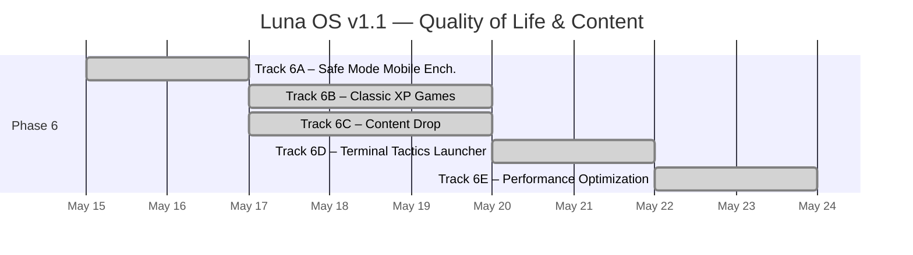

# Roadmap: Luna OS Portfolio — v1.1

**Parent Docs:** [ROADMAP_v1.md](./archive/ROADMAP_v1.md)  
**Version:** 1.1 · **Updated:** 2026-05-17 (Track 6E finalized)  
**Methodology:** Vertical slicing — each track delivers a testable end-to-end feature.

---

## Overview



## Phase 6 — Quality of Life & Content

> The first post-launch iteration. Delivers mobile UX polish, native XP games (Pong + Minesweeper), content expansion (projects, articles, resume, OG image, certifications), a Terminal Tactics itch.io game launcher (✅ complete), and a full performance optimization pass.

---

### Track 6A — Safe Mode Mobile Enhancement ✅

> Touch gesture support, cross-fade transitions, swipe-to-go-back, and content dimming for the mobile Safe Mode experience. Turns the functional-but-abrupt terminal into a polished, app-like navigable interface with BIOS-appropriate animations.

**Refs:** [ROADMAP_v1 §Track 4A](../archive/ROADMAP_v1.md#track-4a--mobile-safe-mode-) · T6A [spec](conductor/tracks/safe-mode-mobile_20260515/spec.md) · T6A [plan](conductor/tracks/safe-mode-mobile_20260515/plan.md)

#### Tasks

- [x] Implement view stack architecture (outgoing/incoming views rendered simultaneously)
- [x] Add cross-fade transitions: outgoing disappears instantly, incoming fades in (0→1, 200ms)
- [x] Implement swipe-to-go-back gesture from left edge (40px detection, >80px commit)
- [x] Add content dimming marker class on outgoing view during transitions
- [x] Respect `prefers-reduced-motion: reduce` (disable transitions, keep dimming)
- [x] Write 23 tests (cross-fade, swipe, dimming, existing)
- [x] Verify no regressions in existing keyboard/touch navigation
- [x] **Update PRD §3.2 (Mobile Experience)** — add gestures, cross-fade transitions, dimming
- [x] **Update TDD §8 (Mobile Safe Mode)** — add view stack, swipe gesture, cross-fade specs

#### Acceptance Criteria

```
✅ Swiping right from the left edge (within 40px) navigates back one view level
✅ Swipe < 80px snaps back with no navigation (cancel gesture)
✅ Opacity fade (1→0) provides visual feedback during drag
✅ Swipe-committed back is instant (no cross-fade transition)
✅ Vertical swipes are ignored (scrolling still works)
✅ Forward programmatic navigation: outgoing disappears instantly, incoming fades in (200ms)
✅ Back programmatic navigation: same transition as forward (uniform BIOS feel)
✅ Both outgoing and incoming views render simultaneously (overlaid on same grid cell)
✅ Outgoing view has content-dimming class during transitions
✅ prefers-reduced-motion disables all cross-fade transitions (dimming still functions)
✅ All existing Safe Mode tests continue to pass (673/673 total)
✅ All src/ files under 500 lines
```

#### Docs Updated

| Document           | Sections | What Changed                                                                               |
| :----------------- | :------- | :----------------------------------------------------------------------------------------- |
| [PRD.md](./PRD.md) | §3.2     | Mobile Safe Mode — added swipe gesture, cross-fade transitions, content dimming            |
| [TDD.md](./TDD.md) | §8, §9   | Mobile spec — view stack architecture, swipe gesture, cross-fade, dimming; animation table |

#### Key Files Modified

```
src/components/mobile/TerminalNav.tsx — View stack, cross-fade, swipe gesture, content dimming
src/styles/xp-safe-mode.css — Cross-fade keyframes, grid overlay, reduced-motion
tests/TerminalNav-transitions.test.tsx — Cross-fade transition tests (4)
tests/TerminalNav-swipe.test.tsx — Swipe gesture tests (8)
tests/TerminalNav-dimming.test.tsx — Content dimming tests (4)
tests/TerminalNav.test.tsx — Updated existing test for dual-view rendering
docs/PRD.md — §3.2 Mobile Experience
docs/TDD.md — §8 Mobile Safe Mode, §9 Animations & Transitions
```

---

### Track 6B — Classic XP Games

> Two native canvas-based games — **Pong** (VS AI) and **Minesweeper** (9×9 Beginner) — running directly inside the XP window system as first-class apps. Desktop icons, CMD commands, and Start Menu integration included.

**Refs:** [ROADMAP_v1 §Track 2C](../archive/ROADMAP_v1.md#track-2c--task-manager-) (Canvas precedent) · T6B [spec](conductor/tracks/classic-xp-games_20260515/spec.md) · T6B [plan](conductor/tracks/classic-xp-games_20260515/plan.md)

#### Tasks

##### Phase 1 — Pong (VS AI) ✅

- [x] Create `src/components/apps/Pong.tsx` — Canvas-based Pong game
  - [x] Game loop via `requestAnimationFrame` with delta-time
  - [x] Player paddle: controlled by keyboard (W/S or Arrow Up/Down)
  - [x] AI paddle: simple tracking with difficulty-dependent speed (Easy: 0.7×, Medium: 1.0×, Hard: 1.4×), configurable reaction delay + error margin, capped at 600 px/s
  - [x] Ball physics: angle reflection off paddles, wall bounces, speed increase per hit (capped at 600 px/s)
  - [x] Score tracking: first to 5 wins, display score at top of canvas
  - [x] Game states: `menu` (difficulty select), `waiting` ("Press SPACE to start"), `playing`, `scored` (brief pause), `won`/`lost` (result + "Press SPACE to restart")
  - [x] XP-styled border around canvas, Tahoma font for score text
  - [x] Respect `prefers-reduced-motion` (cap ball speed at 60%)
  - [x] Pause on window minimize (stop rAF loop), resume on restore
  - [x] Keyboard: Escape to close window, Space to start/restart, R to restart from any state, W/S or Arrow Up/Down for paddle

- [x] Write Pong tests
  - [x] Canvas render (smoke test)
  - [x] Ball-wall collision (4 tests)
  - [x] Paddle-ball collision (8 tests)
  - [x] AI tracking behavior (4 tests)
  - [x] Score state transitions
  - [x] 44 total Pong tests (31 physics + 13 component)

##### Phase 2 — Minesweeper (9×9 Beginner) ✅

- [x] Create `src/components/apps/Minesweeper.tsx` — Canvas-based Minesweeper
  - [x] 9×9 grid, 10 mines, standard Minesweeper rules
  - [x] Left-click: reveal cell; Right-click: toggle flag
  - [x] Flood-fill: BFS-based auto-reveal of adjacent empty cells
  - [x] Mine explosion: reveal all mines on loss, highlight triggered mine in red
  - [x] Win detection: all non-mine cells revealed; auto-flags remaining mines on win
  - [x] Timer: counts up from 0 in seconds, displayed in header area, starts on first click
  - [x] Mine counter: shows remaining mines (total - flags placed)
  - [x] Smiley face button: 🙂 (playing), 😮 (clicking), 😎 (won), 💀 (lost) — click to restart
  - [x] First click guarantee: first click is never a mine (re-generate board if needed)
  - [x] XP-styled border around game area, Courier New monospace for counter/timer
  - [x] Keyboard: R to restart, Escape to close window
  - [x] Canvas rendering: grid lines, numbered cells (1-8 with classic number colors), flag icon, mine icon, 3D raised/inset cell borders

- [x] Write Minesweeper tests
  - [x] Board generation (6 tests: dimensions, mine count, hidden state, first-click safety, validation, adjacency)
  - [x] Flood-fill logic through `revealCell`
  - [x] Win/loss detection
  - [x] Flag toggle (4 tests)
  - [x] First-click safety
  - [x] Timer start/stop
  - [x] 40 total Minesweeper tests (30 engine + 10 component)

##### Phase 3 — Integration ✅

- [x] Add `pong` and `minesweeper` to `WindowId` type in `stores/windows.ts`
- [x] Add default window configs for both games (Pong: 620×460, Minesweeper: 380×450)
- [x] Wire both games into `WindowLayer.renderContent()` — Pong and Minesweeper component imports + case branches
- [x] Create desktop icons: `public/icons/pong.svg`, `public/icons/minesweeper.svg` (48×48 XP-styled)
- [x] Add desktop icons to `index.astro` (vertical column, below Recycle Bin)
- [x] Add both games to Start Menu pinned apps list (LEFT_ITEMS, after Command Prompt)
- [x] Register `pong` and `minesweeper` CMD commands → returns `{ openWindow: 'pong'/'minesweeper' }` — opens via `openWindow` field in `CmdOutput`
- [x] Verify multi-window coexistence (games + Explorer + CMD all open simultaneously)
- [x] Verify all games respect window minimize (pause/resume rAF)
- [x] **Docs — Update PRD §5 (Application Specs)** — added §5.4 Pong and §5.5 Minesweeper app specs
- [x] **Docs — Update TDD §3.1 (WindowId type)** — added `'pong' | 'minesweeper'` to the union
- [x] **Docs — Update TDD §3.2 (Default Window Configs)** — added Pong and Minesweeper rows
- [x] **Docs — Update TDD §6 (Component Inventory)** — added Pong and Minesweeper to React Islands table

#### Acceptance Criteria

```
✅ Pong opens in XP window (~600×450), VS AI opponent, first-to-5 scoring
✅ Player paddle controlled by W/S or Arrow Up/Down keys
✅ Ball reflects off paddles and walls with accurate collision detection
✅ SPACE to start/restart, Escape to close window
✅ AI opponent is beatable (configurable reaction delay + error margin)
✅ Score displayed at canvas top in Tahoma font
✅ Games pause on window minimize (rAF stops, resumes on restore)

✅ Minesweeper opens in XP window (~400×450), 9×9 grid, 10 mines
✅ Left-click reveals cell; Right-click flags/unflags
✅ Flood-fill reveals empty regions instantly
✅ First click is never a mine
✅ Timer counts up from 0; mine counter shows remaining mines
✅ Smiley face button shows game state and restarts on click
✅ R to restart game, Escape to close window

✅ Both games have desktop icons and Start Menu entries
✅ `pong` and `minesweeper` CMD commands open respective windows
✅ Multiple windows (games + apps) can be open simultaneously
✅ All animations respect prefers-reduced-motion: reduce
✅ All existing tests continue to pass
✅ All src/ files under 500 lines
```

#### Key Files Created

```
src/components/apps/Pong.tsx — Canvas-based Pong with VS AI, ~250 lines
src/components/apps/Minesweeper.tsx — Canvas-based Minesweeper 9×9, ~350 lines
public/icons/pong.svg — 48×48 XP-styled Pong desktop icon
public/icons/minesweeper.svg — 48×48 XP-styled Minesweeper desktop icon
tests/pong.test.tsx — Pong unit tests (collision, AI, scoring, states)
tests/minesweeper.test.tsx — Minesweeper unit tests (board, flood-fill, win/loss, flags)
```

#### Docs Updated

| Document           | Sections            | What Changed                                                |
| :----------------- | :------------------ | :---------------------------------------------------------- |
| [PRD.md](./PRD.md) | §5 (new §5.4, §5.5) | Added Pong and Minesweeper application specs                |
| [TDD.md](./TDD.md) | §3.1, §3.2, §6      | Updated WindowId type, default configs, component inventory |

#### Key Files Modified

```
src/stores/windows.ts — Added pong + minesweeper to WindowId, default configs
src/components/window/WindowLayer.tsx — Render Pong/Minesweeper components
src/pages/index.astro — Add game desktop icons
src/components/taskbar/StartMenu.tsx — Add games to pinned apps
src/lib/commands.ts — Add pong + minesweeper commands
src/styles/global.css — Game-specific keyframes, reduced-motion support
tests/window/windowlayer.test.tsx — Game integration tests
docs/PRD.md — §5.4 Pong, §5.5 Minesweeper
docs/TDD.md — §3.1, §3.2, §6
```

---

### Track 6C — Content Drop ✅

> Expanded the portfolio with 2 new project MDX files (Terminal Tactics, Simulacra), 3 Knowledge Base articles (Agent-Assisted Coding, TDD, Database Design Patterns), redesigned resume PDF, and Alibaba Cloud certification entries with detail views.

**Refs:** [PRD §4](./PRD.md#4-file-system--content-mapping) · [ROADMAP_v1 §Track 2A](./archive/ROADMAP_v1.md#track-2a--explorer-content-) · T6C [spec](conductor/archive/content-drop_20260516/spec.md) · T6C [plan](conductor/archive/content-drop_20260516/plan.md)

#### Tasks

- [x] **Projects — Add 2 new MDX files**
  - [x] Create `src/content/projects/terminal-tactics.mdx` (turn-based tactical strategy game)
  - [x] Create `src/content/projects/simulacra.mdx` (autonomous AI Ant Farm)
  - [x] Update virtual filesystem + `generate-filesystem.mjs` + `projects-data.ts` metadata
  - [x] Write schema validation + file existence tests

- [x] **Knowledge Base — Add 3 new articles**
  - [x] Create `agent-assisted-coding.mdx` — spec-driven dev with Conductor
  - [x] Create `tdd.mdx` — Red-Green-Refactor cycle and best practices
  - [x] Create `database-design-patterns.mdx` — SQL vs NoSQL, indexing, sharding
  - [x] Update filesystem + compile pipeline (8 articles total)

- [x] **Resume PDF**
  - [x] Generated professional resume PDF at `public/resume.pdf` (reportlab, 5.2 KB)

- [x] **Certifications**
  - [x] Added `CERTIFICATIONS_METADATA` for ACP + ACA Alibaba Cloud credentials
  - [x] Populated `D:\My_Documents\Certs\` with 2 cert entries
  - [x] Added cert detail view in `ExplorerDetailPane.tsx`

- [x] **Update build pipeline**
  - [x] Prebuild runs with 5 projects, 8 articles, 3 drives
  - [x] `pnpm build` completes with zero errors
- [x] **Docs — Update PRD §4, §7** — bumped to v2.1, added content volume metrics
- [x] **Docs — Update TDD §4.1** — article count updated to 8 total

#### Acceptance Criteria

```
✅ terminal-tactics.mdx and simulacra.mdx render correctly in Explorer and CMD `cat`
✅ 3 new Knowledge Base articles render under Software Engineering category
✅ Resume PDF at /resume.pdf opens in new browser tab from My Documents
✅ Certs folder shows 2 Alibaba Cloud cert entries with metadata detail view
✅ pnpm build completes with no errors
✅ 795 tests passing, 82.33% coverage
✅ All src/ files under 500 lines
```

#### Docs Updated

| Document           | Sections | What Changed                                                                           |
| :----------------- | :------- | :------------------------------------------------------------------------------------- |
| [PRD.md](./PRD.md) | §4, §7   | File system updated with new projects, articles, certs; success metrics bumped to v2.1 |
| [TDD.md](./TDD.md) | §4.1     | Article collection schema — updated categories and total count                         |

#### Key Files Created/Modified

```
src/content/projects/terminal-tactics.mdx — Turn-based tactical strategy game
src/content/projects/simulacra.mdx — Autonomous AI Ant Farm (TanStack Start/PixiJS/Convex)
src/content/articles/agent-assisted-coding.mdx — Spec-driven development guide
src/content/articles/tdd.mdx — Test-Driven Development guide
src/content/articles/database-design-patterns.mdx — Database design reference
public/resume.pdf — Professional resume PDF (5.2 KB)
src/lib/projects-data.ts (modified) — Updated metadata + CERTIFICATIONS_METADATA
src/lib/constants.ts (modified) — Updated filesystem tree for 5 projects, 8 articles, 2 certs
src/components/apps/ExplorerDetailPane.tsx (modified) — Cert detail view
scripts/generate-filesystem.mjs (modified) — Cert folder population
tests/ (6 files modified) — All assertions updated for 5 projects / 8 articles / 2 certs
```

---

### Track 6D — Terminal Tactics Launcher ✅

> Embed the published **Terminal Tactics** game from itch.io inside an XP-styled game launcher window. Desktop icon, iframe window, and CMD `terminal-tactics` command.

**Refs:** T6B (Classic XP Games — same integration patterns) · [PRD §5](./PRD.md#5-interactive-applications) · T6D spec · T6D plan

**Prerequisite:** Terminal Tactics published on itch.io as an HTML game with an embed URL.

#### Tasks

##### Phase 1 — GameLauncher Component & Config ✅

- [x] Create `src/lib/game-launcher-config.ts` — `GAME_LAUNCHER_URLS` registry for embed URLs
- [x] Create `src/components/apps/GameLauncher.tsx` — iframe wrapper component
  - [x] Accept `src` prop for itch.io embed URL from config
  - [x] Render iframe with `title="Terminal Tactics"`, `allow="fullscreen"`, `sandbox="allow-scripts allow-same-origin"`
  - [x] Full-viewport inside window frame (no scrollbars on wrapper)
  - [x] Loading state: "Loading Terminal Tactics..." with animated XP-style progress bar
  - [x] Error state: 15-second timeout, "Game failed to load. [Open in new tab]" fallback to `https://mansyar.itch.io/terminal-tactics`
  - [x] `aria-live="polite"` on loading/error containers for screen readers
  - [x] Escape key: handled by WindowLayer (closes the window)

- [x] Write GameLauncher tests (8 tests)
  - [x] iframe renders with correct `src`, `title`, `allow`, `sandbox` attributes
  - [x] Loading state displays "Loading Terminal Tactics..." before iframe load event
  - [x] Error state renders fallback link after 15-second timeout
  - [x] Timeout clears on successful iframe `onLoad`
  - [x] `aria-live="polite"` present on loading/error state containers

##### Phase 2 — Window System Integration & URL Deep-Linking ✅

- [x] Add `'terminal-tactics'` to `WindowId` type in `src/stores/windows.ts`
- [x] Add default window config: 800×600, x:160, y:60, minWidth: 600, minHeight: 400
- [x] Wire `GameLauncher` into `WindowLayer.renderContent()` at `windowId === 'terminal-tactics'`
- [x] Fix `VALID_WINDOW_IDS` in `src/stores/url-sync.ts` — add `terminal-tactics`, `pong`, `minesweeper`
- [x] Write integration tests (7 tests)
  - [x] WindowId type includes 'terminal-tactics'
  - [x] Default window config exists with correct dimensions
  - [x] VALID_WINDOW_IDS includes terminal-tactics, pong, minesweeper
  - [x] WindowLayer renders GameLauncher for terminal-tactics window
  - [x] URL serialization/deserialization includes terminal-tactics

##### Phase 3 — Desktop Icon, Start Menu & CMD Command ✅

- [x] Create `public/icons/terminal-tactics.svg` — 48×48 XP-styled icon (military/terminal aesthetic)
- [x] Add desktop icon to `index.astro` (below Minesweeper in the icon list)
- [x] Add "Terminal Tactics" to StartMenu.tsx LEFT_ITEMS pinned apps
- [x] Register `terminal-tactics` CMD command
  - [x] `'terminal-tactics': 'Starts the Terminal Tactics game'` in `COMMANDS` metadata
  - [x] `handlerTerminalTactics` → returns `{ lines: ['Starting Terminal Tactics...'], openWindow: 'terminal-tactics' }`
  - [x] Registered in `COMMAND_REGISTRY` — follows same pattern as `pong`/`minesweeper`
- [x] Write command tests (2 tests)
- [x] `play` subcommand system: out of scope (games use existing standalone pattern from Track 6B)

##### Phase 4 — Documentation Updates ✅

- [x] **PRD §5** — Add §5.6 Game Launcher spec
- [x] **PRD §4** — Add "Terminal Tactics" to desktop icons table
- [x] **TDD §2** — Document `VALID_WINDOW_IDS` whitelist in URL Strategy section
- [x] **TDD §3.1** — Add `'terminal-tactics'` to WindowId union type
- [x] **TDD §3.2** — Add Terminal Tactics entry to default window configs
- [x] **TDD §6** — Add `GameLauncher` to React Islands component inventory table
- [x] **TDD §7.1** — Add `terminal-tactics` to supported commands table
- [x] **conductor/product.md** — Add "Game Launcher" to Desktop Mode Core Features
- [x] **conductor/tech-stack.md** — Add Track 6D change log entry

#### Acceptance Criteria

```
✅ Desktop icon "Terminal Tactics" opens XP window with iframe → itch.io embed URL
✅ iframe renders game at full window size with no scrollbars
✅ "Loading Terminal Tactics..." shown with XP progress bar until iframe loads
✅ If iframe doesn't load within 15 seconds, error state shows "Open in new tab" fallback
✅ Escape key closes game window correctly
✅ CMD: `terminal-tactics` opens game window
✅ URL deep-linking works: `?w=terminal-tactics` opens the game window on page load
✅ aria-live="polite" on loading/error state containers for screen readers
✅ prefers-reduced-motion: reduce disables progress bar animation
✅ All existing tests continue to pass (824 tests, 58 files)
✅ All src/ files under 500 lines
```

#### Key Files Created

```
src/components/apps/GameLauncher.tsx — iframe wrapper with loading/error states + XP progress bar
src/lib/game-launcher-config.ts — GAME_LAUNCHER_URLS registry for embed URLs
public/icons/terminal-tactics.svg — 48×48 XP-styled game icon (military/terminal aesthetic)
tests/GameLauncher.test.tsx — 8 tests: iframe, loading, error, timeout, aria-live
```

#### Docs Updated

| Document                  | Sections                 | What Changed                                                                |
| :------------------------ | :----------------------- | :-------------------------------------------------------------------------- |
| [PRD.md](./PRD.md)        | §5 (new §5.6), §4        | Added Game Launcher spec + Terminal Tactics to desktop icons table          |
| [TDD.md](./TDD.md)        | §2, §3.1, §3.2, §6, §7.1 | Updated URL strategy, WindowId type, configs, component inventory, commands |
| [conductor/product.md]    | Core Features            | Added "Game Launcher" to Desktop Mode features list                         |
| [conductor/tech-stack.md] | Change Log               | Added Track 6D entry with files created/modified and test counts            |

#### Key Files Modified

```
src/stores/windows.ts — Added terminal-tactics to WindowId type + default config (800×600)
src/stores/url-sync.ts — Fixed VALID_WINDOW_IDS to include pong, minesweeper, terminal-tactics
src/components/window/WindowLayer.tsx — Import + render GameLauncher component
src/lib/commands.ts — Added COMMANDS metadata + handlerTerminalTactics + registry entry
src/pages/index.astro — Added DesktopIcon for Terminal Tactics
src/components/taskbar/StartMenu.tsx — Added Terminal Tactics to LEFT_ITEMS pinned apps
src/styles/global.css — Added game-launcher-progress keyframe + reduced-motion override
```

---

### Track 6E — Performance Optimization ✅

> Full performance pass targeting Lighthouse scores, bundle size, and Core Web Vitals. Bundle-splits window apps via `React.lazy()`, applies `React.memo` to Explorer sub-components, removes unnecessary `useCallback` wrappers, and verifies font-display:swap + inline SVG wallpaper. No downloadable fonts or bitmap wallpaper conversion needed — Tahoma is a system font, wallpaper is already an inline SVG.

**Refs:** [PRD §7](./PRD.md#7-success-metrics) · ROADMAP_v1 §Track 4C · [AGENTS.md](../AGENTS.md) (TBT < 100ms target) · T6E [spec](conductor/archive/performance-optimization_20260517/spec.md) · T6E [plan](conductor/archive/performance-optimization_20260517/plan.md) · T6E [review checkpoint](conductor/archive/performance-optimization_20260517/plan.md)

#### Tasks

##### Phase 1 — Performance Baseline ✅

- [x] Record pre-optimization Lighthouse scores (Mobile: TBT=37ms, CLS=0; Desktop: TBT=0ms, CLS=0)
- [x] Record pre-optimization bundle size: WindowLayer.js 55KB (all apps inlined), total JS ~321KB raw

##### Phase 2 — Bundle-Split Window Apps ✅

- [x] Replace static imports in `WindowLayer.tsx` with `React.lazy()` + `<Suspense>`
- [x] Lazy-load: `Explorer`, `CmdPrompt`, `TaskManager`, `KnowledgeBase`, `Pong`, `Minesweeper`, `GameLauncher`
- [x] Named-export wrapper pattern: `React.lazy(() => import('./X').then(m => ({ default: m.X })))` — no `export default` added to component files
- [x] Show minimal XP-styled loading fallback with `aria-busy`, `aria-label`, and `role="status"`
- [x] Each app's chunk loads only when its window first opens (verified in build output: 7 separate chunks)
- [x] **Result:** WindowLayer.js **55KB → 17KB** (69% reduction)

##### Phase 3 — Component-Level Optimizations ✅

- [x] **Prerequisite:** Wrapped `handleUp` and `handleFolderNavigate` in `Explorer.tsx` with `useCallback` (stable references required for `React.memo`)
- [x] Add `React.memo` to `ExplorerFileList`, `ExplorerBreadcrumb`, `ExplorerDetailPane`
- [x] **Clock excluded** per spec — 25 lines, zero props, memo overhead > benefit
- [x] **Audit:** Removed unnecessary `useCallback` from `CmdPrompt.executeCommand` — only caller (`handleKeyDown`) is an inline function, so memoization provided zero benefit
- [x] `TaskManager` CPU cell updates verified: still uses ref-based DOM writes (no regression)

##### Phase 4 — Font & Wallpaper Optimization ✅

- [x] Verified `font-display: swap` on both Tahoma `@font-face` declarations in `xp-theme.css`
- [x] Tahoma uses `src: local('Tahoma')` — no downloadable woff2 file, no preload link needed or possible
- [x] Wallpaper verified as inline SVG (CSS gradient + SVG clouds/hills) — zero network requests, already optimal

##### Phase 5 — Build-Time Optimizations ✅

- [x] Audited `pnpm build` output — no duplicate chunks detected
- [x] Code splitting verified: 7 separate app chunks, no unintended React/Nano Stores duplication
- [x] `@astrojs/cloudflare` adapter confirmed absent in test/dev (VITEST env check)
- [x] CSS bundle inspected — no significant unused Tailwind classes

##### Phase 6 — Performance Verification ✅

- [x] Post-optimization: WindowLayer 17KB, 7 app chunks (82KB total) loaded on demand
- [x] All 826 tests pass (58 files, +9 new tests)
- [x] All `src/` files under 500 lines
- [x] `pnpm build` succeeds with zero errors

#### Acceptance Criteria

```
✅ Window apps are lazy-loaded — each app's JS chunk loads only when its window first opens
✅ Lazy loading shows a visual loading state (XP-styled "Loading {app}..." with aria-busy)
✅ WindowLayer.js reduced 55KB → 17KB (69% reduction in critical JS)
✅ Tahoma font uses font-display: swap (already implemented, verified correct)
✅ React.memo applied to ExplorerFileList, ExplorerBreadcrumb, ExplorerDetailPane (Clock excluded — no benefit)
✅ React.memo prerequisite met: all Explorer callback props wrapped in useCallback
✅ Lighthouse Desktop Performance: 0.99, TBT: 0ms, CLS: 0
✅ Lighthouse Mobile Performance: TBT: 37ms (< 100ms target), CLS: 0
✅ Wallpaper remains inline SVG (zero network request, already optimal)
✅ All 826 existing tests continue to pass (was 817)
✅ All src/ files under 500 lines
```

#### Docs Updated

| Document                  | Sections   | What Changed                                                                        |
| :------------------------ | :--------- | :---------------------------------------------------------------------------------- |
| [PRD.md](./PRD.md)        | §7         | Performance targets confirmed; "build time < 5s" corrected to ~10-15s with prebuild |
| [TDD.md](./TDD.md)        | §14        | Added bundle-splitting strategy and lazy loading architecture subsection            |
| [conductor/tech-stack.md] | Change Log | Added Track 6E entry — React.lazy bundle-split, React.memo, useCallback cleanup     |
| [conductor/tracks.md]     | Registry   | Track 6E marked complete and archived                                               |

#### Key Files Modified

```
src/components/window/WindowLayer.tsx — React.lazy() + Suspense for all 7 apps + AppLoadingFallback
src/components/apps/Explorer.tsx — handleUp + handleFolderNavigate wrapped in useCallback
src/components/apps/ExplorerFileList.tsx — React.memo wrapper + memo import
src/components/apps/ExplorerBreadcrumb.tsx — React.memo wrapper + memo import
src/components/apps/ExplorerDetailPane.tsx — React.memo wrapper + memo import
src/components/apps/CmdPrompt.tsx — Removed unnecessary useCallback from executeCommand
tests/window/windowlayer.test.tsx — 5 lazy-loading tests + Escape key handler fix + URL isolation
tests/explorer.test.tsx — 4 React.memo tests (3 exotic component checks + 1 render test)
```

#### Key Files Created

```
(None — all changes were modifications to existing files)
```

---

## Track Dependency Graph

```mermaid
graph TD
    T6A[Track 6A: Safe Mode Mobile] --> T6C[Track 6C: Content Drop]
    T6A --> T6B[Track 6B: Classic XP Games]
    T6B --> T6D[Track 6D: Terminal Tactics Launcher]
    T6C --> T6D
    T6D --> T6E[Track 6E: Performance Opt.]

    style T6A fill:#e74c3c,color:#fff
    style T6B fill:#e67e22,color:#fff
    style T6C fill:#27ae60,color:#fff
    style T6D fill:#9b59b6,color:#fff
    style T6E fill:#27ae60,color:#fff
```



### Parallel Work Opportunities

| Tracks that can run in parallel | After          |
| :------------------------------ | :------------- |
| Track 6A + Track 6B             | Phase 5 (v1)   |
| Track 6C after 6A               | Track 6A       |
| Track 6D after 6B + 6C          | Their deps     |
| Track 6E last                   | All other deps |

### Suggested Execution Order

```
Week 1:    6A (Safe Mode) + 6B (Games)         — parallel, pure code
Week 1-2:  6C (Content)                         — starts when you provide material
Week 2:    6D (Terminal Tactics)                 — complete ✅
Week 2-3:  6E (Performance)                      — last, covers all new apps
```

---

## Legend

| Status  | Meaning     |
| :------ | :---------- |
| `- [ ]` | Not started |
| `- [x]` | Complete    |
| `🚧`    | In progress |
| `🔴`    | Blocked     |
