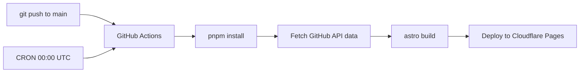

# Technical Design Document: Luna OS Portfolio

**Parent:** [PRD.md](./PRD.md)  
**Version:** 1.0  
**Last Updated:** 2026-05-10

---

## 1. Project Structure

```
portfolio-v3/
├── public/
│   ├── fonts/                    # Tahoma, MS Sans Serif (woff2)
│   ├── icons/                    # Desktop & app icons (SVG/PNG)
│   ├── wallpapers/               # bliss.webp, bliss.avif
│   ├── sounds/                   # startup.mp3, error.mp3 (optional)
│   └── resume.pdf
├── src/
│   ├── components/
│   │   ├── desktop/              # Astro: Desktop, DesktopIcon, Wallpaper
│   │   ├── taskbar/              # React: Taskbar, StartMenu, SystemTray, Clock
│   │   ├── window/               # React: WindowFrame, TitleBar, WindowContent
│   │   ├── apps/                 # React: CmdPrompt, TaskManager, HelpCenter, Explorer
│   │   └── mobile/               # Astro: SafeModeShell, BiosScreen, TerminalNav
│   ├── content/
│   │   ├── projects/             # MDX: one file per project
│   │   └── devops-academy/       # MDX: help articles from devops-from-scratch
│   ├── layouts/
│   │   └── DesktopLayout.astro   # Main shell: wallpaper + taskbar + window layer
│   ├── pages/
│   │   └── index.astro           # Single page app entry
│   ├── stores/                   # Nano Stores (see §3)
│   │   ├── windows.ts
│   │   ├── desktop.ts
│   │   └── filesystem.ts
│   ├── lib/
│   │   ├── github.ts             # GitHub API fetcher (build-time)
│   │   ├── commands.ts           # CLI command registry
│   │   └── constants.ts          # App IDs, default positions, filesystem tree
│   └── styles/
│       └── xp-theme.css          # XP design tokens (see §5)
├── astro.config.mjs
├── tailwind.config.mjs
└── package.json
```

### Island Boundary Rules

| Component | Renderer | Client Directive | Reason |
|:---|:---|:---|:---|
| `Desktop`, `Wallpaper` | Astro | — | Static, zero JS |
| `DesktopIcon` | Astro | — | Static with `onclick` to store action |
| `Taskbar` | React | `client:load` | Always interactive, manages Start Menu |
| `WindowLayer` | React | `client:load` | Core interactive layer, all windows live here |
| `SafeModeShell` | Astro | — | Server-rendered terminal UI |
| `TerminalNav` | React | `client:visible` | Interactive only when scrolled into view |

---

## 2. Routing & URL Strategy

**Architecture:** Single-page with URL search params for state persistence.

### URL Schema

```
https://mansyar.dev/?w=cmd,taskmanager&focus=cmd&start=0
```

| Param | Type | Description |
|:---|:---|:---|
| `w` | `string` (CSV) | Open window IDs: `cmd`, `explorer`, `taskmanager`, `help`, `mydocs`, `recyclebin` |
| `focus` | `string` | Currently focused (topmost) window ID |
| `start` | `0 \| 1` | Whether Start Menu is open |
| `path` | `string` | Current Explorer path, e.g., `C:/Software_Engineering/icarus` |

### Deep-Link Examples

| Link | Result |
|:---|:---|
| `/?w=cmd` | Opens Command Prompt only |
| `/?w=explorer&path=C:/Software_Engineering` | Opens Explorer to projects folder |
| `/?w=taskmanager&focus=taskmanager` | Opens Task Manager focused |
| `/` | Clean desktop, no windows open |

### Implementation

- Nano Stores sync to `URLSearchParams` via a `$urlSync` computed store
- On page load: parse URL → hydrate stores
- On store change: debounced `replaceState()` (no page reload)
- Cloudflare Pages handles this client-side (no edge function needed for static params)

---

## 3. Window Manager Specification

### 3.1 Window State Schema

```typescript
// src/stores/windows.ts
import { map, atom, computed } from 'nanostores';

export type WindowId = 
  | 'explorer' | 'mydocs' | 'help' 
  | 'cmd' | 'recyclebin' | 'taskmanager';

export interface WindowState {
  id: WindowId;
  title: string;
  icon: string;              // path to icon asset
  x: number;                 // px from left
  y: number;                 // px from top
  width: number;             // px
  height: number;            // px
  minWidth: number;          // minimum resize width
  minHeight: number;         // minimum resize height
  zIndex: number;
  status: 'open' | 'minimized' | 'maximized';
  // App-specific state
  explorerPath?: string;     // for Explorer windows
  cmdHistory?: string[];     // for Command Prompt
}

export const $windows = map<Record<WindowId, WindowState>>({});
export const $zCounter = atom<number>(100);
export const $activeWindow = atom<WindowId | null>(null);

// Derived: windows visible in taskbar
export const $taskbarWindows = computed($windows, (wins) =>
  Object.values(wins).filter(w => w.status !== undefined)
);
```

### 3.2 Default Window Configs

| Window | Default Size | Default Position | Min Size |
|:---|:---|:---|:---|
| Explorer | 700×500 | 80, 60 | 400×300 |
| My Documents | 600×450 | 120, 80 | 350×250 |
| Help & Support | 750×550 | 60, 40 | 500×400 |
| Command Prompt | 680×420 | 100, 100 | 450×250 |
| Task Manager | 500×550 | 200, 60 | 400×450 |
| Recycle Bin | 550×400 | 150, 90 | 350×250 |

### 3.3 Window Actions

```typescript
// Core actions
function openWindow(id: WindowId): void;     // Set status='open', increment zCounter, assign zIndex
function closeWindow(id: WindowId): void;     // Remove from $windows
function minimizeWindow(id: WindowId): void;  // Set status='minimized'
function maximizeWindow(id: WindowId): void;  // Set status='maximized', cache prev position
function restoreWindow(id: WindowId): void;   // Restore from maximized/minimized to prev position
function focusWindow(id: WindowId): void;     // Increment zCounter, assign new zIndex, set $activeWindow
function moveWindow(id: WindowId, x: number, y: number): void;
function resizeWindow(id: WindowId, w: number, h: number): void;
```

### 3.4 Behavior Rules

| Behavior | Rule |
|:---|:---|
| **Focus** | Clicking anywhere inside a window calls `focusWindow()`. zIndex increments globally. |
| **Drag** | Title bar only. Constrained to viewport (cannot drag fully offscreen). Min 32px visible from any edge. |
| **Maximize** | Fills viewport minus taskbar height (40px). Double-click title bar toggles. |
| **Minimize** | Slides down to taskbar slot (CSS transition 200ms). Window hidden. |
| **Restore** | Clicking taskbar button on a minimized window restores to cached position. |
| **Taskbar toggle** | Clicking taskbar button on focused window → minimize. On unfocused → focus. On minimized → restore + focus. |
| **Close** | Removes window from state entirely. |
| **Resize** | Drag from edges/corners. 8px hit area. Respects minWidth/minHeight. |
| **Boot** | No windows open by default unless URL params specify otherwise. |

---

## 4. Data Models & Content Schema

### 4.1 Project (MDX Frontmatter)

```typescript
// src/content/config.ts
import { defineCollection } from 'astro:content';
import { glob } from 'astro/loaders';
import { z } from 'astro/zod';

const projects = defineCollection({
  loader: glob({ pattern: '**/*.mdx', base: './src/content/projects' }),
  schema: z.object({
    title: z.string(),
    slug: z.string(),
    drive: z.enum(['C', 'D']),               // C:\Software_Engineering or D:\Systems_Data
    description: z.string(),
    repoUrl: z.string().url(),
    language: z.string(),                     // Primary language
    techStack: z.array(z.string()),
    stars: z.number().default(0),             // Populated at build time
    lastCommit: z.string().default(''),       // ISO date, populated at build time
    commits: z.number().default(0),
    status: z.enum(['active', 'archived', 'wip']),
    icon: z.string().default('file.svg'),     // Explorer list icon
  }),
});

const devopsAcademy = defineCollection({
  loader: glob({ pattern: '**/*.mdx', base: './src/content/devops-academy' }),
  schema: z.object({
    title: z.string(),
    slug: z.string(),
    category: z.string(),                    // e.g., "Linux", "Docker", "CI/CD"
    order: z.number(),                       // Sort within category
    description: z.string(),
    lastUpdated: z.coerce.date(),
  }),
});

export const collections = { projects, devopsAcademy };
```

### 4.2 GitHub API Data Shape

```typescript
// src/lib/github.ts — fetched at build time via Astro
interface GitHubRepoData {
  name: string;
  stargazers_count: number;
  pushed_at: string;           // ISO date of last push
  default_branch: string;
  language: string;
}

// Fetched per-repo, merged into MDX frontmatter at build
async function fetchRepoStats(owner: string, repo: string): Promise<GitHubRepoData>;
```

### 4.3 Virtual Filesystem Tree

```typescript
// src/lib/constants.ts
export const FILE_SYSTEM: FSNode = {
  'C:': {
    type: 'drive',
    children: {
      'Software_Engineering': {
        type: 'folder',
        children: {
          // Populated from `projects` collection where drive === 'C'
        }
      }
    }
  },
  'D:': {
    type: 'drive',
    children: {
      'Systems_Data': {
        type: 'folder',
        children: {
          // Populated from `projects` collection where drive === 'D'
        }
      }
    }
  },
  'E:': {
    type: 'drive',
    children: {
      'DevOps_Academy': {
        type: 'folder',
        children: {
          // Populated from `devopsAcademy` collection, grouped by category
        }
      }
    }
  }
};
```

### 4.4 Resume

`Resume.pdf` is a **real PDF file** in `public/`. The "My Documents" Explorer window shows it as a clickable file that opens in a new browser tab via `window.open()`.

---

## 5. Design Tokens & Style Specification

### 5.1 Color Palette

```css
/* src/styles/xp-theme.css */
:root {
  /* Luna Blue — Taskbar & Title Bars */
  --xp-blue-start:       #0a246a;
  --xp-blue-end:         #3a6ea5;
  --xp-blue-highlight:   #4a8bc9;
  --xp-titlebar-active:  linear-gradient(180deg, #0058e6 0%, #3a80df 10%, #1b5bb5 50%, #2670d8 93%, #0049d0 100%);
  --xp-titlebar-inactive: linear-gradient(180deg, #7a96df 0%, #a4b8e4 10%, #7994d0 50%, #9ab4e2 93%, #7590cc 100%);

  /* Taskbar */
  --xp-taskbar-bg:       linear-gradient(180deg, #1f3f7d 0%, #3068b6 3%, #1b54a3 6%, #1b54a3 94%, #163d82 100%);
  --xp-start-btn-green:  linear-gradient(180deg, #3b8f3f 0%, #47a84c 8%, #2d8e33 92%, #1e7a24 100%);

  /* Window Chrome */
  --xp-window-bg:        #ece9d8;
  --xp-window-border:    #0054e3;
  --xp-button-face:      #ece9d8;
  --xp-button-highlight: #ffffff;
  --xp-button-shadow:    #aca899;
  --xp-button-dk-shadow: #716f64;

  /* Desktop */
  --xp-desktop-bg:       #3a6ea5;

  /* Text */
  --xp-text-primary:     #000000;
  --xp-text-window-title:#ffffff;
  --xp-text-disabled:    #aca899;

  /* Start Menu */
  --xp-start-header-blue: linear-gradient(180deg, #1a50a0 0%, #2b71c4 100%);
  --xp-start-left-bg:    #ffffff;
  --xp-start-right-bg:   #d3e5fa;
  --xp-start-separator:  #d6d2c2;

  /* Safe Mode / Mobile */
  --safe-mode-bg:        #000000;
  --safe-mode-text:      #00ff41;
  --safe-mode-dim:       #008f11;
  --safe-mode-highlight: #00ff41;

  /* Shadows & Borders */
  --xp-shadow-window:    2px 2px 10px rgba(0,0,0,0.35);
}
```

### 5.2 Typography

```css
/* Primary: Tahoma (XP system font) — use web-safe fallback */
@font-face {
  font-family: 'Tahoma';
  src: url('/fonts/tahoma.woff2') format('woff2');
  font-display: swap;
}

:root {
  --font-system:  'Tahoma', 'Segoe UI', Geneva, Verdana, sans-serif;
  --font-mono:    'Lucida Console', 'Consolas', 'Courier New', monospace;
  --font-size-xs:   11px;   /* Menus, status bar */
  --font-size-sm:   12px;   /* File lists, tooltips */
  --font-size-base: 13px;   /* Window content */
  --font-size-title: 13px;  /* Title bar text (bold) */
}
```

### 5.3 Classic 3D Border System

```css
/* Outset (raised button/panel) */
.xp-outset {
  border-top:    1px solid var(--xp-button-highlight);
  border-left:   1px solid var(--xp-button-highlight);
  border-bottom: 1px solid var(--xp-button-dk-shadow);
  border-right:  1px solid var(--xp-button-dk-shadow);
}

/* Inset (pressed button/input field) */
.xp-inset {
  border-top:    1px solid var(--xp-button-shadow);
  border-left:   1px solid var(--xp-button-shadow);
  border-bottom: 1px solid var(--xp-button-highlight);
  border-right:  1px solid var(--xp-button-highlight);
}

/* Window frame (thick 3D border) */
.xp-window-border {
  border: 3px solid var(--xp-window-border);
  border-radius: 8px 8px 0 0;        /* XP rounded top corners */
  box-shadow: var(--xp-shadow-window);
}
```

### 5.4 Icon Sources

| Icon Set | Source | Format |
|:---|:---|:---|
| Desktop Icons (32×32) | Custom SVGs matching XP originals | SVG |
| Explorer List Icons (16×16) | Custom SVGs | SVG |
| Title Bar Buttons | CSS-drawn (minimize/maximize/close) | CSS |
| Start Menu Icons | Custom SVGs | SVG |

> **Note:** All icons are custom-drawn SVGs to avoid copyright. They should be *inspired by* the XP originals but not pixel-copied.

---

## 6. Component Inventory

### React Islands (Interactive)

| Component | Props | Responsibility |
|:---|:---|:---|
| `WindowLayer` | — | Renders all open windows from `$windows` store |
| `WindowFrame` | `windowId` | Chrome (title bar, borders, resize handles), drag logic |
| `TitleBar` | `windowId` | Title text, icon, min/max/close buttons |
| `Taskbar` | — | Start button, open window buttons, system tray, clock |
| `StartMenu` | — | Two-column menu, user avatar, program list |
| `Explorer` | `windowId` | File/folder list, breadcrumb nav, address bar |
| `CmdPrompt` | `windowId` | Terminal emulator with command parsing |
| `TaskManager` | `windowId` | Tabs: Processes, Performance |
| `HelpCenter` | `windowId` | Search bar, sidebar categories, article renderer |

### Astro Components (Static)

| Component | Props | Responsibility |
|:---|:---|:---|
| `DesktopLayout` | — | Page shell: wallpaper + icon grid + island mount points |
| `DesktopIcon` | `icon, label, windowId` | Renders icon + label, double-click opens window via store |
| `Wallpaper` | — | Responsive `<picture>` with AVIF/WebP sources |
| `SafeModeShell` | — | Mobile layout with BIOS boot text and terminal nav |
| `MetaTags` | `title, description` | SEO head content |

---

## 7. Application Specifications

### 7.1 Command Prompt

**Supported Commands:**

| Command | Behavior |
|:---|:---|
| `help` | Lists all available commands |
| `ls` / `dir` | Lists files in current directory |
| `cd <path>` | Navigate directories (`cd ..` supported) |
| `cat <file>` | Print project description as plain text |
| `clear` / `cls` | Clear terminal output |
| `neofetch` | ASCII art + system info card for @mansyar |
| `open <file>` | Opens corresponding window (e.g., `open resume.pdf`) |
| `whoami` | Prints `mansyar\administrator` |
| `echo <text>` | Prints text back |
| *unknown* | `'<cmd>' is not recognized as an internal or external command.` |

**Features:**
- Command history via ↑/↓ arrow keys (stored in window state)
- Blinking cursor animation
- Auto-scroll to bottom on new output
- No tab-complete (v1 scope)

### 7.2 Task Manager

**Processes Tab:**

| Image Name | PID | CPU | Mem Usage | Description |
|:---|:---|:---|:---|:---|
| `python.exe` | 1204 | 12% | 45,320 K | Python Runtime |
| `terraform.svc` | 892 | 8% | 32,100 K | Infrastructure Manager |
| `docker.exe` | 2048 | 15% | 128,400 K | Container Runtime |
| `react.dll` | 1567 | 6% | 22,800 K | UI Framework |
| `node.exe` | 3201 | 10% | 67,500 K | JavaScript Runtime |
| `git.exe` | 445 | 2% | 8,200 K | Version Control |
| `linux_kernel` | 1 | 18% | 256,000 K | Operating System |
| `ansible.svc` | 780 | 5% | 15,600 K | Configuration Mgmt |

> **CPU %** = relative skill level (animated, fluctuates ±3% randomly).

**Performance Tab:**
- Two graphs (CPU & Memory) rendered with `<canvas>` or SVG paths
- Green line on black grid (mimicking XP Task Manager exactly)
- Updates every 1s with slight random variation
- CPU label: "Skills Utilization" / Memory label: "Knowledge Base"

### 7.3 Start Menu Layout

```
┌──────────────────────────────────────┐
│ 👤 Ansyar Muh Amrulloh              │ ← Blue header bar
├──────────────┬───────────────────────┤
│              │                       │
│ 📄 Resume    │ 📁 My Documents       │
│ 🖥️ Explorer  │ 📁 My Computer        │
│ ⚙️ Task Mgr  │ 🖥️ Control Panel      │
│ 💻 CMD       │ ❓ Help & Support      │
│              │                       │
│ ─────────── │ ───────────────────── │
│              │ 🔍 Search             │
│              │ ▶️ All Programs        │
├──────────────┴───────────────────────┤
│  🔴 Shut Down...                     │ ← Bottom bar
└──────────────────────────────────────┘
```

Left column = pinned apps. Right column = system folders. Bottom = Shut Down triggers BSOD/goodbye overlay.

---

## 8. Mobile "Safe Mode" Specification

### Boot Sequence (on first load, < 768px)

```
Windows could not start because the viewport is too small.
Starting in Safe Mode...

Loading PORTFOLIO.SYS ............ done
Loading PROJECTS.DAT ............. done
Loading SKILLS.DRV ............... done

Type HELP for available commands.

C:\MANSYAR>_
```

### Navigation

- Text-based menu system (not a full CLI)
- Numbered options: `[1] Projects  [2] Skills  [3] About  [4] Contact`
- Selecting an option renders content as monospace text blocks
- `[0] Back` returns to previous menu
- No drag, no windows, no Start Menu

### Visual Style

- Black background, green monospace text (`--safe-mode-*` tokens)
- Scanline overlay effect (CSS repeating-linear-gradient, subtle)
- CRT screen curvature effect (CSS border-radius + box-shadow on container)

---

## 9. Animations & Transitions

| Animation | Duration | Easing | Description |
|:---|:---|:---|:---|
| Window open | 150ms | `ease-out` | Scale from 0.95 → 1.0, opacity 0 → 1 |
| Window close | 120ms | `ease-in` | Scale 1.0 → 0.95, opacity 1 → 0 |
| Window minimize | 200ms | `ease-in` | Shrinks toward taskbar button position |
| Window restore | 200ms | `ease-out` | Expands from taskbar to cached position |
| Start Menu open | 150ms | `ease-out` | Slide up from taskbar |
| Start Menu close | 100ms | `ease-in` | Slide down |
| Desktop icon hover | 100ms | `linear` | Blue selection highlight |
| Desktop icon dblclick | — | — | Icon briefly inverts colors (XP-style) |
| Boot sequence (desktop) | 2s | — | Optional: XP logo fade-in, then desktop |
| Safe Mode boot text | 50ms/line | `linear` | Text appears line by line |

---

## 10. Accessibility Strategy

| Concern | Approach |
|:---|:---|
| **Keyboard nav** | All windows, menus, and buttons are focusable. `Tab` cycles through desktop icons → taskbar → open windows. `Enter` activates. `Escape` closes menus/dialogs. |
| **ARIA roles** | Windows: `role="dialog"`, `aria-label`. Taskbar: `role="toolbar"`. Start Menu: `role="menu"`. Desktop: `role="application"`. |
| **Focus management** | Opening a window moves focus to it. Closing returns focus to previously focused element. |
| **Screen readers** | All decorative XP elements have `aria-hidden="true"`. Content areas have proper heading hierarchy. |
| **Reduced motion** | `@media (prefers-reduced-motion: reduce)` disables all animations. |
| **Color contrast** | Safe Mode green-on-black passes WCAG AA. Desktop mode relies on XP's inherently high-contrast chrome. |

---

## 11. Error States

| Scenario | Handling |
|:---|:---|
| **GitHub API failure** | Build uses cached data from last successful fetch. Console warning logged. |
| **404 page** | Styled as Windows XP BSOD (Blue Screen of Death) with error code and "restart" link. |
| **Empty Explorer folder** | "This folder is empty" message with folder icon (matching XP). |
| **CMD invalid path** | `The system cannot find the path specified.` |
| **Offline/JS disabled** | Astro SSR serves static desktop view. No interactive windows, but content accessible via `<noscript>` fallback listing all projects. |

---

## 12. SEO & Meta Strategy

```html
<!-- Default meta (index.astro) -->
<title>Ansyar Muh Amrulloh — Software Engineer | DevOps & Data</title>
<meta name="description" content="Interactive Windows XP-themed portfolio for a Software Engineer specializing in DevOps and Data Engineering." />

<!-- Open Graph -->
<meta property="og:title" content="Luna OS — Ansyar's Portfolio" />
<meta property="og:description" content="Explore projects through a nostalgic Windows XP interface." />
<meta property="og:image" content="/og-preview.png" />
<meta property="og:type" content="website" />

<!-- Structured Data: Person -->
<script type="application/ld+json">
{
  "@context": "https://schema.org",
  "@type": "Person",
  "name": "Ansyar Muh Amrulloh",
  "jobTitle": "Software Engineer",
  "url": "https://mansyar.dev"
}
</script>
```

- `og-preview.png`: Screenshot of the desktop with windows open (generated as a static asset)
- Since it's a single-page app, all SEO is on the index page
- Content inside windows is server-rendered by Astro (crawlable)

---

## 13. Dependencies

```json
{
  "dependencies": {
    "astro": "^5.x",
    "@astrojs/react": "^4.x",
    "@astrojs/mdx": "^4.x",
    "@astrojs/tailwind": "^6.x",
    "react": "^19.x",
    "react-dom": "^19.x",
    "nanostores": "^0.11.x",
    "@nanostores/react": "^0.8.x"
  },
  "devDependencies": {
    "tailwindcss": "^4.x",
    "typescript": "^5.x",
    "@types/react": "^19.x"
  }
}
```

---

## 14. Build & Deploy Pipeline



- **Build trigger:** Push to `main` OR daily CRON
- **Build time data:** GitHub API fetched in `src/lib/github.ts`, injected into content collection entries
- **Output:** Static site (`output: 'static'` in astro.config) — no SSR needed at runtime
- **Cache:** Cloudflare CDN caches all assets with immutable hashes
