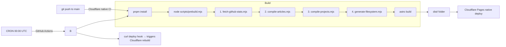

# Technical Design Document: Luna OS Portfolio

**Parent:** [PRD.md](./PRD.md)  
**Version:** 1.7  
**Last Updated:** 2026-05-14

---

## 1. Project Structure

```
portfolio-v3/
├── public/
│   ├── fonts/                    # Tahoma, MS Sans Serif (woff2)
│   ├── icons/                    # Desktop & app icons (SVG/PNG)
│   ├── wallpapers/               # bliss.webp, bliss.avif
│   ├── sounds/                   # startup.mp3, error.mp3 (optional)
│   └── resume.pdf                # Placeholder PDF; user must replace with actual resume
├── src/
│   ├── components/
│   │   ├── desktop/              # Astro: Desktop, DesktopIcon, Wallpaper
│   │   ├── taskbar/              # React: Taskbar, StartMenu, SystemTray, Clock
│   │   ├── window/               # React: WindowFrame, TitleBar, WindowContent
│   │   ├── apps/                 # React: CmdPrompt, TaskManager, KnowledgeBase, Explorer, Pong, Minesweeper
│   │   └── mobile/               # Astro: SafeModeShell, BiosScreen, TerminalNav
│   ├── content/
│   │   ├── projects/             # MDX: one file per project
│   │   └── articles/             # MDX: Knowledge Base articles (SE, AI, DevOps, etc.)
│   ├── layouts/
│   │   └── DesktopLayout.astro   # Main shell: wallpaper + taskbar + window layer
│   ├── pages/
│   │   ├── index.astro           # Single page app entry
│   │   └── 404.astro             # Windows XP BSOD error page (Track 4C)
│   ├── stores/                   # Nano Stores (see §3)
│   │   ├── windows.ts
│   │   ├── desktop.ts
│   │   └── filesystem.ts
│   ├── lib/
│   │   ├── github.ts             # GitHub API fetcher (build-time) (Track 3A)
│   │   ├── commands.ts           # CLI command registry
│   │   ├── task-manager-data.ts  # Process data + performance constants (Track 2C)
│   │   ├── constants.ts          # App IDs, default positions, filesystem tree
│   │   ├── filesystem.ts         # Navigation helpers (getChildren, resolvePath, etc.)
│   │   ├── projects-data.ts      # Static project/article metadata (dev-mode fallback)
│   │   └── generated/            # Build-time outputs (gitignored except projects-content.json)
│   │       ├── articles-content.json   # Pre-compiled article metadata + HTML (by compile-articles.mjs)
│   │       ├── projects-content.json   # Pre-compiled project metadata + HTML + GitHub data (by compile-projects.mjs)
│   │       ├── filesystem.json         # Dynamic FILE_SYSTEM tree (by generate-filesystem.mjs)
│   │       └── github-cache.json       # GitHub API cache for offline resilience (by fetch-github-stats.mjs)
│   └── styles/
│       └── xp-theme.css          # XP design tokens (see §5)
├── scripts/
│   ├── prebuild.mjs              # Build orchestrator (runs all scripts in sequence)
│   ├── fetch-github-stats.mjs    # Build-time GitHub API fetch + cache
│   ├── compile-articles.mjs      # Build-time article MDX → HTML compilation
│   ├── compile-projects.mjs      # Build-time project MDX → HTML + GitHub data merge
│   └── generate-filesystem.mjs   # Build-time dynamic FILE_SYSTEM tree generation
├── astro.config.mjs
└── package.json
```

### Island Boundary Rules

| Component              | Renderer | Client Directive | Reason                                        |
| :--------------------- | :------- | :--------------- | :-------------------------------------------- |
| `Desktop`, `Wallpaper` | Astro    | —                | Static, zero JS                               |
| `DesktopIcon`          | Astro    | —                | Static with `onclick` to store action         |
| `Taskbar`              | React    | `client:load`    | Always interactive, manages Start Menu        |
| `WindowLayer`          | React    | `client:load`    | Core interactive layer, all windows live here |
| `SafeModeShell`        | Astro    | —                | Server-rendered terminal UI                   |
| `TerminalNav`          | React    | `client:visible` | Interactive only when scrolled into view      |

---

## 2. Routing & URL Strategy

**Architecture:** Single-page with URL search params for state persistence.

### URL Schema

```
https://portfolio-os.ansyar-world.top/?w=cmd,taskmanager&focus=cmd&start=0
```

| Param   | Type           | Description                                                                                              |
| :------ | :------------- | :------------------------------------------------------------------------------------------------------- |
| `w`     | `string` (CSV) | Open window IDs: `cmd`, `explorer`, `taskmanager`, `help`, `mydocs`, `recyclebin`, `pong`, `minesweeper` |
| `focus` | `string`       | Currently focused (topmost) window ID                                                                    |
| `start` | `0 \| 1`       | Whether Start Menu is open                                                                               |
| `path`  | `string`       | Current Explorer path, e.g., `C:/Software_Engineering/icarus`                                            |

### Deep-Link Examples

| Link                                        | Result                            |
| :------------------------------------------ | :-------------------------------- |
| `/?w=cmd`                                   | Opens Command Prompt only         |
| `/?w=explorer&path=C:/Software_Engineering` | Opens Explorer to projects folder |
| `/?w=taskmanager&focus=taskmanager`         | Opens Task Manager focused        |
| `/`                                         | Clean desktop, no windows open    |

### Implementation

- Dedicated `src/stores/url-sync.ts` module owns all URL ↔ store synchronization logic
- On page load: `hydrateFromUrl()` parses `?w=`, `?focus=`, `?start=`, `?path=` → hydrates stores via `openWindow()`, `focusWindow()`, `openStartMenu()`
- An `isHydrating` boolean flag prevents feedback loops during hydration
- On store change: debounced (100ms) `replaceState()`/`pushState()` updates URL (no page reload)
- `setPendingPushState()` marks user-initiated actions (window open/close/focus, Start Menu toggle) for `pushState`; all other changes use `replaceState`
- `popstate` event listener re-hydrates stores for browser back/forward navigation
- No-op guard skips `replaceState()` when serialized state matches current URL
- Cloudflare Pages handles this client-side (no edge function needed for static params)

---

## 3. Window Manager Specification

### 3.1 Window State Schema

```typescript
// src/stores/windows.ts
import { map, atom, computed } from 'nanostores';

export type WindowId =
  | 'explorer'
  | 'mydocs'
  | 'help'
  | 'cmd'
  | 'recyclebin'
  | 'taskmanager'
  | 'pong'
  | 'minesweeper';

export interface WindowState {
  id: WindowId;
  title: string;
  icon: string; // path to icon asset
  x: number; // px from left
  y: number; // px from top
  width: number; // px
  height: number; // px
  minWidth: number; // minimum resize width
  minHeight: number; // minimum resize height
  zIndex: number;
  status: 'open' | 'minimized' | 'maximized' | 'closing';
  // App-specific state
  explorerPath?: string; // for Explorer windows
  cmdHistory?: string[]; // for Command Prompt
}

export const $windows = map<Record<WindowId, WindowState>>({});
export const $zCounter = atom<number>(100);
export const $activeWindow = atom<WindowId | null>(null);

// Derived: windows visible in taskbar
export const $taskbarWindows = computed($windows, (wins) =>
  Object.values(wins).filter((w) => w.status !== undefined),
);
```

### 3.2 Default Window Configs

| Window         | Default Size | Default Position | Min Size |
| :------------- | :----------- | :--------------- | :------- |
| Explorer       | 700×500      | 80, 60           | 400×300  |
| My Documents   | 600×450      | 120, 80          | 350×250  |
| Knowledge Base | 750×550      | 60, 40           | 500×400  |
| Command Prompt | 680×420      | 100, 100         | 450×250  |
| Task Manager   | 500×550      | 200, 60          | 400×450  |
| Recycle Bin    | 550×400      | 150, 90          | 350×250  |
| Pong           | 620×460      | 80, 60           | 450×320  |
| Minesweeper    | 380×450      | 120, 80          | 315×380  |

### 3.3 Window Actions

```typescript
// Core actions
function openWindow(id: WindowId): void; // Set status='open', increment zCounter, assign zIndex
function closeWindow(id: WindowId): void; // Remove from $windows
function minimizeWindow(id: WindowId): void; // Set status='minimized'
function maximizeWindow(id: WindowId): void; // Set status='maximized', cache prev position
function restoreWindow(id: WindowId): void; // Restore from maximized/minimized to prev position
function focusWindow(id: WindowId): void; // Increment zCounter, assign new zIndex, set $activeWindow
function moveWindow(id: WindowId, x: number, y: number): void;
function resizeWindow(id: WindowId, w: number, h: number): void;
```

### 3.4 Behavior Rules

| Behavior           | Rule                                                                                                        |
| :----------------- | :---------------------------------------------------------------------------------------------------------- |
| **Focus**          | Clicking anywhere inside a window calls `focusWindow()`. zIndex increments globally.                        |
| **Drag**           | Title bar only. Constrained to viewport (cannot drag fully offscreen). Min 32px visible from any edge.      |
| **Maximize**       | Fills viewport minus taskbar height (40px). Double-click title bar toggles.                                 |
| **Minimize**       | Slides down to taskbar slot (CSS transition 200ms). Window hidden.                                          |
| **Restore**        | Clicking taskbar button on a minimized window restores to cached position.                                  |
| **Taskbar toggle** | Clicking taskbar button on focused window → minimize. On unfocused → focus. On minimized → restore + focus. |
| **Close**          | Removes window from state entirely.                                                                         |
| **Resize**         | Drag from edges/corners. 8px hit area. Respects minWidth/minHeight.                                         |
| **Boot**           | No windows open by default unless URL params specify otherwise.                                             |

---

## 4. Data Models & Content Schema

### 4.1 Content Collection Schemas

```typescript
// src/content/config.ts
import { defineCollection } from 'astro:content';
import { glob } from 'astro/loaders';
import { z } from 'astro/zod';

const projects = defineCollection({
  loader: glob({ pattern: '**/*.mdx', base: './src/content/projects' }),
  schema: z.object({
    title: z.string(),
    slug: z.string(),
    drive: z.enum(['C', 'D']), // C:\Software_Engineering or D:\Systems_Data
    description: z.string(),
    repoUrl: z.string().url(),
    language: z.string(), // Primary language
    techStack: z.array(z.string()),
    stars: z.number().default(0), // Populated at build time
    lastCommit: z.string().default(''), // ISO date, populated at build time
    commits: z.number().default(0),
    status: z.enum(['active', 'archived', 'wip']),
    icon: z.string().default('file.svg'), // Explorer list icon
  }),
});

const articles = defineCollection({
  loader: glob({ pattern: '**/*.mdx', base: './src/content/articles' }),
  schema: z.object({
    title: z.string(),
    slug: z.string(),
    category: z.string(), // e.g., "Software Engineering", "AI", "DevOps"
    order: z.number(), // Sort within category
    description: z.string(),
    lastUpdated: z.coerce.date(),
  }),
});

export const collections = { projects, articles };
```

### 4.2 GitHub API Data Shape

```typescript
// src/lib/github.ts — fetched at build time via standalone scripts (no Astro API dependency)
interface GitHubRepoData {
  name: string;
  stargazers_count: number;
  pushed_at: string; // ISO date of last push
  default_branch: string;
  language: string | null;
}

interface GitHubCommitCountResponse {
  count: number;
}

// Fetch repo metadata from GET /repos/{owner}/{repo}
async function fetchRepoStats(
  owner: string,
  repo: string,
  timeoutMs?: number, // default 10_000
): Promise<GitHubRepoData>;

// Fetch total commit count via Link header parsing from GET /repos/{owner}/{repo}/commits?per_page=1&page=1
async function fetchRepoCommitCount(
  owner: string,
  repo: string,
  timeoutMs?: number,
): Promise<number>;

// Auth: reads GITHUB_TOKEN from env; fallback to unauthenticated (60 req/hr)
// Timeout: AbortController with configurable ms (default 10s)
// Cache: github-cache.json in src/lib/generated/ — keyed by "owner/repo"
// On API failure: reads cache; if exists logs warning, if not exits with error
```

### 4.3 Virtual Filesystem Tree

```typescript
// src/lib/constants.ts
export const FILE_SYSTEM: FSNode = {
  'C:': {
    type: 'drive',
    children: {
      Software_Engineering: {
        type: 'folder',
        children: {
          // Populated from `projects` collection where drive === 'C'
        },
      },
    },
  },
  'D:': {
    type: 'drive',
    children: {
      Systems_Data: {
        type: 'folder',
        children: {
          // Populated from `projects` collection where drive === 'D'
        },
      },
      My_Documents: {
        type: 'folder',
        children: {
          Resume.pdf: { type: 'file', slug: 'resume', size: '0 B' },
          Certs: { type: 'folder', children: [] },               // empty placeholder
          Contact.txt: { type: 'file', slug: 'contact', size: '0.5 KB' },
        },
      },
    },
  },
  'E:': {
    type: 'drive',
    children: {
      Knowledge_Base: {
        type: 'folder',
        children: {
          // Populated from `articles` collection, grouped by category (DevOps, Software_Engineering, AI, etc.)
        },
      },
    },
  },
};
```

**Virtual Recycle Bin:** A synthetic `FSFolder` node (`Recycle_Bin`) is injected at the root level (`\`) alongside the three drives by `getChildren('\\')`. It is not part of `FILE_SYSTEM` — instead it's handled via a `isRecycleBinPath()` guard in `filesystem.ts`'s `resolvePath()` and `getChildren()` functions. Contents: a single deleted file `chasing-chapters (v1)` with slug `chasing-chapters-v1`.

### 4.4 Resume

`Resume.pdf` is a **real PDF file** in `public/`. The "My Documents" Explorer window shows it as a clickable file that opens in a new browser tab via `window.open('/resume.pdf', '_blank')`. The click handler checks for slug `'resume'` in `Explorer.tsx`'s `handleFileClick` and opens the tab instead of setting a selected slug. A placeholder PDF is provided at `public/resume.pdf` — the user must replace it with their actual resume PDF.

---

## 5. Design Tokens & Style Specification

### 5.1 Color Palette

```css
/* src/styles/xp-theme.css */
:root {
  /* Luna Blue — Taskbar & Title Bars */
  --xp-blue-start: #0a246a;
  --xp-blue-end: #3a6ea5;
  --xp-blue-highlight: #4a8bc9;
  --xp-titlebar-active: linear-gradient(
    180deg,
    #0058e6 0%,
    #3a80df 10%,
    #1b5bb5 50%,
    #2670d8 93%,
    #0049d0 100%
  );
  --xp-titlebar-inactive: linear-gradient(
    180deg,
    #7a96df 0%,
    #a4b8e4 10%,
    #7994d0 50%,
    #9ab4e2 93%,
    #7590cc 100%
  );

  /* Taskbar */
  --xp-taskbar-bg: linear-gradient(
    180deg,
    #1f3f7d 0%,
    #3068b6 3%,
    #1b54a3 6%,
    #1b54a3 94%,
    #163d82 100%
  );
  --xp-start-btn-green: linear-gradient(180deg, #3b8f3f 0%, #47a84c 8%, #2d8e33 92%, #1e7a24 100%);

  /* Window Chrome */
  --xp-window-bg: #ece9d8;
  --xp-window-border: #0054e3;
  --xp-button-face: #ece9d8;
  --xp-button-highlight: #ffffff;
  --xp-button-shadow: #aca899;
  --xp-button-dk-shadow: #716f64;

  /* Desktop */
  --xp-desktop-bg: #3a6ea5;

  /* Text */
  --xp-text-primary: #000000;
  --xp-text-window-title: #ffffff;
  --xp-text-disabled: #aca899;

  /* Start Menu */
  --xp-start-header-blue: linear-gradient(180deg, #1a50a0 0%, #2b71c4 100%);
  --xp-start-left-bg: #ffffff;
  --xp-start-right-bg: #d3e5fa;
  --xp-start-separator: #d6d2c2;

  /* Safe Mode / Mobile */
  --safe-mode-bg: #000000;
  --safe-mode-text: #00ff41;
  --safe-mode-dim: #008f11;
  --safe-mode-highlight: #00ff41;

  /* Shadows & Borders */
  --xp-shadow-window: 2px 2px 10px rgba(0, 0, 0, 0.35);
}
```

### 5.2 Typography

```css
/* Primary: Tahoma (XP system font) — use web-safe fallback */
@font-face {
  font-family: 'Tahoma';
  src: url('/fonts/tahoma.woff2') format('woff2');
  font-display: swap;
}

:root {
  --font-system: 'Tahoma', 'Segoe UI', Geneva, Verdana, sans-serif;
  --font-mono: 'Lucida Console', 'Consolas', 'Courier New', monospace;
  --font-size-xs: 11px; /* Menus, status bar */
  --font-size-sm: 12px; /* File lists, tooltips */
  --font-size-base: 13px; /* Window content */
  --font-size-title: 13px; /* Title bar text (bold) */
}
```

### 5.3 Classic 3D Border System

```css
/* Outset (raised button/panel) */
.xp-outset {
  border-top: 1px solid var(--xp-button-highlight);
  border-left: 1px solid var(--xp-button-highlight);
  border-bottom: 1px solid var(--xp-button-dk-shadow);
  border-right: 1px solid var(--xp-button-dk-shadow);
}

/* Inset (pressed button/input field) */
.xp-inset {
  border-top: 1px solid var(--xp-button-shadow);
  border-left: 1px solid var(--xp-button-shadow);
  border-bottom: 1px solid var(--xp-button-highlight);
  border-right: 1px solid var(--xp-button-highlight);
}

/* Window frame (thick 3D border) */
.xp-window-border {
  border: 3px solid var(--xp-window-border);
  border-radius: 8px 8px 0 0; /* XP rounded top corners */
  box-shadow: var(--xp-shadow-window);
}
```

### 5.4 Icon Sources

| Icon Set                    | Source                              | Format |
| :-------------------------- | :---------------------------------- | :----- |
| Desktop Icons (32×32)       | Custom SVGs matching XP originals   | SVG    |
| Explorer List Icons (16×16) | Custom SVGs                         | SVG    |
| Title Bar Buttons           | CSS-drawn (minimize/maximize/close) | CSS    |
| Start Menu Icons            | Custom SVGs                         | SVG    |

> **Note:** All icons are custom-drawn SVGs to avoid copyright. They should be _inspired by_ the XP originals but not pixel-copied.

---

## 6. Component Inventory

### React Islands (Interactive)

| Component       | Props                        | Responsibility                                                                   |
| :-------------- | :--------------------------- | :------------------------------------------------------------------------------- |
| `WindowLayer`   | —                            | Renders all open windows from `$windows` store                                   |
| `WindowFrame`   | `windowId`                   | Chrome (title bar, borders, resize handles), drag logic                          |
| `TitleBar`      | `windowId`                   | Title text, icon, min/max/close buttons                                          |
| `Taskbar`       | —                            | Start button, open window buttons, system tray, clock                            |
| `StartMenu`     | —                            | Two-column menu, user avatar, program list                                       |
| `Explorer`      | `windowId`                   | File/folder list, breadcrumb nav, address bar                                    |
| `CmdPrompt`     | `windowId`                   | Terminal emulator with command parsing                                           |
| `TaskManager`   | `windowId`                   | Tabs: Processes (table, CPU animation, End Process), Performance (Canvas graphs) |
| `CanvasGraph`   | `label, width, height, data` | Reusable green-on-black line graph with grid, 60-point buffer                    |
| `KnowledgeBase` | `windowId`                   | Search bar, sidebar categories, article renderer                                 |
| `Pong`          | `windowId`                   | Canvas Pong VS AI with difficulty menu, AI tracking, first-to-5 scoring          |
| `Minesweeper`   | `windowId`                   | Canvas Minesweeper 9×9 with flood-fill, timer, mine counter, smiley face restart |

### Astro Components (Static)

| Component       | Props                   | Responsibility                                                                    |
| :-------------- | :---------------------- | :-------------------------------------------------------------------------------- |
| `DesktopLayout` | —                       | Page shell: wallpaper + icon grid + island mount points                           |
| `DesktopIcon`   | `icon, label, windowId` | Renders icon + label, double-click opens window via store                         |
| `Wallpaper`     | `imageSrc?`             | Inline SVG/CSS Bliss-style rolling hills; optional `imageSrc` for bitmap fallback |
| `SafeModeShell` | —                       | Mobile layout with BIOS boot text and terminal nav                                |
| `MetaTags`      | `title, description`    | SEO head content                                                                  |

---

## 7. Application Specifications

### 7.1 Command Prompt

**Architecture:**

- **`src/lib/commands.ts`:** Centralized command registry and parser. Exports `CmdOutput` (lines, clear, openExplorer, openUrl, newCmdPath), `CmdContext` (cmdPath), `CommandHandler` type, `COMMAND_REGISTRY` map, and `parseCommand()` function.
- **`src/components/apps/CmdPrompt.tsx`:** React island terminal shell. Uses a hidden input for keystroke capture with a visible `<span>` overlay showing typed text + blinking block cursor. Reads `cmdPath` from Nano Store `$windows`, updates on `cd`.
- **State Management:** Command history stored in local component state (per-session, not persisted). `cmdPath` tracked in Nano Store `WindowState` for cross-component consistency with Explorer.

**Input Layout:**

- Hidden `<input>` (opacity 0) captures all keystrokes
- Visible `<span>` renders the prompt + typed text + blinking cursor
- Cursor implemented as `.cmd-cursor-blink` CSS class with `@keyframes` opacity blink (1s step-end)
- `prefers-reduced-motion: reduce` disables cursor blink

**Scrollbar Behavior:**

- Outer terminal wrapper handles both axes (`overflow: auto`)
- Input line uses `position: sticky; bottom: 0` to stay visible during vertical scrolling
- Vertical scrollbar on right edge; horizontal scrollbar below input line at terminal bottom

**Supported Commands:**

| Command       | Aliases | Behavior                                                                                        |
| :------------ | :------ | :---------------------------------------------------------------------------------------------- |
| `help`        | `/?`    | Lists all 9 commands with descriptions (filters out alias entries)                              |
| `ls`          | `dir`   | Lists drives/folders/files with `[DRIVE]`, `[DIR]`, `[FILE]` type indicators                    |
| `cd <path>`   | `chdir` | Change directory (supports `.`, `..`, `\`, `C:\`, absolute paths)                               |
| `cat <file>`  | `type`  | Shows project/article metadata from `PROJECTS_METADATA`/`ARTICLES_METADATA`                     |
| `clear`       | `cls`   | Clears output buffer, re-shows MARP welcome banner                                              |
| `neofetch`    | —       | Tux ASCII art (12-line penguin) + system info (OS, Shell, Resolution, etc.)                     |
| `open <slug>` | —       | Opens Explorer at file's parent folder; `open resume.pdf` opens new tab                         |
| `whoami`      | —       | Prints `mansyar\administrator`                                                                  |
| `echo <text>` | —       | Prints text back verbatim                                                                       |
| `pong`        | —       | Opens Pong game window with AI opponent                                                         |
| `minesweeper` | —       | Opens Minesweeper 9×9 game window                                                               |
| _unknown_     | —       | `'<cmd>' is not recognized as an internal or external command, operable program or batch file.` |

**Features:**

- Command history via ↑/↓ arrow keys (local component state, per-session, deduplicates consecutive entries)
- Blinking block cursor animation (CSS `@keyframes` + `step-end`)
- Auto-scroll to bottom on new output
- **Tab completion** — auto-completes command names, folder names for `cd`, file slugs for `cat`/`type`/`open`; shows options inline for multiple matches
- MARP ASCII art welcome banner on initial render and after `clear`/`cls`
- Both scrollbars at terminal window edge; horizontal below input line
- `open` command calls `openWindow('explorer')` and updates `explorerPath` in store
- No external terminal emulation libraries — pure React + Nano Stores

### 7.2 Task Manager

**Architecture:**

- **`src/components/apps/TaskManager.tsx`:** Main React island (438 lines). Manages tab state, CPU animation (setInterval 1s with ref-based DOM updates), row selection, End Process dialog, and Performance data generation.
- **`src/components/apps/CanvasGraph.tsx`:** Reusable canvas line graph (135 lines). Pure Canvas API — green line (`#00ff00`) on black (`#000000`) grid with Y-axis percentage labels. Accepts dynamic data via `data` prop.
- **`src/lib/task-manager-data.ts`:** Extracted constants — `PROCESS_DATA` (8 entries), `CPU_PERF_BASE` (~9.5%), `MEM_PERF_BASE` (~28.12%), `initCpuPerfData()`/`initMemPerfData()` generators.

**Implementation Notes:**

- CPU animation uses two separate `setInterval` effects (process CPU every 1s, performance data every 1s)
- Process CPU fluctuation is ±3% accumulated from previous value; performance data is `base + random(±2%)` each tick
- CPU cell textContent updated directly via `useRef` array to avoid full table re-render on every tick
- Warning dialog uses position:absolute overlay with SVG warning triangle icon (review fix)
- CanvasGraph uses a `dataRef.current = data.slice(...)` pattern outside effects, re-draws via useEffect dependency on `[width, height, data]`
- JSDom does not implement `getContext('2d')` without the `canvas` npm package — Canvas tests verify element presence and attributes only

**Processes Tab:**
| :-------------- | :--- | :-- | :-------- | :--------------------- |
| `python.exe` | 1204 | 12% | 45,320 K | Python Runtime |
| `terraform.svc` | 892 | 8% | 32,100 K | Infrastructure Manager |
| `docker.exe` | 2048 | 15% | 128,400 K | Container Runtime |
| `react.dll` | 1567 | 6% | 22,800 K | UI Framework |
| `node.exe` | 3201 | 10% | 67,500 K | JavaScript Runtime |
| `git.exe` | 445 | 2% | 8,200 K | Version Control |
| `linux_kernel` | 1 | 18% | 256,000 K | Operating System |
| `ansible.svc` | 780 | 5% | 15,600 K | Configuration Mgmt |

> **CPU %** = relative skill level (animated, fluctuates ±3% randomly).

**Performance Tab:**

- Two graphs (CPU & Memory) rendered with `<canvas>` or SVG paths
- Green line on black grid (mimicking XP Task Manager exactly)
- Updates every 1s with slight random variation
- CPU label: "Skills Utilization" / Memory label: "Knowledge Base"

### 7.3 Start Menu Layout

```
┌──────────────────────────────────────┐
│ 👤 Muhammad Ansyar Rafi Putra       │ ← Blue header bar
├──────────────┬───────────────────────┤
│              │                       │
│ 📄 Resume    │ 📁 My Documents       │
│ 🖥️ Explorer  │ 📁 My Computer        │
│ ⚙️ Task Mgr  │ 🖥️ Control Panel      │
│ 💻 CMD       │ ❓ Knowledge Base       │
│              │                       │
│ ─────────── │ ───────────────────── │
│              │ 🔍 Search             │
│              │ ▶️ All Programs        │
├──────────────┴───────────────────────┤
│  🔴 Shut Down...                     │ ← Bottom bar
└──────────────────────────────────────┘
```

Left column = pinned apps. Right column = system folders. Bottom = Shut Down triggers BSOD/goodbye overlay.

---

## 8. Mobile "Safe Mode" Specification

### Technical Implementation

The Safe Mode uses a **view stack architecture** in `TerminalNav.tsx`:

- **View Stack:** Both outgoing and incoming views render simultaneously during transitions. Outgoing view is wrapped in `.view-outgoing` (with `aria-hidden="true"`), incoming in `.view-incoming`. Both are overlaid using CSS Grid (`grid-area: 1 / 1`) to prevent vertical stacking.
- **State:** `previousView`, `currentView` (from Nano Store), `isTransitioning` flag. After 250ms timeout, outgoing view unmounts.
- **Cross-Fade Transition:** Uniform cross-fade for all programmatic navigation (forward and back use the same animation). Outgoing view animates opacity 1→0 (`fadeOut`, 200ms ease-out), incoming animates 0→1 (`fadeIn`, 200ms ease-out). Both animate simultaneously during the cross-fade.
- **Content Dimming:** Outgoing view gets `.content-dimming` CSS class during transitions (`transition: opacity 150ms ease-out`). Subtle brightness change without text or progress bar. Works even under `prefers-reduced-motion: reduce`.
- **Swipe-to-Go-Back:** Touch gesture handler in dedicated `useEffect` (separate from keyboard handler). Touch start within 40px of left edge triggers gesture. Opacity fade (1→0 by drag distance / viewport width) provides visual feedback. >80px drag commits instantly (no transition), ≤80px cancels with 150ms ease-out snap-back. Vertical drag (scrolling) is ignored. Uses `useRef` for touch state to avoid re-renders. Mouse events are ignored (touch-only).
- **Keyboard Navigation:** `1-5` for main menu items, `0` for back. Uses `navigateTo()` helper which sets `isTransitioning=true`, calls `setPendingPushState()` for URL sync, then `setSafeModeView()`. Keyboard and touch effects are in separate `useEffect` blocks to prevent subscription conflicts.

### Boot Sequence (on first load, < 768px)

```
Windows could not start because the viewport is too small.
Starting in Safe Mode...

Loading PORTFOLIO.SYS ............ done
Loading PROJECTS.DAT ............. done
Loading SKILLS.DRV ............... done

Type HELP for available commands.

C:\MANSYAR>_
```

### Navigation

- Text-based menu system (not a full CLI)
- Numbered options: `[1] Projects  [2] Skills  [3] About  [4] Contact`
- Selecting an option renders content as monospace text blocks
- `[0] Back` returns to previous menu
- No drag, no windows, no Start Menu

### Visual Style

- Black background, green monospace text (`--safe-mode-*` tokens)
- Scanline overlay effect (CSS repeating-linear-gradient, subtle)
- CRT screen curvature effect (CSS border-radius + box-shadow on container)

---

## 9. Animations & Transitions

| Animation                            | Duration  | Easing     | Description                                          |
| :----------------------------------- | :-------- | :--------- | :--------------------------------------------------- |
| Window open                          | 150ms     | `ease-out` | Scale from 0.95 → 1.0, opacity 0 → 1                 |
| Window close                         | 120ms     | `ease-in`  | Scale 1.0 → 0.95, opacity 1 → 0                      |
| Window minimize                      | 200ms     | `ease-in`  | Shrinks toward taskbar button position               |
| Window restore                       | 200ms     | `ease-out` | Expands from taskbar to cached position              |
| Start Menu open                      | 150ms     | `ease-out` | Slide up from taskbar                                |
| Start Menu close                     | 100ms     | `ease-in`  | Slide down                                           |
| Desktop icon hover                   | 100ms     | `linear`   | Blue selection highlight                             |
| Desktop icon dblclick                | —         | —          | Icon briefly inverts colors (XP-style)               |
| Boot sequence (desktop)              | 2s        | —          | Optional: XP logo fade-in, then desktop              |
| Safe Mode boot text                  | 50ms/line | `linear`   | Text appears line by line                            |
| Safe Mode view cross-fade (outgoing) | 200ms     | `ease-out` | Outgoing view fades 1→0 (CSS `@keyframes fadeOut`)   |
| Safe Mode view cross-fade (incoming) | 200ms     | `ease-out` | Incoming view fades 0→1 (CSS `@keyframes fadeIn`)    |
| Safe Mode content dimming            | 150ms     | `ease-out` | Outgoing view dims to opacity 0.7 during transitions |
| Swipe cancel snap-back               | 150ms     | `ease-out` | Opacity snaps 0→1 when swipe drag < 80px threshold   |

---

## 10. Accessibility Strategy (Track 4B)

| Concern              | Approach                                                                                                                                                                                                                                                                                                                                                                                                                                                                                                                                                                                                                                                                                                                                                    |
| :------------------- | :---------------------------------------------------------------------------------------------------------------------------------------------------------------------------------------------------------------------------------------------------------------------------------------------------------------------------------------------------------------------------------------------------------------------------------------------------------------------------------------------------------------------------------------------------------------------------------------------------------------------------------------------------------------------------------------------------------------------------------------------------------- |
| **Keyboard nav**     | All windows, menus, and buttons are focusable. `Tab` cycles through desktop icons (tabindex=0) → skip-to-content link → taskbar (native buttons) → Start Menu (when open) → open windows (TitleBar → content). `Enter`/`Space` activates. `Escape` closes menus/windows (global keydown listener in WindowLayer).                                                                                                                                                                                                                                                                                                                                                                                                                                           |
| **ARIA roles**       | Desktop shell: `role="group"` + `aria-label="Luna OS Desktop"`. DesktopIcon: `role="button"`, `aria-label`, `tabindex="0"`. Windows: `role="dialog"`, `aria-label`, `aria-modal="true"`. Taskbar: `role="toolbar"`, `aria-label="Taskbar"`. Start Menu: `role="menu"`, items `role="menuitem"`. Explorer: `role="region"` + `aria-label="File Explorer"`. CmdPrompt: `role="terminal"`, output `role="log"`. KnowledgeBase: `role="region"` + `aria-label="Knowledge Base"`, search `role="searchbox"`, sidebar `role="navigation"`. SafeMode: `role="group"` + `aria-label="Safe Mode Terminal"`. BiosBoot: `role="status"` + `aria-live="polite"`. Clock: `role="timer"` + `aria-live="polite"`. ShutdownOverlay: `role="status"` + `aria-live="polite"`. |
| **Focus management** | Opening a window via `luna:open-window` event saves `document.activeElement` to module-level variable. New window's TitleBar minimize button auto-focuses via `requestAnimationFrame`. Closing window detects window count decrease and restores focus to saved element (falls back to Start button if element no longer in DOM).                                                                                                                                                                                                                                                                                                                                                                                                                           |
| **Screen readers**   | All decorative XP elements have `aria-hidden="true"` (window resize handles). CSS-only decorations (gradients, borders, pseudo-elements) are not exposed to accessibility tree. Start Menu avatar already has `aria-hidden="true"`.                                                                                                                                                                                                                                                                                                                                                                                                                                                                                                                         |
| **Reduced motion**   | All animations/transitions overridden under `@media (prefers-reduced-motion: reduce)`: window open/close/min/max, Start Menu open/close, CMD cursor blink, shutdown progress bar, desktop icon hover, BIOS cursor pulse, CRT scanline/curvature. BIOS boot typewriter skips entirely via JS `matchMedia` check.                                                                                                                                                                                                                                                                                                                                                                                                                                             |
| **Color contrast**   | All text color pairs verified passing WCAG AA (4.5:1 normal text, 3:1 large text) with programmatic contrast ratio tests using `relativeLuminance()` and `contrastRatio()` helpers. Key pairs: `#000000`/`#ece9d8` (~14.5:1), `#ffffff`/`#0a246a` (~7.5:1), `#00ff41`/`#000000` (~15.3:1), `#cc0000`/`#ffffff` (~5.9:1). Disabled text `#aca899`/`#ece9d8` (~2.4:1) documented as acceptable for non-interactive state.                                                                                                                                                                                                                                                                                                                                     |
| **Skip navigation**  | Visually-hidden "Skip to content" link as first focusable element in `RootLayout.astro`, targeting `#main-content` on DesktopLayout. Visible only on keyboard focus (`:focus`).                                                                                                                                                                                                                                                                                                                                                                                                                                                                                                                                                                             |
| **Focus-visible**    | Global `:focus-visible` dotted outline (1px dotted #000, 2px offset). `:focus:not(:focus-visible)` has no outline (prevents mouse-click outline pollution). Specific overrides for buttons, `role="button"`, `role="tab"`, `role="menuitem"` with negative offset to show inside 3D borders.                                                                                                                                                                                                                                                                                                                                                                                                                                                                |
| **WCAG AA tests**    | 9 programmatic contrast tests verify all color pairs. Reusable `expectWcagAa()`, `contrastRatio()`, `relativeLuminance()` helpers in `tests/aria-helpers.ts`.                                                                                                                                                                                                                                                                                                                                                                                                                                                                                                                                                                                               |

---

## 11. Error States

| Scenario                  | Handling                                                                                                                                      |
| :------------------------ | :-------------------------------------------------------------------------------------------------------------------------------------------- |
| **GitHub API failure**    | Build uses cached data from last successful fetch. Console warning logged.                                                                    |
| **404 page**              | Styled as Windows XP BSOD with `*** STOP: 0x000000FE (PORTFOLIO_NOT_FOUND)`, fake memory dump indicator, and "Press any key to restart" link. |
| **Empty Explorer folder** | "This folder is empty" message with folder icon (matching XP).                                                                                |
| **CMD invalid path**      | `The system cannot find the path specified.`                                                                                                  |
| **Offline/JS disabled**   | Astro SSR serves static desktop view. `<noscript>` block lists all 3 portfolio projects as plain HTML links with XP-themed fallback CSS.      |

---

## 12. SEO & Meta Strategy

```astro
---
// Implemented via src/components/desktop/MetaTags.astro — reusable, zero-JS component
import MetaTags from '../components/desktop/MetaTags.astro';
---

<!-- MetaTags injects: title, description, OG tags, and JSON-LD -->
<MetaTags title={title} description={description} />
```

- **MetaTags.astro:** Astro component (`src/components/desktop/MetaTags.astro`) with props `title`, `description`, and optional `ogImage` (defaults to `/og-preview.png`). Zero JS.
- **OG Tags:** `og:title`, `og:description`, `og:image="/og-preview.png"`, `og:type="website"`
- **Structured Data:** JSON-LD Person schema — `@type: "Person"`, `name: "Muhammad Ansyar Rafi Putra"`, `jobTitle: "Software Engineer"`, `url: "https://mansyar.dev"`
- **apple-touch-icon:** SVG favicon referenced via `<link rel="apple-touch-icon" href="/favicon.svg" />`
- `og-preview.png`: Static asset in `/public/og-preview.png` for social media preview cards
- Since it's a single-page app, all SEO is on the index page
- Content inside windows is server-rendered by Astro (crawlable)

---

## 13. Dependencies

```json
{
  "dependencies": {
    "astro": "^5.x",
    "@astrojs/react": "^4.x",
    "@astrojs/mdx": "^4.x",
    "@astrojs/tailwind": "^6.x",
    "react": "^19.x",
    "react-dom": "^19.x",
    "nanostores": "^0.11.x",
    "@nanostores/react": "^0.8.x"
  },
  "devDependencies": {
    "tailwindcss": "^4.x",
    "typescript": "^5.x",
    "@types/react": "^19.x"
  }
}
```

---

## 14. Build & Deploy Pipeline



### Pre-Build Scripts

| #   | Script                    | Purpose                                                                | Output                  | Failure                                                             |
| --- | ------------------------- | ---------------------------------------------------------------------- | ----------------------- | ------------------------------------------------------------------- |
| 1   | `fetch-github-stats.mjs`  | Fetch live stars, commits, last push from GitHub API                   | `github-cache.json`     | Optional — warning logged on failure; cached data used if available |
| 2   | `compile-articles.mjs`    | Parse article MDX frontmatter + render body to HTML via `marked`       | `articles-content.json` | Critical — aborts build                                             |
| 3   | `compile-projects.mjs`    | Parse project MDX frontmatter + render body to HTML, merge GitHub data | `projects-content.json` | Critical — aborts build                                             |
| 4   | `generate-filesystem.mjs` | Build dynamic FILE_SYSTEM tree from compiled JSON outputs              | `filesystem.json`       | Critical — aborts build                                             |

### Dev Mode

`pnpm dev` (astro dev) does **not** run `prebuild.mjs`. To ensure dev mode works:

- `projects-content.json` and `articles-content.json` are checked into git (`.gitignore` exceptions `!src/lib/generated/projects-content.json` and `!src/lib/generated/articles-content.json`)
- `filesystem.json` is also tracked in git for dev mode
- `constants.ts` keeps a static `FILE_SYSTEM` tree as fallback for development without build
- `github-cache.json` is gitignored — first `pnpm build` creates it

### Pre-Deploy Verification

Before pushing to `main`, the pre-push hook runs:

1. `astro check` — TypeScript typechecking across all Astro/TS/TSX files
2. `vitest run --coverage` — Full test suite with ≥80% coverage threshold

Push is rejected if either step fails. This acts as the sole staging gate (no separate staging environment).

### Key Details

- **Orchestrator:** `scripts/prebuild.mjs` runs all 4 scripts in strict sequence via `execSync`
- **GitHub Auth:** Reads `GITHUB_TOKEN` env var for authenticated requests (higher rate limit); unauthenticated fallback (60 req/hr)
- **Cache:** Last-good GitHub API response stored in `src/lib/generated/github-cache.json`
- **Push to main:** Cloudflare Pages native CI detects push, runs `pnpm build`, deploys `dist/` automatically. No custom deploy command needed.
- **CRON (00:00 UTC):** GitHub Actions workflow (`deploy.yml`) runs `pnpm build` to refresh GitHub data, then curls `CLOUDFLARE_DEPLOY_HOOK_URL` secret to trigger a Cloudflare rebuild via deploy hook.
- **Pre-push quality gate:** Husky `pre-push` hook runs `astro check` (typecheck) + `vitest run --coverage` (≥80% threshold). Push rejected if either fails.
- **Concurrency guard:** `concurrency: deploy-${{ github.ref }}` prevents overlapping workflow runs.
- **Output:** Static site — `@astrojs/cloudflare` adapter loaded conditionally (present in production, skipped during vitest via `VITEST=true` env check)
- **Live URL:** `https://portfolio-os.ansyar-world.top` via Cloudflare-managed custom domain with automatic SSL
- **Fallback URL:** `https://portfolio-v3.m-ansyarafi.workers.dev`
- **Smoke test:** `node scripts/smoke-test.mjs` — validates HTTP 200, content-type, HSTS header, and title tag
- **Cloudflare CDN** caches all assets with immutable hashes
- **Build time:** ~3.44s (including prebuild)
